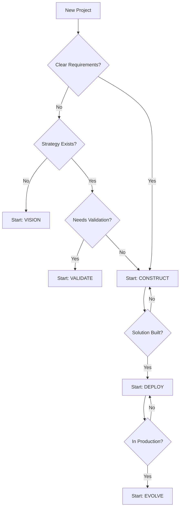

# 5-Phase Methodology - Quick Reference

**Purpose**: Overview of the delivery methodology and phase selection guidance
**Token Budget**: ~650 tokens (~100 lines)
**Last Updated**: November 2025

---

## Methodology Overview

**5-Phase Approach**: Vision → Validate → Construct → Deploy → Evolve

**Key Principle**: Not all projects start at Vision. Choose your entry point based on client maturity and project clarity.

---

## Phase Selection Decision Tree

---

## Vision Phase

**When to Start Here**:
- ✅ Greenfield projects with no existing architecture
- ✅ Low organizational maturity
- ✅ Strategic ambiguity ("we need to transform")
- ✅ Require Target Operating Model (TOM) definition
- ✅ Gap analysis needed (as-is vs to-be)

**Duration**: 4-8 weeks

**Key Deliverables**:
- Target Operating Model (TOM)
- Maturity assessment (as-is)
- Gap analysis and transformation roadmap
- High-level architecture vision
- Business case and value projections

**Outputs**:
- Vision presentations
- Architecture diagrams (C4 Context, landscape)
- Transformation roadmap
- Business case with ROI

**Keywords**: vision, TOM, target operating model, maturity, gap analysis, as-is vs to-be

**Load Full Phase**: `phases/phase-vision.md`
**Load Templates**: `templates/vision-phase-templates.md`

---

## Validate Phase

**When to Start Here**:
- ✅ Strategy exists but unproven
- ✅ Need to test hypotheses before full investment
- ✅ Proof of Concept (POC) or MVP required
- ✅ High risk/uncertainty requiring validation
- ✅ Stakeholder buy-in needs demonstration

**Duration**: 3-6 weeks

**Key Deliverables**:
- MVP or POC implementation
- Hypothesis validation report
- Technical feasibility assessment
- Refined requirements and user stories
- Updated business case with actual data

**Outputs**:
- Working prototype
- Validation report
- Technical architecture (refined)
- Go/no-go recommendation

**Keywords**: validate, MVP, hypothesis, proof of concept, pilot, POC, prototype

**Load Full Phase**: `phases/phase-validate.md`
**Load Templates**: `templates/validate-phase-templates.md`

---

## Construct Phase

**When to Start Here**:
- ✅ Clear requirements and design
- ✅ Mature client organization
- ✅ TOM already defined
- ✅ Ready for full implementation
- ✅ Team and resources in place

**Duration**: 8-24 weeks (varies widely)

**Key Deliverables**:
- Production-ready solution
- Technical documentation
- Architecture Decision Records (ADRs)
- Test coverage and quality reports
- Deployment packages

**Outputs**:
- Deployed solution (dev/test environments)
- Technical documentation
- User guides and training materials
- Test results and quality metrics

**Keywords**: construct, build, implementation, development, coding

**Load Full Phase**: `phases/phase-construct.md`
**Load Templates**: `templates/technical-documentation-templates.md`

---

## Deploy Phase

**When to Start Here**:
- ✅ Solution built and tested
- ✅ Ready for production rollout
- ✅ Cutover plan needed
- ✅ Migration or go-live imminent
- ✅ Change management required

**Duration**: 2-8 weeks

**Key Deliverables**:
- Cutover plan and runbooks
- Production deployment
- User training completion
- Hypercare support plan
- Post-deployment validation

**Outputs**:
- Live production system
- Deployment documentation
- Support runbooks
- Training completion records
- Go-live report

**Keywords**: deploy, cutover, go-live, migration, rollout, production

**Load Full Phase**: `phases/phase-deploy.md`
**Load Scenarios**: `scenarios/large-scale-migrations.md` (if migration)

---

## Evolve Phase

**When to Start Here**:
- ✅ System live in production
- ✅ Focus on adoption and optimization
- ✅ Continuous improvement mode
- ✅ Feature enhancements needed
- ✅ Performance tuning required

**Duration**: Ongoing

**Key Deliverables**:
- Adoption metrics and dashboards
- Optimization recommendations
- Feature enhancement backlog
- Performance tuning results
- User feedback integration

**Outputs**:
- Enhanced solution
- Optimization reports
- Adoption playbooks
- Continuous improvement roadmap

**Keywords**: evolve, adoption, optimization, continuous improvement, enhancements

**Load Full Phase**: `phases/phase-evolve.md`

---

## Phase Transitions

### Vision → Validate
**Trigger**: TOM approved, need to prove technical feasibility

### Vision → Construct
**Trigger**: TOM approved, low risk, stakeholders aligned, skip validation

### Validate → Construct
**Trigger**: POC successful, hypotheses validated, go-ahead received

### Construct → Deploy
**Trigger**: Solution built, tested, deployment plan ready

### Deploy → Evolve
**Trigger**: System live, hypercare complete, shift to optimization

---

## Common Patterns

**Full Lifecycle** (all 5 phases):
Large enterprise transformation, greenfield projects
Duration: 6-18 months

**Fast Track** (Validate → Construct → Deploy):
Proven patterns, mature teams, clear requirements
Duration: 3-9 months

**Optimization Focus** (Evolve only):
Existing systems needing enhancement
Duration: Ongoing

---

## Next Steps

1. **Identify your starting phase** using decision tree
2. **Load relevant phase file** for detailed guidance
3. **Load templates** for that phase's deliverables
4. **Apply methodology** to your specific project

---

*Phase Methodology Version: 1.0*
*Based on: Vision → Validate → Construct → Deploy → Evolve*
*Typical full lifecycle: 6-18 months*
