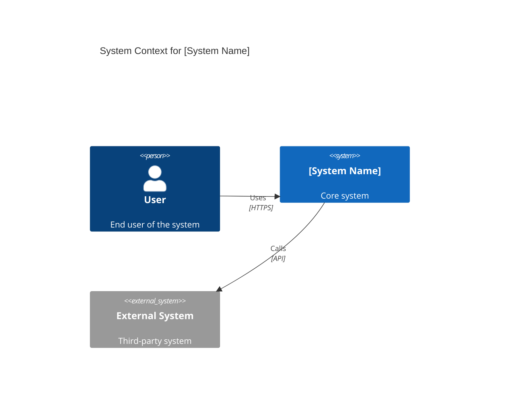
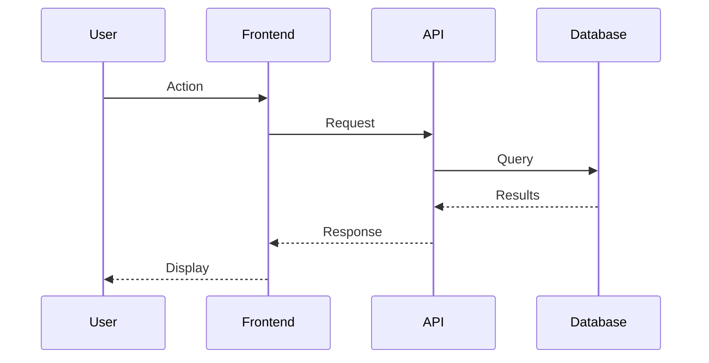
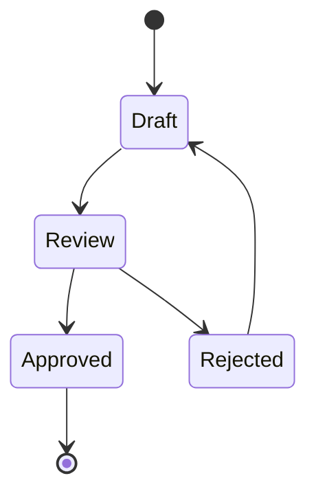

# Template Selection Guide

**Purpose**: Quick reference for selecting document templates and diagram patterns
**Token Budget**: ~800 tokens (~100 lines)
**Last Updated**: November 2025

---

## Document Type Decision Matrix

| User Need | Template Type | Load File |
|-----------|---------------|-----------|
| Architecture diagrams | Mermaid patterns | `mermaid-diagram-patterns.md` |
| Presentations (Strategy, Architecture) | Presentation templates | `presentation-templates.md` |
| Technical documentation | Technical docs | `technical-documentation-templates.md` |
| Business case / ROI analysis | Business case | `business-case-templates.md` |
| Proposals and RFP responses | Proposal templates | `proposal-templates.md` |
| Architecture decisions | ADRs | `architecture-decision-records.md` |
| Vision phase deliverables | Vision templates | `vision-phase-templates.md` |
| Validate phase deliverables | Validate templates | `validate-phase-templates.md` |

---

## Quick Diagram Patterns (Inline)

### C4 Context Diagram (10-line template)


### Simple Sequence Diagram (12-line template)


### State Diagram (10-line template)


**For complex diagrams**: Load `templates/mermaid-diagram-patterns.md` (1,974 lines)

---

## Mermaid Diagram Library

**Available Diagram Types**:
- **C4 Diagrams**: Context, Container, Component, Dynamic, Deployment
- **Sequence Diagrams**: API flows, process interactions
- **State Diagrams**: Workflow, process states
- **Entity Relationship**: Data models, database schemas
- **Flowcharts**: Decision trees, process flows
- **Gantt Charts**: Roadmaps, project timelines
- **Class Diagrams**: Object models

**Branding**:
Always ask: "Which branding should I apply?" (Microsoft, client-specific, or generic)

**Keywords**: diagram, mermaid, C4, sequence, state, ER, flowchart, visualization

**Load Full Library**: `templates/mermaid-diagram-patterns.md`

---

## Presentation Templates

**Use Cases**:
- Executive briefings
- Architecture reviews
- Vision presentations
- Stakeholder updates

**Standard Structures**:
1. **Executive Summary Deck** (10-15 slides)
2. **Technical Deep Dive** (20-30 slides)
3. **Architecture Review** (15-20 slides)
4. **Business Case Presentation** (12-18 slides)

**Keywords**: presentation, PowerPoint, slide deck, executive briefing

**Load Full Templates**: `templates/presentation-templates.md`

**Skill Integration**: Use **pptx skill** for actual presentation creation

---

## Technical Documentation Templates

**Use Cases**:
- Solution Design Documents (SDD)
- High-Level Design (HLD)
- Low-Level Design (LLD)
- API documentation
- Runbooks and operations guides

**Common Structures**:
- Architecture overview with C4 diagrams
- Component specifications
- Integration patterns
- Security architecture
- Deployment architecture
- Monitoring and observability

**Keywords**: technical documentation, design document, SDD, HLD, LLD, runbook

**Load Full Templates**: `templates/technical-documentation-templates.md`

**Skill Integration**: Use **docx skill** for document creation

---

## Business Case Templates

**Use Cases**:
- Investment justification
- ROI analysis
- Cost-benefit analysis
- Business value assessment

**Key Sections**:
- Executive summary
- Problem statement
- Proposed solution
- Financial analysis (TCO, ROI)
- Risk assessment
- Implementation roadmap

**Keywords**: business case, ROI, TCO, investment, cost-benefit, financial analysis

**Load Full Templates**: `templates/business-case-templates.md`

**Skill Integration**: Use **xlsx skill** for financial modeling

---

## Proposal Templates

**Use Cases**:
- RFP responses
- SOW (Statement of Work)
- Client proposals
- Engagement letters

**Standard Sections**:
- Executive summary
- Understanding of requirements
- Proposed approach
- Team and qualifications
- Timeline and milestones
- Pricing and commercials

**Keywords**: proposal, RFP, SOW, statement of work, engagement letter

**Load Full Templates**: `templates/proposal-templates.md`

---

## Architecture Decision Records (ADRs)

**When to Use**:
- Documenting significant architecture decisions
- Capturing decision context and rationale
- Recording trade-offs and alternatives considered

**ADR Template**:
```markdown
# ADR-NNN: [Decision Title]

## Status
[Proposed | Accepted | Deprecated | Superseded]

## Context
[What is the issue we're facing?]

## Decision
[What did we decide?]

## Consequences
[What are the positive and negative impacts?]

## Alternatives Considered
[What other options did we evaluate?]
```

**Keywords**: ADR, architecture decision, decision record, trade-off

**Load Full Guide**: `templates/architecture-decision-records.md`

---

## Phase-Specific Templates

### Vision Phase Templates
- Target Operating Model (TOM) diagrams
- Maturity assessment frameworks
- Gap analysis visualizations
- Transformation roadmaps

**Load**: `templates/vision-phase-templates.md`

### Validate Phase Templates
- Hypothesis validation frameworks
- POC success criteria
- MVP scope definition
- Go/no-go decision frameworks

**Load**: `templates/validate-phase-templates.md`

---

## Template Loading Strategy

**Simple Need** (e.g., "create a sequence diagram"):
→ Use inline template above (no file load needed)

**Medium Need** (e.g., "create architecture presentation"):
→ Load specific template file (e.g., `presentation-templates.md`)

**Complex Need** (e.g., "complete Vision phase deliverables"):
→ Load phase-specific templates + diagram library

---

## Skills Integration

**Always consult relevant skills before creating documents**:

- **pptx skill** → All presentations
- **docx skill** → Documentation and reports
- **xlsx skill** → Analysis, business cases, financial models
- **pdf skill** → Final reports and formal documents
- **User-uploaded skills** → Client-specific templates and brand guidelines

---

*Template Guide Version: 1.0*
*Template Files: 8*
*Integration: pptx, docx, xlsx, pdf skills*
