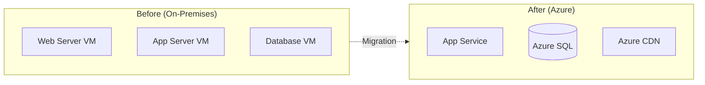

# Architecture Decision Records (ADR) Templates

## Overview

Architecture Decision Records (ADRs) document important architectural decisions along with their context and consequences. ADRs create an audit trail of why systems are built the way they are, enabling teams to understand past decisions and make informed future choices.

**Skills-First Reminder**: Before creating ANY ADR, ALWAYS check for available skills:
- **docx skill** → ADR documents for version control and collaboration
- **pdf skill** → Final ADRs for formal architectural governance
- **pptx skill** → ADR presentations for architecture review boards
- Check for user-uploaded skills for custom ADR templates or brand guidelines

**Reference**: [ADR GitHub Initiative](https://adr.github.io/) - Community-driven ADR best practices

## What is an Architecture Decision Record?

An ADR is a document that captures a significant architectural decision along with its context and consequences. Key characteristics:

- **Immutable**: Once accepted, ADRs are not edited; they are superseded by new ADRs
- **Numbered**: Sequential numbering for easy reference (ADR-001, ADR-002, etc.)
- **Concise**: Typically 1-2 pages, focused on the decision
- **Discoverable**: Stored in version control, searchable
- **Context-rich**: Explains the "why" not just the "what"

---

## ADR Template Structure

### Standard ADR Template (use **docx skill**)

```markdown
# ADR-[NUMBER]: [Short Title of Decision]

**Status**: [Proposed | Accepted | Deprecated | Superseded by ADR-XXX]

**Date**: [YYYY-MM-DD]

**Deciders**: [List of people involved in the decision]

**Technical Context**: [e.g., Construct Phase, Production Deployment]

---

## Context

### Current Situation
[Describe the current state, problem, or opportunity]

### Forces at Play
[List the factors, constraints, and requirements influencing the decision]

**Business Drivers**:
- [Driver 1]: [Description]
- [Driver 2]: [Description]

**Technical Constraints**:
- [Constraint 1]: [Description]
- [Constraint 2]: [Description]

**Regulatory/Compliance**:
- [Requirement 1]: [Description]

**Quality Attributes**:
- [Attribute 1 - e.g., Performance]: [Target or requirement]
- [Attribute 2 - e.g., Security]: [Target or requirement]

---

## Decision

**We will**: [Clear, concise statement of the decision]

[Detailed explanation of what was decided, including:]
- Specific technology, pattern, or approach chosen
- Scope and boundaries of the decision
- Implementation approach
- Timeline or phasing (if applicable)

---

## Rationale

**Why this decision**:

1. **[Reason 1]**: [Explanation of how this decision addresses a force/constraint]
2. **[Reason 2]**: [Explanation]
3. **[Reason 3]**: [Explanation]

**Key Benefits**:
- [Benefit 1]: [Description and impact]
- [Benefit 2]: [Description and impact]

**Alignment**:
- Aligns with [corporate strategy/technical vision/architecture principle]
- Supports [Well-Architected Framework pillar - e.g., Security, Reliability]

---

## Alternatives Considered

### Alternative 1: [Name]
**Description**: [What was this option?]

**Pros**:
- [Pro 1]
- [Pro 2]

**Cons**:
- [Con 1]
- [Con 2]

**Why Not Chosen**: [Brief explanation]

### Alternative 2: [Name]
[Same structure as Alternative 1]

### Alternative 3: Do Nothing / Status Quo
**Description**: Continue with current approach

**Why Not Chosen**: [Risks and costs of inaction]

---

## Consequences

### Positive Consequences
- **[Consequence 1]**: [Description of benefit]
- **[Consequence 2]**: [Description of benefit]

### Negative Consequences / Trade-offs
- **[Consequence 1]**: [Description of drawback or compromise]
  - **Mitigation**: [How we'll address this]
- **[Consequence 2]**: [Description]
  - **Mitigation**: [How we'll address this]

### Risks
- **[Risk 1]**: [Description] - **Mitigation**: [Strategy]
- **[Risk 2]**: [Description] - **Mitigation**: [Strategy]

### Impact Areas
- **Development**: [How this affects development process]
- **Operations**: [How this affects operations]
- **Cost**: [Financial implications - one-time and recurring]
- **Skills**: [Team skills needed, training required]
- **Vendors**: [Vendor dependencies created or removed]

---

## Implementation Notes

**Prerequisites**:
- [Prerequisite 1]
- [Prerequisite 2]

**Timeline**:
- [Phase 1]: [Timeframe and activities]
- [Phase 2]: [Timeframe and activities]

**Success Criteria**:
- [Criterion 1]: [How we'll measure success]
- [Criterion 2]: [How we'll measure success]

---

## Related Decisions

- **ADR-XXX**: [Related decision title] - [Relationship description]
- **ADR-YYY**: [Related decision title] - [Relationship description]

---

## References

- [Link to documentation]
- [Link to proof of concept results]
- [Link to vendor evaluation]
- [Link to architectural diagrams - use Mermaid]

---

## Approval

| Role | Name | Signature | Date |
|------|------|-----------|------|
| Solution Architect | | | |
| Technical Lead | | | |
| Security Architect | | | |
| Enterprise Architect | | | |

---

**Notes**: [Any additional context, follow-up actions, or review dates]
```

---

## ADR Best Practices

### When to Create an ADR

Create an ADR for decisions that:

✅ **Structural Impact**: Affect the fundamental structure of the system
✅ **High Cost to Change**: Would be expensive to reverse later
✅ **Affect Multiple Teams**: Cross-team or enterprise-wide impact
✅ **Non-Obvious**: Not immediately obvious why this choice was made
✅ **Set Precedent**: Establish patterns for future decisions
✅ **Compliance/Security**: Impact regulatory or security posture

**Examples**:
- Choosing Azure vs. AWS vs. on-premises
- Selecting microservices vs. monolithic architecture
- Choosing SQL vs. NoSQL database
- Implementing Zero Trust security model
- Adopting Domain-Driven Design patterns

**Don't create ADRs for**:
- ❌ Routine implementation details (variable naming, code style)
- ❌ Easily reversible decisions
- ❌ Team-local decisions with no broader impact
- ❌ Obvious choices with no real alternatives

### ADR Numbering and Versioning

**Numbering Convention**:
- Use sequential numbers: ADR-001, ADR-002, ADR-003, etc.
- Zero-pad for sorting: ADR-001 (not ADR-1)
- Never reuse numbers, even if an ADR is superseded

**Status Lifecycle**:
1. **Proposed**: Under discussion, not yet decided
2. **Accepted**: Decision made and approved
3. **Deprecated**: No longer applicable but not replaced
4. **Superseded by ADR-XXX**: Replaced by a newer decision

**Versioning**:
- ADRs are immutable once accepted
- Do not edit accepted ADRs
- If the decision changes, create a new ADR that supersedes the old one
- Update the old ADR status to "Superseded by ADR-XXX"

### Storage and Organization

**Recommended Locations**:

1. **In Source Control** (Preferred):
   ```
   /docs/architecture/decisions/
   ├── ADR-001-azure-as-cloud-platform.md
   ├── ADR-002-dataverse-as-data-platform.md
   ├── ADR-003-domain-driven-design-adoption.md
   └── README.md (index of all ADRs)
   ```

2. **In SharePoint/Confluence**: For non-technical stakeholder access

3. **Both**: Store in Git, publish to SharePoint for visibility

**File Naming**:
- `ADR-[NUMBER]-[short-title-kebab-case].md`
- Example: `ADR-015-azure-openai-for-copilot.md`

**Format**:
- Markdown (preferred) for version control
- Word/PDF (use **docx skill** or **pdf skill**) for formal governance
- Both: Generate PDFs from Markdown for archival

### Review and Approval Process

**Typical Flow**:

1. **Draft**: Author creates ADR in "Proposed" status
2. **Peer Review**: Technical leads review and provide feedback
3. **Architecture Review Board (ARB)**: Present to ARB for discussion
4. **Approval**: ARB approves, status changed to "Accepted"
5. **Communication**: Share with affected teams
6. **Implementation**: Implement per the ADR
7. **Retrospective**: Review outcomes after implementation

**Approval Authority**:
- **System-level ADRs**: Solution Architect + Tech Lead
- **Enterprise-wide ADRs**: Enterprise Architect + CTO/CIO
- **Security-impacting ADRs**: Security Architect required
- **High-cost ADRs**: May require CFO/budget approval

**Timeline**:
- Allow 1-2 weeks for review and feedback
- Urgent decisions: Expedited ARB review within 48 hours
- Document if normal process was bypassed (e.g., emergency)

### Lifecycle Management

**Reviewing ADRs**:
- Quarterly: Review recent ADRs to validate decisions
- Annually: Review all ADRs for obsolescence
- Major changes: Review affected ADRs when system evolves

**Deprecating ADRs**:
- Mark as "Deprecated" if no longer applicable
- Do not delete - preserve historical record
- Document why it's deprecated

**Superseding ADRs**:
- Create new ADR with updated decision
- Reference original ADR: "Supersedes ADR-XXX"
- Update original ADR: "Superseded by ADR-YYY"

---

## Common ADR Categories

### 1. Platform Selection Decisions

**Examples**:
- ADR-001: Adopt Microsoft Azure as Cloud Platform
- ADR-015: Use Dataverse as Enterprise Data Platform
- ADR-027: Adopt Power Platform for Citizen Development

**Key Considerations**:
- Vendor evaluation criteria
- Total Cost of Ownership (TCO)
- Licensing and support
- Migration path from current state
- Skill availability and training needs

### 2. Integration Pattern Choices

**Examples**:
- ADR-008: Use Azure Service Bus for Asynchronous Integration
- ADR-012: Adopt API Management for External APIs
- ADR-019: Implement Event-Driven Architecture with Event Grid

**Key Considerations**:
- Synchronous vs. asynchronous
- Performance and latency requirements
- Error handling and retry logic
- Security and authentication patterns
- Monitoring and observability

### 3. Security Control Implementations

**Examples**:
- ADR-005: Implement Zero Trust Architecture
- ADR-011: Adopt Azure AD B2C for Customer Identity
- ADR-023: Use Managed Identities for Service Authentication

**Key Considerations**:
- Compliance requirements (GDPR, HIPAA, SOX)
- Threat model and attack vectors
- Defense in depth strategy
- Audit and logging requirements
- Incident response procedures

### 4. Performance Optimization Tradeoffs

**Examples**:
- ADR-007: Implement CQRS Pattern for Read Scalability
- ADR-014: Use Redis Cache for Session State
- ADR-021: Adopt CDN for Static Content Delivery

**Key Considerations**:
- Performance targets (latency, throughput)
- Scalability requirements
- Cost implications
- Complexity vs. benefit tradeoff
- Monitoring and alerting strategy

### 5. Cost Optimization Decisions

**Examples**:
- ADR-009: Use Azure Reserved Instances for Predictable Workloads
- ADR-018: Implement Auto-Scaling for Non-Production Environments
- ADR-025: Adopt FinOps Practices for Cost Management

**Key Considerations**:
- Budget constraints
- Cost vs. performance tradeoffs
- Cost vs. reliability tradeoffs
- FinOps governance
- Cost allocation and chargeback

---

## Integration with Skills and Tools

### Using docx Skill for ADRs

**Workflow**:
1. Create ADR using **docx skill** with template above
2. Store in SharePoint with version control enabled
3. Enable comments for collaborative review
4. Track changes during review process
5. Generate final PDF using **pdf skill** when accepted

**Benefits**:
- Professional formatting
- Easy collaboration and commenting
- Version history built-in
- Familiar to stakeholders

### Using Mermaid Diagrams in ADRs

Include architecture diagrams to visualize decisions:

**Example - Before/After Architecture**:


**Reference**: Load `mermaid-diagram-patterns.md` for comprehensive diagram templates

### Version Control Best Practices

**Git Workflow**:
```bash
# Create feature branch for ADR
git checkout -b adr/015-azure-openai-adoption

# Create ADR file
# docs/architecture/decisions/ADR-015-azure-openai-adoption.md

# Commit with descriptive message
git add docs/architecture/decisions/ADR-015-azure-openai-adoption.md
git commit -m "docs: Add ADR-015 for Azure OpenAI adoption decision"

# Push and create PR for review
git push origin adr/015-azure-openai-adoption

# After approval, merge to main
# ADR status changed to "Accepted"
```

---

## Example ADR Scenarios

### Scenario 1: Choosing Between Microservices and Monolith
- **Context**: Building new enterprise application
- **Decision**: Start with modular monolith, transition to microservices
- **Rationale**: Balance agility with team maturity
- **Consequences**: Easier initial development, planned migration path

### Scenario 2: Data Residency for Multi-Geo Deployment
- **Context**: Global expansion with data sovereignty requirements
- **Decision**: Deploy regional Azure instances with data replication
- **Rationale**: Compliance with GDPR and local regulations
- **Consequences**: Increased complexity, higher cost, compliance achieved

### Scenario 3: AI Model Selection for Copilot
- **Context**: Building internal copilot for customer service
- **Decision**: Use Azure OpenAI GPT-4o with RAG pattern
- **Rationale**: Best balance of capability, cost, and data privacy
- **Consequences**: Enterprise-grade AI, higher cost than alternatives, vendor dependency

---

## Related References

- `/references/phases/phase-construct.md` - ADRs created during Construct phase
- `/references/frameworks/domain-driven-design.md` - DDD architectural decisions
- `/references/templates/technical-documentation-templates.md` - Related documentation
- `/references/templates/mermaid-diagram-patterns.md` - Diagrams for ADRs
- `/references/quality-standards.md` - Quality criteria for ADRs

## External Resources

- **ADR GitHub**: https://adr.github.io/
- **ADR Tools**: https://github.com/npryce/adr-tools
- **Microsoft Architecture Center**: https://learn.microsoft.com/en-us/azure/architecture/
- **MADR Template**: https://adr.github.io/madr/ (Markdown ADR)

---

## When to Load This Reference

Load this reference when:
- Creating architecture decision records
- Establishing ADR governance processes
- Documenting significant architectural choices
- Onboarding teams to ADR practices
- Keywords: "ADR", "architecture decision", "decision record", "architectural choice", "governance", "documentation"
