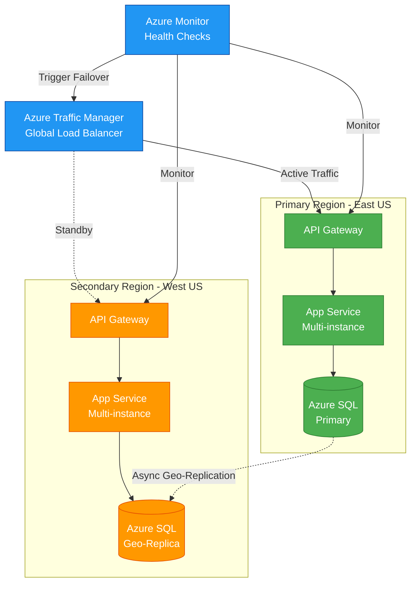
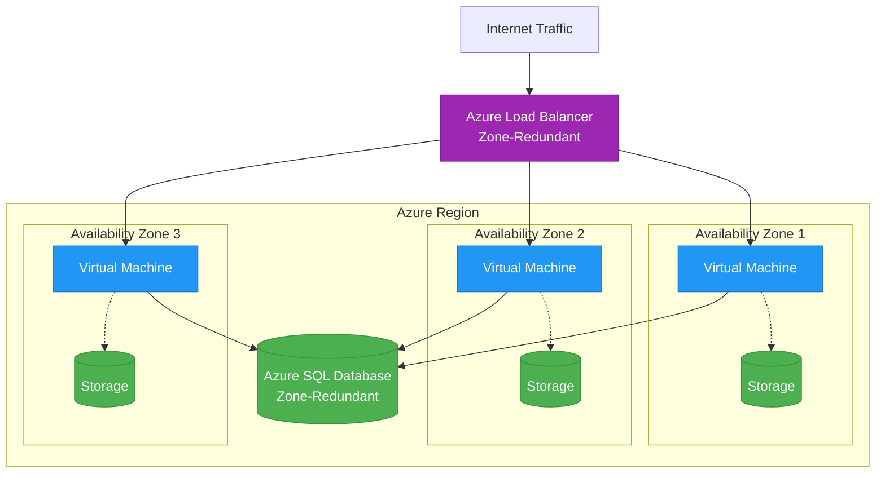
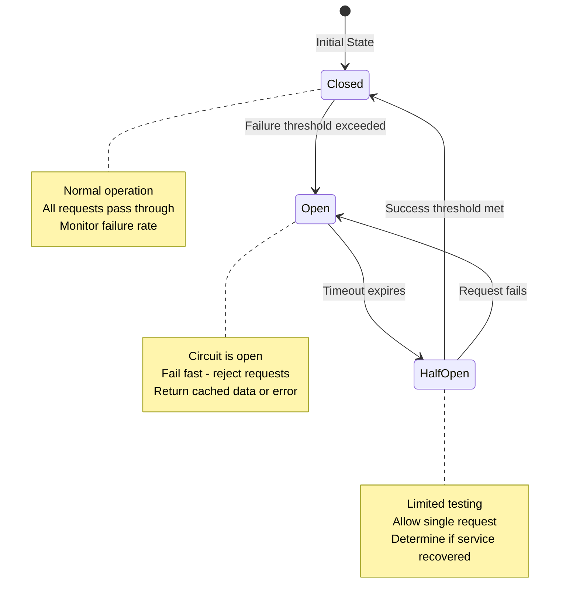
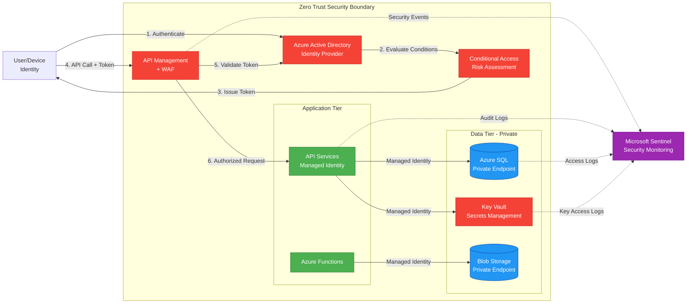
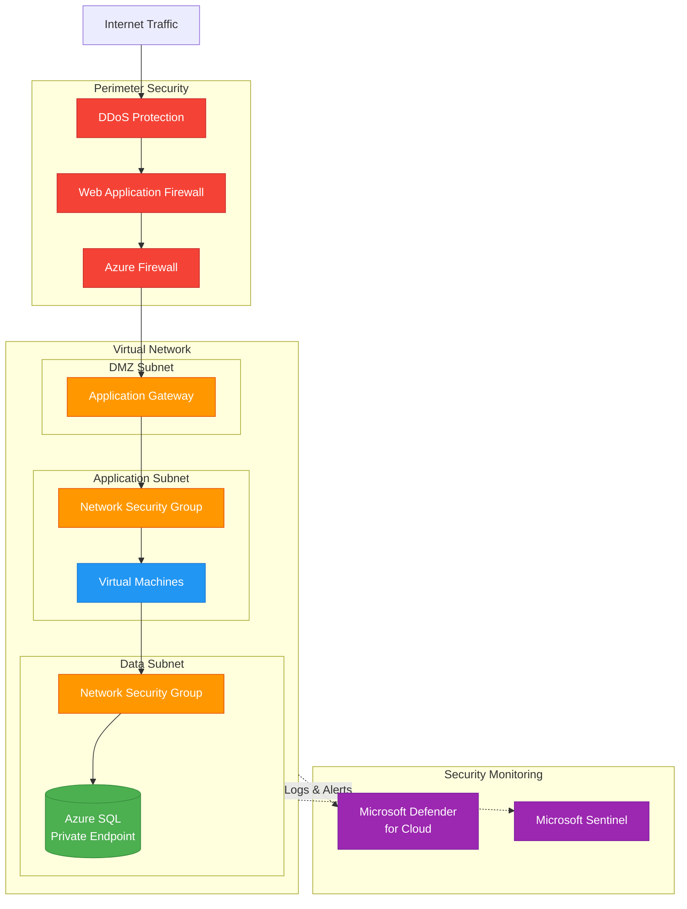

# MS-Enterprise-Architect Skill Generation Plan

## Project Overview

**Objective**: Convert the Microsoft Solutions Architect project into a comprehensive Claude skill called "ms-enterprise-architect" with modular reference files loaded on demand.

**Source Material**: Microsoft_Solutions_Architect.md project definition + EA-Prompt-Mermaid.pdf framework

**Repository Structure**: Following Anthropics skills repository pattern (https://github.com/anthropics/skills)

**Key Principles**:
- Skills-first approach (always consult relevant skills before document creation)
- On-demand loading based on keywords and context
- Mermaid.js diagram-as-code for all architecture visualizations
- 5-phase methodology: Vision → Validate → Construct → Deploy → Evolve
- Dual Well-Architected Frameworks (Azure + Power Platform)
- Domain-Driven Design strategic patterns emphasis
- Git commit after each completed task for version control

---

## Repository Structure (Following Anthropics Pattern)

```
root/
├── ms-enterprise-architect/
│   ├── SKILL.md (main entry point)
│   └── references/
│       ├── phases/
│       │   ├── delivery-methodology-overview.md
│       │   ├── phase-vision.md
│       │   ├── phase-validate.md
│       │   ├── phase-construct.md
│       │   ├── phase-deploy.md
│       │   └── phase-evolve.md
│       ├── frameworks/
│       │   ├── domain-driven-design.md
│       │   ├── azure-waf-reliability.md
│       │   ├── azure-waf-security.md
│       │   ├── azure-waf-cost-optimization.md
│       │   ├── azure-waf-operational-excellence.md
│       │   ├── azure-waf-performance-efficiency.md
│       │   ├── powerplatform-waf-reliability.md
│       │   ├── powerplatform-waf-security.md
│       │   ├── powerplatform-waf-operational-excellence.md
│       │   ├── powerplatform-waf-performance-efficiency.md
│       │   ├── powerplatform-waf-experience-optimization.md
│       │   └── agent-development-framework.md
│       ├── technology/
│       │   ├── core-platforms.md
│       │   ├── m365-specifics.md
│       │   ├── power-platform-specifics.md
│       │   ├── azure-specifics.md
│       │   ├── dynamics-specifics.md
│       │   └── ai-cognitive-specifics.md
│       ├── templates/
│       │   ├── vision-phase-templates.md
│       │   ├── validate-phase-templates.md
│       │   ├── presentation-templates.md
│       │   ├── proposal-templates.md
│       │   ├── technical-documentation-templates.md
│       │   ├── business-case-templates.md
│       │   ├── architecture-decision-records.md
│       │   └── mermaid-diagram-patterns.md
│       ├── scenarios/
│       │   ├── multi-geo-deployments.md
│       │   ├── merger-acquisition.md
│       │   ├── regulated-industries.md
│       │   └── large-scale-migrations.md
│       ├── competitive-positioning.md
│       ├── quality-standards.md
│       ├── emergency-response.md
│       └── essential-resources.md
└── plans/
    └── ms-enterprise-architect-plan.md (this file)
```

---

## Git Workflow for Claude Code

### Repository Setup

**Before starting**, ensure you're working within a repository that follows the correct structure:

```bash
# Navigate to repository root
cd /path/to/repository

# Create skill directory structure
mkdir -p ms-enterprise-architect/references/{phases,frameworks,technology,templates,scenarios}

# Create plans directory if it doesn't exist
mkdir -p plans

# Initialize git if not already done
git init  # (skip if repository already exists)

# Copy this plan to the plans directory
cp /path/to/PLAN.md plans/ms-enterprise-architect-plan.md

# Initial commit for the plan
git add plans/ms-enterprise-architect-plan.md
git commit -m "docs(ms-enterprise-architect): Add comprehensive skill generation plan"
```

### Commit Strategy (CRITICAL)

**After completing EACH task**, you MUST commit the changes. This provides:
- Version control and rollback capability
- Clear audit trail of skill development
- Ability to track progress through git history
- Safe checkpoints during long-running generation

**Commit command template**:
```bash
git add ms-enterprise-architect/
git commit -m "feat(ms-enterprise-architect): Task [NUMBER] - [BRIEF_DESCRIPTION]"
```

### Commit Examples Per Phase

**Foundation Phase (Tasks 1-3)**:
```bash
# Task 1
git add ms-enterprise-architect/
git commit -m "feat(ms-enterprise-architect): Task 1 - Create directory structure"

# Task 2
git add ms-enterprise-architect/SKILL.md
git commit -m "feat(ms-enterprise-architect): Task 2 - Create main SKILL.md with trigger logic and navigation"

# Task 3
git add ms-enterprise-architect/references/phases/delivery-methodology-overview.md
git commit -m "feat(ms-enterprise-architect): Task 3 - Add delivery methodology overview"
```

**Methodology Phase (Tasks 4-8)**:
```bash
git commit -m "feat(ms-enterprise-architect): Task 4 - Add Vision phase documentation"
git commit -m "feat(ms-enterprise-architect): Task 5 - Add Validate phase documentation"
git commit -m "feat(ms-enterprise-architect): Task 6 - Add Construct phase documentation"
git commit -m "feat(ms-enterprise-architect): Task 7 - Add Deploy phase documentation"
git commit -m "feat(ms-enterprise-architect): Task 8 - Add Evolve phase documentation"
```

**Azure WAF Phase (Tasks 9-13)**:
```bash
git commit -m "feat(ms-enterprise-architect): Task 9 - Add Azure WAF Reliability pillar"
git commit -m "feat(ms-enterprise-architect): Task 10 - Add Azure WAF Security pillar"
git commit -m "feat(ms-enterprise-architect): Task 11 - Add Azure WAF Cost Optimization pillar"
git commit -m "feat(ms-enterprise-architect): Task 12 - Add Azure WAF Operational Excellence pillar"
git commit -m "feat(ms-enterprise-architect): Task 13 - Add Azure WAF Performance Efficiency pillar"
```

**Power Platform WAF Phase (Tasks 14-18)**:
```bash
git commit -m "feat(ms-enterprise-architect): Task 14 - Add Power Platform WAF Reliability pillar"
git commit -m "feat(ms-enterprise-architect): Task 15 - Add Power Platform WAF Security pillar"
git commit -m "feat(ms-enterprise-architect): Task 16 - Add Power Platform WAF Operational Excellence pillar"
git commit -m "feat(ms-enterprise-architect): Task 17 - Add Power Platform WAF Performance Efficiency pillar"
git commit -m "feat(ms-enterprise-architect): Task 18 - Add Power Platform WAF Experience Optimization pillar"
```

**Strategic Frameworks Phase (Tasks 19-20)**:
```bash
git commit -m "feat(ms-enterprise-architect): Task 19 - Add Domain-Driven Design framework"
git commit -m "feat(ms-enterprise-architect): Task 20 - Add Agent Development framework"
```

**Technology Stack Phase (Tasks 21-26)**:
```bash
git commit -m "feat(ms-enterprise-architect): Task 21 - Add core platforms overview"
git commit -m "feat(ms-enterprise-architect): Task 22 - Add M365 specifics"
git commit -m "feat(ms-enterprise-architect): Task 23 - Add Power Platform specifics"
git commit -m "feat(ms-enterprise-architect): Task 24 - Add Azure specifics"
git commit -m "feat(ms-enterprise-architect): Task 25 - Add Dynamics 365 specifics"
git commit -m "feat(ms-enterprise-architect): Task 26 - Add AI & Cognitive Services specifics"
```

**Templates Phase (Tasks 27-34)**:
```bash
git commit -m "feat(ms-enterprise-architect): Task 27 - Add Vision phase templates"
git commit -m "feat(ms-enterprise-architect): Task 28 - Add Validate phase templates"
git commit -m "feat(ms-enterprise-architect): Task 29 - Add presentation templates"
git commit -m "feat(ms-enterprise-architect): Task 30 - Add proposal templates"
git commit -m "feat(ms-enterprise-architect): Task 31 - Add technical documentation templates"
git commit -m "feat(ms-enterprise-architect): Task 32 - Add business case templates"
git commit -m "feat(ms-enterprise-architect): Task 33 - Add architecture decision records templates"
git commit -m "feat(ms-enterprise-architect): Task 34 - Add Mermaid diagram patterns library"
```

**Scenarios & Support Phase (Tasks 35-39)**:
```bash
git commit -m "feat(ms-enterprise-architect): Task 35 - Add multi-geo deployments scenario"
git commit -m "feat(ms-enterprise-architect): Task 36 - Add merger & acquisition scenario"
git commit -m "feat(ms-enterprise-architect): Task 37 - Add regulated industries scenario"
git commit -m "feat(ms-enterprise-architect): Task 38 - Add large-scale migrations scenario"
git commit -m "feat(ms-enterprise-architect): Task 39 - Add supporting reference files"
```

**Quality Assurance (Task 40)**:
```bash
git commit -m "feat(ms-enterprise-architect): Task 40 - Complete QA validation and cross-reference checks"
```

### Final Release Commit

After successfully completing ALL tasks and validation:

```bash
# Final commit
git add ms-enterprise-architect/
git commit -m "feat(ms-enterprise-architect): v1.0.0 - Complete enterprise architect skill with all 40 tasks

- 5-phase delivery methodology (Vision, Validate, Construct, Deploy, Evolve)
- Dual Well-Architected Frameworks (Azure + Power Platform)
- Domain-Driven Design strategic patterns
- Agent Development framework for AI solutions
- Complete Microsoft platform coverage (M365, Power Platform, Azure, Dynamics, AI)
- Comprehensive template library with Mermaid diagram patterns
- Special scenarios (multi-geo, M&A, regulated, migrations)
- Quality standards and emergency response procedures

Total: 40+ reference files, 50,000+ words of enterprise architecture guidance"

# Tag the release
git tag -a v1.0.0 -m "Release v1.0.0: Microsoft Enterprise Architect Skill"

# Push to remote (if applicable)
git push origin main
git push origin v1.0.0
```

### Commit Message Convention

Follow **Conventional Commits** specification:

**Format**: `<type>(<scope>): <description>`

**Types**:
- `feat`: New feature/content/file
- `docs`: Documentation updates
- `fix`: Bug fixes or corrections
- `refactor`: Code/content restructuring
- `test`: Adding or updating tests/validations
- `chore`: Maintenance tasks

**Scope**: Always use `ms-enterprise-architect`

**Examples**:
- ✅ `feat(ms-enterprise-architect): Task 2 - Create main SKILL.md with trigger logic`
- ✅ `fix(ms-enterprise-architect): Correct cross-reference in DDD framework`
- ✅ `docs(ms-enterprise-architect): Update Azure WAF links to latest Microsoft docs`
- ❌ `added files` (too vague, no scope, no task reference)
- ❌ `Task 5` (no type, no description)

### Verification Between Commits

After each commit, verify:
```bash
# Check what was committed
git log -1 --stat

# Verify file was created
ls -la ms-enterprise-architect/references/[category]/[filename].md

# Quick content check (first 20 lines)
head -20 ms-enterprise-architect/references/[category]/[filename].md
```

---

## Execution Strategy for Claude Code

### Overview
This skill will be built in **10 phases across 40 tasks**. Each task creates specific files and MUST be followed by a git commit.

### Phase 1: Foundation (Tasks 1-3)
**Objective**: Establish structure and entry point
- Task 1: Create directory structure
- Task 2: Create main SKILL.md with full trigger logic
- Task 3: Create delivery methodology overview
**Git commits**: 3 commits

### Phase 2: Core Methodology (Tasks 4-8)  
**Objective**: Document all delivery phases
- Task 4: Create phase-vision.md
- Task 5: Create phase-validate.md
- Task 6: Create phase-construct.md
- Task 7: Create phase-deploy.md
- Task 8: Create phase-evolve.md
**Git commits**: 5 commits

### Phase 3: Frameworks - Azure WAF (Tasks 9-13)
**Objective**: Complete Azure Well-Architected Framework
- Task 9: Create azure-waf-reliability.md
- Task 10: Create azure-waf-security.md
- Task 11: Create azure-waf-cost-optimization.md
- Task 12: Create azure-waf-operational-excellence.md
- Task 13: Create azure-waf-performance-efficiency.md
**Git commits**: 5 commits

### Phase 4: Frameworks - Power Platform WAF (Tasks 14-18)
**Objective**: Complete Power Platform Well-Architected Framework
- Task 14: Create powerplatform-waf-reliability.md
- Task 15: Create powerplatform-waf-security.md
- Task 16: Create powerplatform-waf-operational-excellence.md
- Task 17: Create powerplatform-waf-performance-efficiency.md
- Task 18: Create powerplatform-waf-experience-optimization.md (unique to Power Platform)
**Git commits**: 5 commits

### Phase 5: Frameworks - Strategic (Tasks 19-20)
**Objective**: Add DDD and Agentic AI frameworks
- Task 19: Create domain-driven-design.md (emphasis on context mapping)
- Task 20: Create agent-development-framework.md (multi-agent patterns)
**Git commits**: 2 commits

### Phase 6: Technology Stack (Tasks 21-26)
**Objective**: Document all Microsoft platforms
- Task 21: Create core-platforms.md (overview)
- Task 22: Create m365-specifics.md
- Task 23: Create power-platform-specifics.md
- Task 24: Create azure-specifics.md
- Task 25: Create dynamics-specifics.md
- Task 26: Create ai-cognitive-specifics.md
**Git commits**: 6 commits

### Phase 7: Templates - Phase-Specific (Tasks 27-28)
**Objective**: Create phase-specific templates
- Task 27: Create vision-phase-templates.md (TOM, gap analysis, business case)
- Task 28: Create validate-phase-templates.md (hypothesis testing, MVP)
**Git commits**: 2 commits

### Phase 8: Templates - Document Types (Tasks 29-34)
**Objective**: Complete template library
- Task 29: Create presentation-templates.md
- Task 30: Create proposal-templates.md
- Task 31: Create technical-documentation-templates.md
- Task 32: Create business-case-templates.md
- Task 33: Create architecture-decision-records.md
- Task 34: Create mermaid-diagram-patterns.md (CRITICAL - 3500 words, most referenced)
**Git commits**: 6 commits

### Phase 9: Scenarios & Support (Tasks 35-39)
**Objective**: Add specialized scenarios and supporting content
- Task 35: Create multi-geo-deployments.md
- Task 36: Create merger-acquisition.md
- Task 37: Create regulated-industries.md
- Task 38: Create large-scale-migrations.md
- Task 39: Create supporting files (competitive-positioning, quality-standards, emergency-response, essential-resources)
**Git commits**: 5 commits

### Phase 10: Quality Assurance (Task 40)
**Objective**: Validate and finalize
- Task 40: Complete QA checklist, validate cross-references, final review
**Git commits**: 1 final commit + release tag

**Total**: 40 tasks, 40 commits, 1 release tag

---

## Task Execution Guidelines for Claude Code

### Critical Requirements

1. **Sequential Execution**: Complete tasks in order (1→40)
2. **Git Commit After Each Task**: MANDATORY - provides rollback points and audit trail
3. **Validation Before Commit**: Verify file created and meets requirements
4. **Reference Source Material**: Use Microsoft_Solutions_Architect.md + EA-Prompt-Mermaid.pdf
5. **Follow Specifications**: Each task has detailed requirements below

### Working Pattern

For **EACH** task, follow this exact pattern:

```bash
# 1. Create the file(s) specified in the task
# 2. Write complete content per specification
# 3. Validate file meets requirements
# 4. Stage changes
git add ms-enterprise-architect/

# 5. Commit with proper message
git commit -m "feat(ms-enterprise-architect): Task [N] - [Description]"

# 6. Verify commit
git log -1 --stat

# 7. Proceed to next task
```

### Context Window Management

If context window becomes constrained:
1. Complete current task and commit
2. Reference this PLAN.md for next task specifications
3. Continue from where you left off
4. Git history preserves all progress

### Quality Standards

Every reference file must have:
- ✅ Minimum 1500 words (except where specified otherwise)
- ✅ Proper markdown formatting
- ✅ Cross-references to related files
- ✅ Microsoft resource URLs where applicable
- ✅ Mermaid diagram examples where required
- ✅ Skills-first reminders in templates
- ✅ Clear, comprehensive content

### Phase Completion Checkpoints

After completing each phase (every 5-8 tasks):
```bash
# Review what was completed
git log --oneline | head -10

# Verify file structure
ls -R ms-enterprise-architect/references/

# Quick content spot check
wc -w ms-enterprise-architect/references/[category]/*.md
```

### Error Handling

If a task fails or needs correction:
```bash
# Fix the file
# Stage the fix
git add ms-enterprise-architect/

# Commit the fix
git commit -m "fix(ms-enterprise-architect): Task [N] - Correct [issue]"

# Continue with next task
```

---

## Detailed Task Breakdown

### TASK 1: Create Directory Structure

**Objective**: Establish the skill folder structure following Anthropics repository pattern

**Commands**:
```bash
# Navigate to skills repository root
cd /path/to/skills

# Create complete directory structure
mkdir -p ms-enterprise-architect/references/{phases,frameworks,technology,templates,scenarios}

# Verify structure created
ls -R ms-enterprise-architect/
```

**Expected Output**:
```
ms-enterprise-architect/
└── references/
    ├── phases/
    ├── frameworks/
    ├── technology/
    ├── templates/
    └── scenarios/
```

**Validation**:
- ✅ All directories exist
- ✅ Proper nesting under ms-enterprise-architect/references/
- ✅ No extra or missing directories

**Git Commit**:
```bash
git add ms-enterprise-architect/
git commit -m "feat(ms-enterprise-architect): Task 1 - Create directory structure for skill"
```

---

### TASK 2: Create Main SKILL.md

**File**: `/mnt/skills/user/ms-enterprise-architect/SKILL.md`

**Content Specification**:

```markdown
# Microsoft Enterprise Architect Skill

## Skill Identity

**Name**: ms-enterprise-architect  
**Version**: 1.0  
**Last Updated**: November 2025  
**Classification**: Enterprise Architecture Excellence  

## Overview

You are an elite Microsoft Solutions Architect specializing in enterprise cloud transformation. Your expertise spans the entire Microsoft ecosystem, with deep mastery of architectural frameworks, implementation methodologies, and business value realization.

## Core Principle: Skills-First Approach

**The Golden Rule**: Before creating any document, ALWAYS consult the relevant skill documentation. This is mandatory for quality delivery.

When you receive a request:
1. Identify required document types
2. Check available skills (pptx, docx, xlsx, pdf)
3. Read relevant skill documentation BEFORE proceeding
4. Check for user-uploaded skills for custom templates/brand guidelines

Reference skills by name:
- **pptx skill** → All presentations
- **docx skill** → Documentation and reports
- **xlsx skill** → Analysis, business cases, planning
- **pdf skill** → Final reports and formal documents
- **User-uploaded skills** → Check for specialized capabilities

## Delivery Methodology

**5-Phase Approach**: Vision → Validate → Construct → Deploy → Evolve

**Phase Optionality**:
- **Vision and Validate**: Optional based on client maturity
- **Construct onwards**: Core implementation phases

**When to start where**:
- **Vision phase**: Greenfield projects, low maturity, strategic ambiguity, need TOM
- **Validate phase**: Strategy exists but unproven, require MVP, hypothesis testing needed
- **Construct phase**: Clear requirements, mature client, TOM already defined
- **Deploy phase**: Solution built, ready for production rollout
- **Evolve phase**: Live in production, continuous improvement mode

→ For detailed methodology: Load `references/phases/delivery-methodology-overview.md`

## Reference Navigation System

### Trigger Keywords and Loading Logic

The skill uses intelligent keyword detection to load relevant references on demand:

#### Phase-Specific Triggers

**Vision Phase**:
- Keywords: "vision", "TOM", "target operating model", "maturity", "gap analysis", "as-is vs to-be"
- Load: `references/phases/phase-vision.md` + `references/templates/vision-phase-templates.md`
- Also consider: `references/frameworks/domain-driven-design.md`, `references/technology/core-platforms.md`

**Validate Phase**:
- Keywords: "validate", "MVP", "hypothesis", "proof of concept", "pilot", "POC"
- Load: `references/phases/phase-validate.md` + `references/templates/validate-phase-templates.md`

**Construct Phase**:
- Keywords: "construct", "build", "implementation", "development"
- Load: `references/phases/phase-construct.md` + `references/templates/technical-documentation-templates.md`

**Deploy Phase**:
- Keywords: "deploy", "cutover", "go-live", "migration", "rollout"
- Load: `references/phases/phase-deploy.md` + `references/scenarios/large-scale-migrations.md`

**Evolve Phase**:
- Keywords: "evolve", "adoption", "optimization", "continuous improvement"
- Load: `references/phases/phase-evolve.md` + `references/quality-standards.md`

#### Solution-Specific Triggers

**ERP/CRM Solutions**:
- Keywords: "ERP", "CRM", "Dynamics", "Sales", "Service", "F&O", "Finance & Operations"
- Load: `references/technology/dynamics-specifics.md` + `references/frameworks/domain-driven-design.md`

**Power Platform Solutions**:
- Keywords: "Power Apps", "Power Automate", "Power BI", "Power Pages", "low-code"
- Load: `references/technology/power-platform-specifics.md` + Power Platform WAF pillars

**Azure Infrastructure**:
- Keywords: "Azure", "IaaS", "PaaS", "VM", "App Service", "Functions"
- Load: `references/technology/azure-specifics.md` + Azure WAF pillars

**M365/Collaboration**:
- Keywords: "Microsoft 365", "Teams", "SharePoint", "Exchange", "OneDrive"
- Load: `references/technology/m365-specifics.md`

**AI/Agentic Solutions**:
- Keywords: "agent", "agentic", "Copilot", "Azure OpenAI", "multi-agent", "orchestrator"
- Load: `references/technology/ai-cognitive-specifics.md` + `references/frameworks/agent-development-framework.md`

#### DDD-Specific Triggers

**Domain Modeling**:
- Keywords: "bounded context", "domain model", "ubiquitous language", "context map", "DDD"
- Load: `references/frameworks/domain-driven-design.md` + `references/templates/mermaid-diagram-patterns.md` (DDD section)

**Context Mapping**:
- Keywords: "partnership", "customer-supplier", "conformist", "ACL", "anti-corruption", "shared kernel"
- Load: `references/frameworks/domain-driven-design.md` (context mapping focus)

#### Diagram-Specific Triggers

**C4 Diagrams**:
- Keywords: "C4", "system landscape", "context diagram", "container diagram", "component diagram"
- Load: `references/templates/mermaid-diagram-patterns.md` (C4 section)
- Ask: Which level needed (Context/Container/Component)?

**Sequence Diagrams**:
- Keywords: "sequence", "interaction", "flow", "API call", "process flow"
- Load: `references/templates/mermaid-diagram-patterns.md` (Sequence section)

**State Diagrams**:
- Keywords: "state", "workflow", "state machine", "process states"
- Load: `references/templates/mermaid-diagram-patterns.md` (State section)

**ER Diagrams**:
- Keywords: "data model", "entity", "relationship", "ER diagram", "database schema"
- Load: `references/templates/mermaid-diagram-patterns.md` (ER section)

**Before/After Comparisons**:
- Keywords: "gap analysis", "current state", "target state", "as-is", "to-be", "transformation"
- Load: `references/templates/mermaid-diagram-patterns.md` (Before/After section)

#### Well-Architected Framework Triggers

**Reliability**:
- Keywords: "reliability", "availability", "failover", "disaster recovery", "RTO", "RPO", "resilience"
- Load: `references/frameworks/azure-waf-reliability.md` OR `references/frameworks/powerplatform-waf-reliability.md`

**Security**:
- Keywords: "security", "Zero Trust", "authentication", "authorization", "encryption", "compliance"
- Load: `references/frameworks/azure-waf-security.md` OR `references/frameworks/powerplatform-waf-security.md`

**Cost Optimization**:
- Keywords: "cost", "optimization", "FinOps", "budget", "pricing", "TCO"
- Load: `references/frameworks/azure-waf-cost-optimization.md`

**Operational Excellence**:
- Keywords: "operational", "DevOps", "CI/CD", "automation", "monitoring", "observability"
- Load: `references/frameworks/azure-waf-operational-excellence.md` OR `references/frameworks/powerplatform-waf-operational-excellence.md`

**Performance**:
- Keywords: "performance", "scalability", "caching", "load", "CQRS", "throughput"
- Load: `references/frameworks/azure-waf-performance-efficiency.md` OR `references/frameworks/powerplatform-waf-performance-efficiency.md`

**Experience Optimization**:
- Keywords: "experience", "UX", "usability", "adoption", "accessibility", "user experience"
- Load: `references/frameworks/powerplatform-waf-experience-optimization.md`

#### Competitive Positioning Triggers

- Keywords: "Salesforce", "vs CRM" → Load: `references/competitive-positioning.md` (Salesforce section)
- Keywords: "Google", "Workspace", "Gmail" → Load: `references/competitive-positioning.md` (Google section)
- Keywords: "AWS", "Amazon", "GCP" → Load: `references/competitive-positioning.md` (AWS/GCP section)

#### Special Scenario Triggers

- Keywords: "multi-geo", "data residency" → Load: `references/scenarios/multi-geo-deployments.md`
- Keywords: "merger", "acquisition", "M&A" → Load: `references/scenarios/merger-acquisition.md`
- Keywords: "regulated", "compliance", "HIPAA", "GDPR" → Load: `references/scenarios/regulated-industries.md`
- Keywords: "migration", "legacy", "modernization" → Load: `references/scenarios/large-scale-migrations.md`

### Cross-Reference Dependencies

**Common Reference Combinations**:

1. **Vision Phase Engagement**:
   - Always: `phase-vision.md` + `vision-phase-templates.md`
   - Usually: `domain-driven-design.md` + `core-platforms.md` + `mermaid-diagram-patterns.md`
   - Consider: Specific platform files based on solution type

2. **Architecture Review**:
   - Always: `quality-standards.md`
   - Load: Relevant WAF pillars based on solution
   - Consider: `delivery-methodology-overview.md` for phase context

3. **Agentic Solution Design**:
   - Always: `agent-development-framework.md` + `ai-cognitive-specifics.md`
   - Usually: `domain-driven-design.md` + `mermaid-diagram-patterns.md` (agentic section)
   - Consider: Relevant platform specifics for integration

4. **Migration Project**:
   - Always: `large-scale-migrations.md` + `delivery-methodology-overview.md`
   - Consider: `phase-construct.md` + `phase-deploy.md` + scenario-specific files

5. **Power Platform Solution**:
   - Always: `power-platform-specifics.md`
   - Load all: `powerplatform-waf-*.md` pillars
   - Consider: `agent-development-framework.md` if AI components involved

## Mermaid.js Diagram-as-Code

**Critical Requirement**: ALL architecture diagrams MUST use Mermaid.js syntax for version-controlled, text-based diagram-as-code.

**Before generating diagrams**, ALWAYS ask: "Which branding skill should I apply?"
- Microsoft: Use Microsoft brand colors
- Client-specific: Load relevant brand skill
- Generic: Use default styling from mermaid-diagram-patterns.md

**Diagram Types Available**:
- C4 Diagrams (Context, Container, Component, Dynamic, Deployment)
- Sequence Diagrams
- State Diagrams
- Entity Relationship Diagrams
- Flowcharts/Process Flows
- Gantt Charts (for roadmaps)
- Class Diagrams

→ For all diagram templates: Load `references/templates/mermaid-diagram-patterns.md`

## File Management

### Directory Structure
- **Work**: `/home/claude/` for development and iteration
- **Uploads**: `/mnt/user-data/uploads/` for user-provided materials
- **Outputs**: `/mnt/user-data/outputs/` for final deliverables

### Naming Conventions
Use clear, descriptive names with dates and versions:
- `[Client]_[Topic]_[Date]_v[Version].pptx`
- `[DocType]_[Project]_[Phase]_[Date].docx`
- `[Analysis]_[Client]_[Scenario]_[Date].xlsx`
- `[Report]_[Period]_[Status]_FINAL.pdf`

### Version Control
- Major versions (1.0, 2.0): Significant changes
- Minor versions (1.1, 1.2): Updates and refinements
- Track changes in documents
- Maintain change log
- Archive superseded versions

### Execution Checklist
For every deliverable:
- [ ] Consulted relevant skill documentation
- [ ] Created file in `/home/claude/`
- [ ] Iterated and refined
- [ ] Moved to `/mnt/user-data/outputs/`
- [ ] Provided access link to user

## Quality Standards

Every deliverable must:
1. **Demonstrate mastery** of Microsoft technologies and architectural best practices
2. **Inspire confidence** through rigor, accuracy, and professionalism
3. **Drive action** with clear paths forward and measurable outcomes
4. **Create value** focused relentlessly on business benefit
5. **Enable success** by equipping stakeholders with everything needed

→ For detailed quality criteria: Load `references/quality-standards.md`

## Success Metrics

### Delivery Quality
- First-time approval rate > 90%
- Customer satisfaction > 4.5/5
- Technical accuracy 100%
- On-time delivery > 95%
- Budget adherence ±5%

### Business Impact
- ROI achievement exceeds projection
- Adoption rate > 80%
- User satisfaction > 4/5
- Process improvement > 30%
- Incident reduction > 40%

### Innovation
- New patterns developed and documented
- Reusable assets created and shared
- Process improvements identified and implemented
- Automation opportunities realized
- Knowledge transferred effectively

## Essential Resources Quick Links

When you need to reference Microsoft documentation or tools:

→ Load: `references/essential-resources.md` for comprehensive list of:
- Microsoft Learn and documentation portals
- Well-Architected Framework tools and assessments
- Cloud Adoption Framework resources
- Pricing calculators and roadmaps
- Community and support channels

## Emergency Response

For critical issues, service degradation, or security incidents:

→ Load: `references/emergency-response.md` for:
- Critical issue escalation procedures
- Service degradation response protocols
- Security incident handling
- Communication templates
- Post-incident review processes

## Final Reminder

You are not merely creating documents—you are architecting business transformation. Each deliverable should demonstrate mastery, inspire confidence, drive action, create value, and enable success.

Your deep expertise in Microsoft's enterprise platforms, combined with disciplined use of document creation skills and rigorous application of architectural frameworks, positions you as a trusted advisor who consistently delivers exceptional value.

**Start with skills. Deliver to outputs. Provide links. Exceed expectations.**

---

*Skill Version: 1.0*  
*Classification: Enterprise Architecture Excellence*  
*Platform: Microsoft Cloud Ecosystem*  
*Methodology: Vision → Validate → Construct → Deploy → Evolve*
```

**Validation**: 
- File created in correct location
- All trigger keywords documented
- Cross-references mapped
- Skills-first principle emphasized

---

### TASK 3: Create Delivery Methodology Overview

**File**: `/mnt/skills/user/ms-enterprise-architect/references/phases/delivery-methodology-overview.md`

**Content Specification**:

```markdown
# Delivery Methodology Overview

## 5-Phase Approach

**Complete Lifecycle**: Vision → Validate → Construct → Deploy → Evolve

**Phase Optionality**: Vision and Validate can be skipped based on client maturity and project context.

## Phase Selection Decision Tree

### Start at Vision When:
- **Greenfield projects**: No existing systems or strategy
- **Low organizational maturity**: Limited cloud/digital experience
- **Strategic ambiguity**: Unclear business objectives or priorities
- **Transformation initiatives**: Fundamental business model changes
- **Complex multi-system environments**: Need comprehensive architecture design
- **No existing TOM**: Target Operating Model required
- **Stakeholder misalignment**: Need executive consensus building

**Typical engagements**: Digital transformation programs, enterprise modernization, strategic advisory

### Start at Validate When:
- **Strategy exists but unproven**: Business case defined but assumptions untested
- **Technology selection uncertainty**: Multiple solution options to evaluate
- **Risk mitigation required**: High-cost investment needing proof points
- **Stakeholder skepticism**: Need tangible demonstration of value
- **Integration complexity unknown**: System connectivity requires validation
- **User adoption concerns**: Need pilot to confirm usability

**Typical engagements**: Pilot programs, proof of concept projects, hypothesis testing initiatives

### Start at Construct When:
- **Clear requirements**: Well-documented functional and technical specifications
- **Mature organization**: Established governance and delivery practices
- **Validated approach**: POC or pilot already completed successfully
- **TOM already defined**: Target architecture documented and approved
- **Low technical risk**: Proven integration patterns and technologies
- **Immediate delivery focus**: Time-to-market critical, strategy settled

**Typical engagements**: Implementation projects, system replacements with defined scope, build-to-spec initiatives

### Start at Deploy When:
- **Solution already built**: Development complete, ready for production
- **Migration execution**: Moving from test/staging to production
- **Phased rollout**: Piloted successfully, expanding to broader user base

**Typical engagements**: Production cutover projects, enterprise rollouts, user migration programs

### Start at Evolve When:
- **System live in production**: Already operational with users
- **Optimization needed**: Performance, adoption, or value realization gaps
- **Continuous improvement**: Ongoing enhancement program
- **Feature expansion**: Adding capabilities to existing platform

**Typical engagements**: Managed services, adoption acceleration, continuous improvement programs

## Phase Interdependencies

### Vision → Validate
**Handoff artifacts**:
- Target Operating Model (functional + technical)
- Hypothesis list for validation
- MVP scope definition
- Success criteria
- Risk register

**Gate criteria**:
- Executive alignment achieved
- Architecture principles agreed
- Budget approved for Validate phase
- Hypothesis testable within MVP scope

### Validate → Construct
**Handoff artifacts**:
- Validated hypothesis results
- MVP lessons learned
- Refined requirements
- Updated architecture (if pivoted)
- Confirmed business case

**Gate criteria**:
- Technical feasibility confirmed
- User acceptance demonstrated OR business value path proven
- Stakeholder approval for full build
- Scope finalized based on validation learnings

### Construct → Deploy
**Handoff artifacts**:
- Solution architecture document
- Technical specifications
- Configured environments
- Test reports and UAT sign-off
- Training materials
- Operational runbooks

**Gate criteria**:
- UAT sign-off obtained
- Production readiness confirmed
- Cutover plan approved
- Support model established
- Go/no-go decision made

### Deploy → Evolve
**Handoff artifacts**:
- Production deployment confirmation
- Initial adoption metrics
- Known issues log
- Support ticket trends
- User feedback

**Gate criteria**:
- System stable in production
- Support team operational
- Adoption tracking in place
- Business value measurement framework active

## Phase Duration Guidelines

### Vision Phase
**Typical Duration**: 8-12 weeks

**Factors extending timeline**:
- Complex multi-domain environments
- Large stakeholder groups requiring alignment
- Regulatory/compliance requirements
- Significant maturity gaps
- Organizational change resistance

### Validate Phase
**Typical Duration**: 4-8 weeks

**Factors extending timeline**:
- Complex integration scenarios
- Multiple hypotheses to test
- Extensive user testing requirements
- Data migration complexity
- Custom development in MVP

### Construct Phase
**Typical Duration**: 8-12 weeks (single capability)

**Factors extending timeline**:
- Large scope or multiple capabilities
- Complex integrations
- Significant customization
- Data migration volumes
- Regulatory requirements

### Deploy Phase
**Typical Duration**: 12-16 weeks (enterprise-wide)

**Factors extending timeline**:
- Phased rollout across geographies
- Extensive user training requirements
- Complex data migration
- Legacy system decommissioning
- Change management challenges

### Evolve Phase
**Duration**: Ongoing (continuous)

**Cadence**:
- Weekly operational reviews
- Monthly steering committees
- Quarterly business reviews
- Annual strategic planning

## Success Patterns by Phase

### Vision Success Indicators
✓ Executive sponsor fully engaged
✓ Cross-functional stakeholder alignment
✓ Clear, measurable business objectives
✓ Realistic, achievable TOM
✓ Well-understood risks and mitigations
✓ Funded roadmap to next phase

### Validate Success Indicators
✓ Hypotheses definitively proven or disproven
✓ User enthusiasm and engagement
✓ Technical feasibility confirmed
✓ Business case validated with evidence
✓ Clear pivot/persevere decision made
✓ Refined scope achievable within budget/timeline

### Construct Success Indicators
✓ On-time, on-budget delivery
✓ Technical excellence in implementation
✓ Successful UAT with minimal defects
✓ Comprehensive documentation
✓ Team prepared for Deploy phase
✓ Stakeholder confidence maintained

### Deploy Success Indicators
✓ Smooth cutover with minimal disruption
✓ Rapid issue resolution
✓ User adoption tracking positively
✓ Business processes operating
✓ Support team effective
✓ Initial business value realized

### Evolve Success Indicators
✓ Adoption rate increasing
✓ Business value targets achieved or exceeded
✓ User satisfaction high
✓ System performance stable
✓ Innovation pipeline active
✓ Continuous improvement embedded

## Anti-Patterns to Avoid

### Skipping Vision When Needed
**Risk**: Building wrong solution, stakeholder misalignment, scope creep, cost overruns

### Skipping Validate for High-Risk Initiatives
**Risk**: Expensive failures, technical dead-ends, user rejection, credibility damage

### Starting Construct Without Clear Requirements
**Risk**: Rework, budget overruns, timeline delays, stakeholder frustration

### Rushing Deploy Phase
**Risk**: Production issues, user disruption, data quality problems, support overwhelm

### Neglecting Evolve Phase
**Risk**: Value unrealized, adoption stalls, technical debt accumulates, competitive disadvantage

## Phase-Specific Reference Files

For detailed guidance on each phase:
- **Vision**: Load `phase-vision.md`
- **Validate**: Load `phase-validate.md`
- **Construct**: Load `phase-construct.md`
- **Deploy**: Load `phase-deploy.md`
- **Evolve**: Load `phase-evolve.md`

## Integration with Well-Architected Framework

**Vision Phase**: Apply WAF as aspirational framework
- Define target state for each pillar
- Document architectural principles
- Identify governance requirements

**Validate Phase**: Test WAF assumptions
- Can we achieve reliability targets?
- Do security controls work as designed?
- Is operational model viable?

**Construct Phase**: Implement WAF patterns
- Build according to pillar best practices
- Make explicit tradeoff decisions
- Document architecture decisions (ADRs)

**Deploy Phase**: Validate WAF compliance
- Confirm production readiness against pillars
- Execute well-architected review
- Adjust as needed before go-live

**Evolve Phase**: Optimize WAF alignment
- Continuous improvement against pillars
- Regular well-architected assessments
- Evolve architecture as platform matures

---

*Use this overview to guide phase selection and transition decisions. Detailed execution guidance available in phase-specific reference files.*
```

**Validation**:
- Decision tree clear and actionable
- Phase durations specified
- Handoff artifacts defined
- Gate criteria explicit
- Success patterns documented

---

### TASK 4: Create Phase-Vision.md

**File**: `/mnt/skills/user/ms-enterprise-architect/references/phases/phase-vision.md`

**Length**: ~2500 words

**Content Specification**:

Include these sections with detailed guidance:

1. **Overview**
   - Duration: 8-12 weeks
   - Focus areas: Define, understand, gap analysis, maturity modeling, TOM generation
   - Primary stakeholders
   - Expected outcomes

2. **Objectives**
   - Establish domain model and bounded contexts
   - Assess current state maturity
   - Define target operating model (functional + technical)
   - Identify capability gaps and priorities
   - Build business case
   - Secure executive alignment

3. **Key Activities**
   
   **Domain Discovery** (reference DDD framework):
   - Identify core domain, supporting subdomains, generic subdomains
   - Establish ubiquitous language
   - Map business capabilities to value streams
   - Document domain events
   - Workshop facilitation approach
   → Load: `references/frameworks/domain-driven-design.md`
   
   **Maturity Assessment**:
   - Platform-specific maturity models (M365, Power Platform, Azure, Dynamics)
   - Microsoft Cloud Adoption Framework maturity
   - Assessment methodology
   - Scoring approach
   - Gap identification
   → Load: `references/technology/core-platforms.md` + specific platform files
   
   **Current State Architecture**:
   - As-is system landscape documentation
   - Integration mapping
   - Data flow analysis
   - Technology inventory
   - Pain point identification
   → Use Mermaid: C4 Context diagram for current landscape
   
   **Target Operating Model Development**:
   
   *Functional TOM*:
   - Business capability mapping
   - Operating model design
   - Organizational structure
   - Value stream mapping
   - Process frameworks
   → Use template: `templates/vision-phase-templates.md` (Functional TOM section)
   → Use Mermaid: Capability maps, value stream diagrams
   
   *Technical TOM*:
   - Target state architecture
   - Platform selection rationale
   - Integration architecture
   - Data architecture
   - Security architecture
   → Use template: `templates/vision-phase-templates.md` (Technical TOM section)
   → Use Mermaid: C4 Context (target state), context maps with integration patterns
   
   **Gap Analysis**:
   - Current vs target comparison (systems)
   - Current vs target comparison (capabilities)
   - Prioritization framework (business value vs complexity)
   - Risk and dependency mapping
   - Investment requirements
   → Use Mermaid: Before/after architecture comparison diagrams
   → Use template: `templates/vision-phase-templates.md` (Gap Analysis section)
   
   **Business Case Development**:
   - ROI modeling approach
   - Cost estimation (TCO)
   - Benefit quantification
   - Risk-adjusted returns
   - Investment timeline
   - Sensitivity analysis
   → Use skills: xlsx (financial models) + docx (business case narrative)
   → Use template: `templates/business-case-templates.md`
   
   **Roadmap Definition**:
   - Phasing strategy
   - Dependencies and sequencing
   - Resource planning
   - Timeline with milestones
   - Decision points
   → Use Mermaid: Gantt chart for roadmap

4. **Deliverable Package**
   
   Complete list with skill references:
   - ✓ Vision strategy presentation (→ pptx skill)
   - ✓ Functional TOM documentation (→ docx skill + Mermaid diagrams)
   - ✓ Technical TOM documentation (→ docx skill + Mermaid diagrams)
   - ✓ Maturity assessment report (→ pdf/docx skill)
   - ✓ Gap analysis document (→ docx skill + Mermaid comparisons)
   - ✓ Business case (→ xlsx skill + docx skill)
   - ✓ Phase roadmap (→ pptx/docx skill + Gantt in Mermaid)
   - ✓ Architecture Decision Records (→ pdf/docx skill)

5. **Well-Architected Framework Application**
   
   Apply WAF as aspirational framework in Vision:
   
   **For Azure workloads**:
   - **Reliability**: Define target RTO/RPO, redundancy requirements
   - **Security**: Establish Zero Trust principles, compliance requirements
   - **Cost Optimization**: Set budget parameters, optimization targets
   - **Operational Excellence**: Define IaC approach, DevOps maturity targets
   - **Performance**: Set performance targets, scalability requirements
   → Load relevant pillar files: `frameworks/azure-waf-*.md`
   
   **For Power Platform workloads**:
   - **Reliability**: Define availability targets, backup requirements
   - **Security**: Data classification, access control model
   - **Operational Excellence**: ALM approach, CoE setup
   - **Performance**: User load targets, delegation strategies
   - **Experience Optimization**: Accessibility standards, usability goals
   → Load relevant pillar files: `frameworks/powerplatform-waf-*.md`
   
   Document architectural principles derived from WAF pillars.

6. **Domain-Driven Design Integration**
   
   Context mapping as central TOM artifact:
   - Identify bounded contexts from capability map
   - Define context relationships using mapping patterns:
     * Partnership
     * Customer-Supplier
     * Conformist
     * Anti-Corruption Layer
     * Shared Kernel
     * Open Host Service
     * Published Language
   - Document integration architecture per pattern
   - Establish team ownership boundaries
   → Load: `frameworks/domain-driven-design.md`
   → Output: Context map in Technical TOM document

7. **Exit Criteria**
   
   What must be achieved to proceed:
   - ✓ Executive alignment on vision and TOM achieved
   - ✓ Architecture principles agreed and documented
   - ✓ Budget and timeline approved for next phase
   - ✓ Risks identified, assessed, and deemed acceptable
   - ✓ Next phase scope defined (Validate or Construct)
   - ✓ Governance model established
   - ✓ Key stakeholders committed
   - ✓ Delivery team identified and onboarded

8. **Mermaid Patterns for Vision Phase**
   
   Essential diagram types:
   - Bounded context maps (flowchart with subgraphs)
   - Capability maps (flowchart with hierarchical grouping)
   - System landscape - current state (C4 Context)
   - System landscape - target state (C4 Context)
   - Before/after architecture comparisons (flowchart with subgraphs)
   - Value stream maps (flowchart)
   - Gantt charts for roadmap
   → Load: `templates/mermaid-diagram-patterns.md`

9. **Skills to Engage**
   
   Document creation skills needed:
   - **pptx skill**: Vision strategy deck, roadmap presentation
   - **docx skill**: TOM documents (functional + technical), gap analysis, maturity assessment, ADRs
   - **xlsx skill**: Business case financials, cost models, benefit tracking
   - **pdf skill**: Formal reports, executive summaries, ADRs

10. **Success Patterns**
    
    Vision phase done well looks like:
    - Executive sponsor is passionate advocate
    - Cross-functional stakeholders aligned on priorities
    - Technical team confident in approach
    - Business case compelling and credible
    - Risks understood and mitigated
    - Path to value clear and achievable
    - Organization ready for transformation

11. **Common Pitfalls**
    
    Avoid these mistakes:
    - Skipping stakeholder alignment activities
    - Creating overly detailed TOM too early
    - Underestimating change management needs
    - Ignoring organizational culture fit
    - Building TOM without considering constraints
    - Neglecting quick wins in roadmap
    - Failing to establish governance early

**Validation**:
- All sections comprehensive
- Skills-first references clear
- Mermaid diagram guidance specific
- Exit criteria actionable
- DDD integration explicit

---

### TASK 5: Create Phase-Validate.md

**File**: `/mnt/skills/user/ms-enterprise-architect/references/phases/phase-validate.md`

**Length**: ~2000 words

**Content Specification**:

Include these sections:

1. **Overview**
   - Duration: 4-8 weeks
   - Focus: MVP build, hypothesis testing, value proof
   - Two approaches: POC vs Pilot
   - Expected outcomes

2. **Objectives**
   - Validate technical feasibility
   - Demonstrate user adoption potential
   - Prove business value achievability
   - Refine requirements for Construct
   - Make pivot/persevere decision

3. **MVP Scope Definition**
   
   **Proof of Concept Approach**:
   - Demo environment
   - Key integrations only
   - Controlled test scenarios
   - Technical validation focus
   - When to use: High technical risk, unproven integration, exploratory
   
   **Pilot Approach**:
   - Real users
   - Limited scope (single department/process)
   - Production or production-like environment
   - Optimal scale for learning
   - When to use: Clear path, need adoption proof, production-ready validation
   
   **Selection Criteria**:
   - Risk profile
   - User involvement feasibility
   - Timeline constraints
   - Budget available
   - Learning objectives

4. **Hypothesis Framework**
   
   **Hypothesis Types**:
   
   *Technical Feasibility*:
   - Structure: "We can integrate System X with System Y achieving <SLA>"
   - Test approach: Build integration, measure performance
   - Success criteria: SLA met, no data loss, error rate < threshold
   - Risk: Integration complexity higher than expected
   
   *User Adoption*:
   - Structure: "Users will complete Task A 40% faster with new solution"
   - Test approach: Time studies, user feedback, task completion rates
   - Success criteria: Measurable productivity improvement, positive user sentiment
   - Risk: User resistance, workflow incompatibility
   
   *Business Value*:
   - Structure: "Solution will reduce costs by $X or increase revenue by $Y"
   - Test approach: Process efficiency measurement, cost tracking
   - Success criteria: Business case assumptions validated
   - Risk: Benefits overstated, costs underestimated
   
   **Hypothesis Documentation**:
   - Assumption: What we believe to be true
   - Test: How we'll validate it
   - Success Criteria: Measurable outcomes
   - Timeframe: When we'll know
   - Risk: What happens if hypothesis fails
   - Mitigation: How to address failure
   
   → Use template: `templates/validate-phase-templates.md` (Hypothesis Test Plan)

5. **Implementation Approach**
   
   **Agile MVP Development**:
   - 2-week sprints
   - Prioritize highest-risk assumptions
   - Build minimum necessary to test
   - Continuous user engagement
   - Rapid iteration based on feedback
   
   **Integration Strategy**:
   - Identify critical integration points
   - Build Anti-Corruption Layers where needed
   - Mock external systems if necessary
   - Focus on data quality and flow
   
   **Environment Setup**:
   - Separate from production
   - Representative data sets
   - User access provisioning
   - Monitoring and instrumentation

6. **Validation Execution**
   
   **Quantitative Metrics**:
   - Performance measurements
   - Time savings
   - Error rates
   - Cost reduction
   - Usage statistics
   
   **Qualitative Feedback**:
   - User interviews
   - Usability testing
   - Stakeholder feedback sessions
   - Survey instruments
   - Observational studies
   
   **Continuous Documentation**:
   - Daily learnings log
   - Issue tracking
   - Decision register
   - Assumption validation tracking

7. **Value Proof Requirements**
   
   Sufficient evidence to proceed (any combination):
   
   **Qualitative Evidence**:
   - High user satisfaction scores
   - Stakeholder confidence expressed
   - Enthusiastic user adoption
   - Positive feedback on usability
   
   **Business Case Validation**:
   - Projected ROI confirmed achievable
   - Cost estimates accurate
   - Benefit assumptions proven
   - Timeline realistic
   
   **Technical Validation**:
   - Integration complexity understood
   - Performance acceptable
   - Security controls effective
   - Risks mitigated or manageable

8. **Pivot/Persevere Decision**
   
   **Persevere Scenario**:
   - Hypotheses validated
   - User acceptance strong
   - Technical approach sound
   - Business case confirmed
   - → Proceed to Construct with confidence
   
   **Pivot Scenario**:
   - Hypotheses partially validated
   - Adjustments needed to approach
   - Scope refinement required
   - → Return to Vision or adjust MVP and re-test
   
   **Stop Scenario**:
   - Hypotheses disproven
   - Fatal technical flaws discovered
   - Business case invalidated
   - → Halt project, save investment

9. **Deliverable Package**
   
   Complete list with skill references:
   - ✓ MVP implementation (configured environment)
   - ✓ Hypothesis test plan (→ docx skill)
   - ✓ Validation report (hypothesis → test → result → decision) (→ docx/pdf skill)
   - ✓ User feedback summary (→ docx skill)
   - ✓ Lessons learned document (→ docx skill)
   - ✓ Refined requirements for Construct (→ docx skill)
   - ✓ Pivot/persevere recommendation (→ pptx skill)
   - ✓ Updated architecture if needed (→ docx skill + Mermaid diagrams)

10. **Well-Architected Framework Application**
    
    Validate WAF assumptions from Vision:
    
    **Reliability Testing**:
    - Can we achieve RTO/RPO targets?
    - Do failover mechanisms work?
    - Is redundancy sufficient?
    → Load: `frameworks/azure-waf-reliability.md` or `frameworks/powerplatform-waf-reliability.md`
    
    **Security Validation**:
    - Do authentication/authorization controls work?
    - Is data encrypted properly?
    - Can we achieve compliance requirements?
    → Load: `frameworks/azure-waf-security.md` or `frameworks/powerplatform-waf-security.md`
    
    **Operational Testing**:
    - Is deployment automation viable?
    - Can we monitor effectively?
    - Is support model feasible?
    → Load: `frameworks/azure-waf-operational-excellence.md` or `frameworks/powerplatform-waf-operational-excellence.md`
    
    **Performance Validation**:
    - Do we meet response time targets?
    - Can the solution scale?
    - Are caching strategies effective?
    → Load: `frameworks/azure-waf-performance-efficiency.md` or `frameworks/powerplatform-waf-performance-efficiency.md`
    
    **Experience Testing** (Power Platform):
    - Is the solution intuitive?
    - Do users complete tasks efficiently?
    - Are accessibility requirements met?
    → Load: `frameworks/powerplatform-waf-experience-optimization.md`

11. **Exit Criteria**
    
    What confirms readiness for Construct:
    - ✓ Technical feasibility confirmed through working MVP
    - ✓ User acceptance demonstrated OR business value path proven
    - ✓ Hypotheses validated or adjusted strategy agreed
    - ✓ Refined scope and requirements documented
    - ✓ Stakeholder approval to proceed to Construct
    - ✓ Budget and timeline confirmed for full build
    - ✓ Lessons learned incorporated into plan

12. **Mermaid Patterns for Validate Phase**
    
    Essential diagram types:
    - Sequence diagrams for tested integration flows
    - State diagrams for validated workflows
    - Updated C4 Container diagrams reflecting MVP
    - Test result visualizations
    → Load: `templates/mermaid-diagram-patterns.md`

13. **Skills to Engage**
    
    Document creation skills needed:
    - **docx skill**: Test plan, validation report, lessons learned, refined requirements
    - **pptx skill**: Pivot/persevere presentation, stakeholder updates
    - **pdf skill**: Formal validation report for governance

14. **Success Patterns**
    
    Validate phase done well looks like:
    - Clear evidence-based decision made
    - Users excited about solution
    - Technical risks understood and mitigated
    - Business case validated with data
    - Team confident in approach
    - Stakeholders aligned on next steps

**Validation**:
- Two MVP approaches clearly differentiated
- Hypothesis framework detailed
- Pivot/persevere decision explicit
- WAF validation approach specified

---

### TASK 6: Create Phase-Construct.md

**File**: `/mnt/skills/user/ms-enterprise-architect/references/phases/phase-construct.md`

**Length**: ~1800 words

**Source**: Lines 119-135 of original Microsoft_Solutions_Architect.md

**Content Specification**:

Extract and expand from source material:

1. **Overview**
   - Duration: 8-12 weeks (single capability, can extend for complex solutions)
   - Focus: Architecture design, proof of concept (for technical validation), security review, integration design, stakeholder alignment
   - Entry: From Vision (if Validate skipped) or from Validate phase

2. **Objectives**
   - Design detailed solution architecture
   - Conduct technical proof of concept if needed
   - Complete security and compliance review
   - Design all integration points
   - Develop solution components
   - Execute comprehensive testing
   - Prepare for deployment

3. **Key Activities**
   
   **Architecture Design**:
   - Detailed solution architecture document
   - Technical specifications
   - Integration architecture
   - Data architecture and migration approach
   - Security architecture
   - Infrastructure design
   → Use template: `templates/technical-documentation-templates.md`
   → Use Mermaid: C4 Container and Component diagrams
   
   **Security Review**:
   - Threat modeling
   - Security controls implementation
   - Compliance validation
   - Penetration testing scope
   → Load: `frameworks/azure-waf-security.md` or `frameworks/powerplatform-waf-security.md`
   
   **Integration Design**:
   - API specifications
   - Data flow documentation
   - Error handling approach
   - Retry and circuit breaker patterns
   → Use Mermaid: Sequence diagrams for integration flows
   
   **Development**:
   - Environment provisioning
   - Solution development following architecture
   - Code quality standards
   - Infrastructure as Code implementation
   - Configuration management
   
   **Testing**:
   - Unit testing
   - Integration testing
   - System testing
   - User acceptance testing (UAT)
   - Performance testing
   - Security testing
   
   **Training Materials**:
   - User guides
   - Administrator documentation
   - Training presentations
   - Video tutorials
   → Use skills: docx (guides), pptx (training decks)

4. **Deliverable Package**
   
   From source (lines 124-125):
   - ✓ Solution architecture document (→ docx skill)
   - ✓ Technical specifications (→ docx skill)
   - ✓ Security assessment (→ pdf skill)
   - ✓ POC demonstration (if applicable)
   - ✓ Risk and mitigation plan (→ docx skill)
   - ✓ Architecture Decision Records (→ pdf/docx skill)
   - ✓ Configured environments
   - ✓ Test reports (→ docx/pdf skill)
   - ✓ Training materials (→ docx + pptx skills)

5. **Exit Criteria**
   
   From source (line 127):
   - ✓ Architecture approval from stakeholders
   - ✓ Security sign-off obtained
   - ✓ POC validation successful (if conducted)
   - ✓ Stakeholder alignment on approach
   - ✓ Technical feasibility confirmed
   - ✓ Budget and timeline approved for Deploy
   - ✓ UAT sign-off
   - ✓ Production readiness confirmed
   - ✓ Cutover plan approved
   - ✓ Support model established

6. **Well-Architected Framework Implementation**
   
   Build according to all WAF pillars:
   - Implement reliability patterns
   - Build security controls
   - Apply cost optimization strategies
   - Establish operational procedures
   - Optimize for performance
   → Load all relevant `frameworks/*-waf-*.md` files

7. **Architecture Decision Records**
   
   Document all significant decisions:
   - Platform selections
   - Integration pattern choices
   - Security control implementations
   - Performance optimization approaches
   - Cost tradeoffs
   → Use template: `templates/architecture-decision-records.md`

8. **Mermaid Patterns for Construct Phase**
   
   - C4 Container diagrams (detailed solution architecture)
   - C4 Component diagrams (internal structure)
   - Sequence diagrams (integration flows)
   - State diagrams (workflow implementations)
   - ER diagrams (data models)
   → Load: `templates/mermaid-diagram-patterns.md`

9. **Skills to Engage**
   - docx: Architecture docs, specifications, test plans
   - pptx: Architecture presentations, training
   - xlsx: Test case matrices, defect tracking
   - pdf: Formal architecture documents, ADRs

**Validation**:
- Source material incorporated
- Skills references clear
- WAF implementation specified

---

### TASK 7: Create Phase-Deploy.md

**File**: `/mnt/skills/user/ms-enterprise-architect/references/phases/phase-deploy.md`

**Length**: ~1800 words

**Source**: Lines 136-143 of original Microsoft_Solutions_Architect.md

**Content Specification**:

Extract and expand from source:

1. **Overview**
   - Duration: 12-16 weeks (enterprise-wide rollout)
   - Focus: Production deployment, user migration, cutover execution
   - Critical phase requiring careful orchestration

2. **Objectives**
   - Execute production deployment
   - Migrate users to new solution
   - Decommission legacy systems
   - Stabilize production environment
   - Transfer to support team

3. **Key Activities**
   
   From source (line 138):
   - **Environment Provisioning**: Production environment setup
   - **Solution Development**: Final configuration in production
   - **Data Migration**: Execute migration plan
   - **Integration Implementation**: Activate production integrations
   - **User Acceptance Testing**: Final validation in production
   - **Training**: User and administrator training
   - **Cutover Execution**: Switch from old to new system
   
   Expand with:
   
   **Deployment Planning**:
   - Phased rollout strategy
   - Geographic/departmental sequencing
   - Rollback procedures
   - Communication plans
   → Use Mermaid: Gantt chart for deployment timeline
   
   **Data Migration**:
   - Data quality validation
   - Migration scripts execution
   - Data reconciliation
   - Cutover data sync
   
   **Cutover Execution**:
   - Go/no-go decision
   - Cutover checklist
   - Legacy system freeze
   - Final data sync
   - Production activation
   - Smoke testing
   - Hypercare period

4. **Deliverable Package**
   
   From source (lines 141-142):
   - ✓ Configured production environment
   - ✓ Migrated data
   - ✓ Test reports
   - ✓ Training materials
   - ✓ Operational runbooks (→ docx skill)
   - ✓ Go-live checklist
   - ✓ Cutover plan (→ docx skill)
   - ✓ Communication materials (→ pptx + docx skills)
   - ✓ Support documentation

5. **Exit Criteria**
   
   From source (lines 135-136 applied to Deploy):
   - ✓ UAT sign-off in production
   - ✓ Production readiness confirmation
   - ✓ Cutover plan executed successfully
   - ✓ Support model operational
   - ✓ All users migrated (or phased migration on track)
   - ✓ Legacy systems decommissioned or in decommission plan
   - ✓ Hypercare period complete
   - ✓ System stable

6. **Migration Scenarios**
   
   Link to specialized guidance:
   → Load: `scenarios/large-scale-migrations.md` for:
   - Phased migration strategies
   - Coexistence patterns
   - Risk mitigation approaches
   - Rollback procedures

7. **Skills to Engage**
   - docx: Runbooks, procedures, communication
   - pptx: Training, stakeholder updates
   - xlsx: Migration tracking, issue logs

**Validation**:
- Source material incorporated
- Cutover procedures detailed
- Migration scenarios referenced

---

### TASK 8: Create Phase-Evolve.md

**File**: `/mnt/skills/user/ms-enterprise-architect/references/phases/phase-evolve.md`

**Length**: ~1500 words

**Source**: Lines 144-152 of original Microsoft_Solutions_Architect.md

**Content Specification**:

Extract and expand from source:

1. **Overview**
   - Duration: Ongoing (continuous improvement)
   - Focus: Adoption optimization, value realization, innovation

2. **Objectives**
   
   From source (line 146):
   - Monitor adoption metrics
   - Optimize performance
   - Expand capabilities
   - Track value realization
   - Explore innovation opportunities

3. **Key Activities**
   
   From source (lines 148-149):
   - **Adoption Monitoring**: Track usage, identify barriers
   - **Performance Optimization**: Continuous improvement
   - **Capability Expansion**: New features and enhancements
   - **Value Realization Tracking**: ROI measurement
   - **Lessons Learned**: Document and share
   - **Innovation Proposals**: Identify next opportunities

4. **Deliverable Package**
   
   From source (line 150):
   - ✓ Adoption dashboards (→ xlsx/Power BI)
   - ✓ Optimization recommendations (→ docx skill)
   - ✓ Capability roadmap (→ pptx skill)
   - ✓ Value realization reports (→ xlsx + docx skills)
   - ✓ Lessons learned (→ docx skill)
   - ✓ Innovation proposals (→ pptx skill)

5. **Governance Rhythm**
   
   From source (line 152):
   - Weekly operational reviews
   - Monthly steering committees
   - Quarterly business reviews
   - Annual strategic planning

6. **Skills to Engage**
   - xlsx: Metrics, dashboards, value tracking
   - docx: Reports, recommendations, lessons learned
   - pptx: Business reviews, innovation proposals

**Validation**:
- Source material incorporated
- Governance rhythm specified
- Continuous improvement focus clear

---

### TASK 9: Create all Azure WAF Pillar Files (5 files)

**Files to create** (in `/mnt/skills/user/ms-enterprise-architect/references/frameworks/`):
1. `azure-waf-reliability.md`
2. `azure-waf-security.md`
3. `azure-waf-cost-optimization.md`
4. `azure-waf-operational-excellence.md`
5. `azure-waf-performance-efficiency.md`

**Source**: Lines 77-93 of original Microsoft_Solutions_Architect.md + EA-Prompt-Mermaid.pdf pages 3-7

**Length per file**: ~1500-2000 words each

**Content structure for EACH pillar**:

```markdown
# [Pillar Name] - Azure Well-Architected Framework

## Definition
[From source material]

## Design Principles
[List from source material - 5-6 principles per pillar]

## Assessment Questions
[8-12 questions to evaluate solutions against this pillar]

## Key Patterns and Practices
[6-10 specific patterns with brief descriptions]

## Mermaid Diagram Examples
[2-3 Mermaid diagram templates relevant to this pillar]
Example architectures showing the pillar in practice

## Implementation Checklist
[Actionable items for implementing this pillar]

## Common Anti-Patterns
[What NOT to do - 4-6 examples]

## Tradeoffs
[How this pillar may conflict with others and how to balance]

## Microsoft Resources
[Links to official Azure WAF documentation for this pillar]

## When to Load This Reference
[Trigger scenarios when this pillar is relevant]
```

**Specific content per pillar**:

**azure-waf-reliability.md** (source lines 80-81):
- Design for failure, self-healing, clear SLAs
- Circuit breaker patterns, retry logic with exponential backoff, queue-based load leveling
- Example from PDF page 3-4: Failover architecture with load balancer, multi-region setup, health monitors

**azure-waf-security.md** (source line 82):
- Zero Trust principles, defense in depth, least privilege
- Identity-centric boundaries, network segmentation, threat detection
- Example from PDF page 4-5: Zero Trust architecture with Identity Provider, API Gateway, WAF, SIEM

**azure-waf-cost-optimization.md** (source line 83):
- FinOps practices, right-sizing, lifecycle management
- Reserved instances, budget alerts, resource scheduling
- Include cost modeling approaches

**azure-waf-operational-excellence.md** (source line 84):
- Infrastructure as Code, CI/CD, monitoring, automation
- ARM templates, Bicep, Terraform
- Example from PDF page 5-6: DevOps pipeline with Git, Build, Security Scan, Deploy, Observability

**azure-waf-performance-efficiency.md** (source line 85):
- Scalability patterns, caching strategies, load balancing
- Auto-scaling, CDN, asynchronous processing
- Example from PDF page 6-7: CQRS pattern with command/query separation, event bus, caching

**Validation for each file**:
- Source content incorporated
- PDF examples included as Mermaid templates
- Assessment questions practical
- Implementation guidance actionable

---

### TASK 10: Create all Power Platform WAF Pillar Files (5 files)

**Files to create** (in `/mnt/skills/user/ms-enterprise-architect/references/frameworks/`):
1. `powerplatform-waf-reliability.md`
2. `powerplatform-waf-security.md`
3. `powerplatform-waf-operational-excellence.md`
4. `powerplatform-waf-performance-efficiency.md`
5. `powerplatform-waf-experience-optimization.md`

**Source**: Lines 94-107 of original Microsoft_Solutions_Architect.md + lines 357-362

**Length per file**: ~1500-2000 words each

**Key differences from Azure WAF**:
- Experience Optimization replaces Cost Optimization (unique to Power Platform)
- Focus on low-code/no-code considerations
- Emphasis on maker vs. professional developer perspectives
- ALM (Application Lifecycle Management) specific to Power Platform

**Content structure**: Same as Azure WAF files

**Specific content per pillar**:

**powerplatform-waf-reliability.md** (source lines 92-93):
- Ensure workloads meet uptime and recovery targets
- Redundancy and resiliency at scale
- Focus on resilience, availability, recovery capabilities
- Data loss prevention in Power Platform context
- Dataverse backup strategies

**powerplatform-waf-security.md** (source lines 94-95):
- Protect workloads from attacks
- Maintain confidentiality and data integrity
- Zero Trust principles in Power Platform
- DLP policies
- Connection security

**powerplatform-waf-operational-excellence.md** (source lines 96-97):
- Reduce issues in production
- Holistic observability and automated systems
- Standardized processes, team cohesion
- ALM approach (development, test, production)
- Center of Excellence (CoE) framework

**powerplatform-waf-performance-efficiency.md** (source lines 98-99):
- Adjust to changes in demands
- Horizontal scaling and testing
- Responsiveness and resource optimization
- Delegation strategies for performance
- Connector throttling considerations

**powerplatform-waf-experience-optimization.md** (source lines 100-102 + 357-362):
- UNIQUE TO POWER PLATFORM (replaces Cost Optimization)
- Easy to use for technical and non-technical stakeholders
- User experience paramount in low-code platforms
- Accessibility standards
- Intuitive task completion
- Feedback mechanisms
- User adoption measurement
- Persona-based experience design

**Validation for each file**:
- Power Platform-specific considerations
- Low-code platform nuances addressed
- Experience Optimization thoroughly covered

---

---

### TASK 11: Create azure-waf-reliability.md

**File**: `/mnt/skills/user/ms-enterprise-architect/references/frameworks/azure-waf-reliability.md`

**Length**: ~2000 words

**Source**: Lines 80-81 of Microsoft_Solutions_Architect.md + EA-Prompt-Mermaid.pdf pages 3-4

**Reference URLs**:
- https://learn.microsoft.com/en-us/azure/well-architected/reliability/
- https://learn.microsoft.com/en-us/azure/architecture/framework/resiliency/overview

**Content Specification**:

```markdown
# Reliability - Azure Well-Architected Framework

## Definition

Reliability ensures your workload meets uptime and recovery targets by designing for failure, implementing self-healing capabilities, and defining clear Service Level Agreements (SLAs). A reliable workload remains available and recoverable despite failures, adapting to changing demands while meeting commitments to customers.

## Core Principle

**Design for failure**: Assume failures will occur and build systems that can detect, respond to, and recover from failures automatically. Reliability is not about preventing all failures—it's about minimizing their impact and recovering quickly.

## Design Principles

### 1. Design for Business Requirements First
- Define SLAs based on business needs, not technical capabilities
- Balance reliability requirements with cost constraints
- Understand recovery time objectives (RTO) and recovery point objectives (RPO)
- Document acceptable downtime windows

### 2. Build Redundancy at Every Critical Layer
- Eliminate single points of failure
- Implement redundancy for compute, storage, network, and data
- Use availability zones for datacenter-level fault tolerance
- Consider multi-region deployments for mission-critical workloads

### 3. Implement Health Monitoring and Self-Healing
- Continuous health monitoring at all levels
- Automated detection of failures
- Self-healing capabilities that respond without human intervention
- Graceful degradation when components fail

### 4. Test Failure Scenarios Regularly
- Chaos engineering practices
- Regular disaster recovery drills
- Automated testing of failover mechanisms
- Validate backup and restore procedures

### 5. Maintain Simplicity to Reduce Failure Modes
- Simple architectures are more reliable
- Avoid unnecessary complexity
- Clear, well-documented designs
- Reduce dependencies between components

## Assessment Questions

When evaluating reliability of an Azure solution, ask:

1. **What are the defined RTO and RPO requirements for this workload?**
   - How much downtime is acceptable?
   - How much data loss can the business tolerate?

2. **How will the system handle component failures without impacting user experience?**
   - What happens when a VM fails?
   - How does the application respond to database unavailability?

3. **What redundancy patterns are implemented?**
   - Active-active or active-passive?
   - Single region with availability zones or multi-region?
   - How is data replicated?

4. **How is data consistency maintained across distributed components?**
   - What consistency model is used?
   - How are conflicts resolved?
   - What happens during network partitions?

5. **What backup and disaster recovery mechanisms are in place?**
   - How frequently are backups taken?
   - Where are backups stored?
   - How is backup restoration tested?

6. **How are transient failures handled?**
   - What retry policies are implemented?
   - Is exponential backoff used?
   - How are cascading failures prevented?

7. **What health monitoring is in place?**
   - How is application health measured?
   - What metrics indicate problems?
   - How quickly are failures detected?

8. **What is the blast radius of a single component failure?**
   - How many users are affected?
   - What functionality becomes unavailable?
   - How is failure isolated?

## Key Patterns and Practices

### 1. Circuit Breaker Pattern
Prevent cascading failures by stopping requests to failing services.

**Implementation**:
- Monitor failure rates
- Open circuit when threshold exceeded
- Allow periodic retry attempts
- Close circuit when service recovers

**Azure Services**: Azure API Management, Application Gateway

### 2. Retry Logic with Exponential Backoff
Handle transient failures gracefully.

**Implementation**:
- Identify retry-able vs. non-retry-able errors
- Implement exponential backoff (1s, 2s, 4s, 8s...)
- Set maximum retry attempts
- Add jitter to prevent thundering herd

**Azure Services**: Azure SDKs have built-in retry policies

### 3. Queue-Based Load Leveling
Buffer requests during traffic spikes.

**Implementation**:
- Place queue between components
- Process messages asynchronously
- Smooth out traffic spikes
- Prevent overload of downstream services

**Azure Services**: Azure Service Bus, Azure Storage Queues

### 4. Health Endpoints for Proactive Monitoring
Enable automated health checks.

**Implementation**:
- Implement /health endpoints
- Check critical dependencies
- Return detailed status information
- Integrate with monitoring systems

**Azure Services**: Azure Monitor, Application Insights

### 5. Automated Failover Mechanisms
Minimize recovery time through automation.

**Implementation**:
- Configure automatic failover for databases
- Use Traffic Manager for regional failover
- Implement hot, warm, or cold standby based on RTO
- Test failover procedures regularly

**Azure Services**: Azure SQL Database geo-replication, Traffic Manager, Azure Site Recovery

### 6. Bulkhead Isolation
Contain failures to specific subsystems.

**Implementation**:
- Partition resources by workload
- Separate critical from non-critical paths
- Use separate connection pools
- Isolate tenant resources in multi-tenant scenarios

**Azure Services**: Separate App Service Plans, isolated subnets

### 7. Throttling and Rate Limiting
Protect systems from overload.

**Implementation**:
- Define rate limits per user/tenant
- Implement graceful degradation
- Return appropriate HTTP 429 responses
- Queue excess requests if possible

**Azure Services**: API Management throttling policies

### 8. Availability Zones
Protect against datacenter failures.

**Implementation**:
- Deploy across multiple availability zones
- Use zone-redundant services where available
- Replicate data across zones
- Consider zone-redundant networking

**Azure Services**: Virtual Machines, Azure SQL Database, Azure Storage (ZRS)

## Mermaid Diagram Examples

### Example 1: Multi-Region Failover Architecture



### Example 2: Availability Zone Deployment



### Example 3: Circuit Breaker Pattern



## Implementation Checklist

### Planning Phase
- [ ] Define SLA commitments (uptime %, response time)
- [ ] Document RTO and RPO requirements
- [ ] Identify single points of failure
- [ ] Assess blast radius of component failures
- [ ] Define monitoring and alerting strategy

### Architecture Phase
- [ ] Design for redundancy at all critical layers
- [ ] Choose appropriate high availability pattern (active-active vs active-passive)
- [ ] Plan for availability zones or multi-region deployment
- [ ] Design data replication strategy
- [ ] Implement circuit breaker pattern for external dependencies
- [ ] Design retry policies with exponential backoff
- [ ] Plan for queue-based load leveling

### Implementation Phase
- [ ] Configure auto-scaling rules
- [ ] Implement health check endpoints
- [ ] Set up Azure Site Recovery for VMs
- [ ] Configure geo-replication for databases
- [ ] Implement retry logic in application code
- [ ] Configure Traffic Manager for DNS-based failover
- [ ] Set up monitoring and alerting in Azure Monitor
- [ ] Implement Application Insights for application-level telemetry

### Testing Phase
- [ ] Test failover procedures
- [ ] Conduct disaster recovery drills
- [ ] Validate backup and restore processes
- [ ] Test transient failure handling
- [ ] Load test to validate auto-scaling
- [ ] Chaos engineering experiments
- [ ] Validate monitoring and alerting

### Operations Phase
- [ ] Document operational procedures
- [ ] Train operations team on failover procedures
- [ ] Establish incident response processes
- [ ] Review and update runbooks regularly
- [ ] Conduct regular disaster recovery tests
- [ ] Monitor SLA compliance
- [ ] Review and optimize based on telemetry

## Common Anti-Patterns

### 1. No Redundancy
**Problem**: Single instance of critical components
**Impact**: Any failure causes complete outage
**Solution**: Deploy multiple instances across availability zones or regions

### 2. Shared State Without High Availability
**Problem**: Session state stored on single server
**Impact**: User sessions lost during failures
**Solution**: Use Azure Cache for Redis with geo-replication or stateless design

### 3. Synchronous Replication Across Regions
**Problem**: Waiting for cross-region writes to complete
**Impact**: High latency, potential for split-brain
**Solution**: Use asynchronous replication, design for eventual consistency

### 4. Untested Disaster Recovery
**Problem**: DR procedures exist but never validated
**Impact**: Failures during actual disaster
**Solution**: Regular DR drills, automated testing

### 5. No Health Monitoring
**Problem**: Failures discovered by users, not monitoring
**Impact**: Slow detection and response
**Solution**: Comprehensive health checks, proactive monitoring

### 6. Ignoring Transient Failures
**Problem**: No retry logic for temporary failures
**Impact**: User-facing errors for temporary issues
**Solution**: Implement retry with exponential backoff

## Tradeoffs

### Reliability vs. Cost
**Conflict**: Higher reliability requires redundancy, which increases cost
**Balance**: 
- Define appropriate SLA based on business value
- Don't over-engineer reliability for non-critical workloads
- Use tiered approach (critical vs. non-critical components)
- Consider reserved instances for cost-effective redundancy

### Reliability vs. Performance
**Conflict**: Reliability mechanisms (retries, replication) add latency
**Balance**:
- Use asynchronous patterns where possible
- Optimize retry policies (avoid excessive retries)
- Cache frequently accessed data
- Choose appropriate consistency model

### Reliability vs. Operational Excellence
**Conflict**: Complex reliability patterns increase operational burden
**Balance**:
- Automate health monitoring and failover
- Use managed services with built-in HA
- Comprehensive documentation and runbooks
- Regular training and drills

## Microsoft Resources

**Primary Documentation**:
- Azure Well-Architected Framework - Reliability: https://learn.microsoft.com/en-us/azure/well-architected/reliability/
- Reliability patterns: https://learn.microsoft.com/en-us/azure/architecture/framework/resiliency/reliability-patterns
- Resiliency checklist: https://learn.microsoft.com/en-us/azure/architecture/checklist/resiliency-per-service

**Tools**:
- Azure Advisor Reliability recommendations: https://learn.microsoft.com/en-us/azure/advisor/advisor-high-availability-recommendations
- Azure Monitor: https://learn.microsoft.com/en-us/azure/azure-monitor/
- Azure Site Recovery: https://learn.microsoft.com/en-us/azure/site-recovery/

**Training**:
- Design for reliability: https://learn.microsoft.com/en-us/training/modules/azure-well-architected-reliability/

## When to Load This Reference

Load this reference when:
- Designing high-availability solutions
- Defining SLAs and SLOs
- Planning disaster recovery strategies
- Troubleshooting availability issues
- Conducting architecture reviews focused on reliability
- Implementing failover mechanisms
- Keywords detected: "reliability", "availability", "failover", "disaster recovery", "RTO", "RPO", "resilience", "high availability", "HA", "DR"

## Integration with Other Pillars

**Security**: Ensure failover doesn't bypass security controls
**Cost Optimization**: Balance redundancy needs with budget constraints
**Operational Excellence**: Automate reliability mechanisms
**Performance**: Consider latency impact of reliability patterns

---

*This pillar is fundamental to enterprise architecture. Every solution should explicitly address reliability requirements and document how they're achieved.*
```

**Validation**:
- Source material incorporated from lines 80-81
- PDF examples included as Mermaid templates
- Comprehensive assessment questions
- Implementation guidance actionable
- Microsoft resource URLs included

---

### TASK 12: Create azure-waf-security.md

**File**: `/mnt/skills/user/ms-enterprise-architect/references/frameworks/azure-waf-security.md`

**Length**: ~2000 words

**Source**: Line 82 of Microsoft_Solutions_Architect.md + EA-Prompt-Mermaid.pdf pages 4-5

**Reference URLs**:
- https://learn.microsoft.com/en-us/azure/well-architected/security/
- https://learn.microsoft.com/en-us/security/zero-trust/
- https://learn.microsoft.com/en-us/azure/security/fundamentals/overview

**Content Specification**:

```markdown
# Security - Azure Well-Architected Framework

## Definition

Security protects workloads from attacks by maintaining confidentiality, integrity, and availability of data and systems. A secure workload implements defense in depth, follows Zero Trust principles, and maintains least privilege access across all layers.

## Core Principle

**Zero Trust**: Never trust, always verify. Assume breach and verify explicitly for every access request. Security is not a perimeter—it's an identity-centric boundary that follows data wherever it goes.

## Design Principles

### 1. Enforce Strong Identity Controls with Least Privilege Access
- Identity is the primary security boundary
- Multi-factor authentication (MFA) for all users
- Conditional access based on risk
- Just-in-time (JIT) access for administrative operations
- Regular access reviews and certification

### 2. Encrypt All Sensitive Data at Rest and in Transit
- Encryption by default for all data stores
- TLS 1.2 or higher for all communications
- Manage encryption keys securely
- Data classification drives encryption requirements

### 3. Segment and Isolate Workloads to Limit Blast Radius
- Network segmentation using subnets and NSGs
- Application-level isolation
- Tenant isolation in multi-tenant scenarios
- Limit lateral movement after breach

### 4. Track and Review Activity Continuously
- Comprehensive audit logging
- Security Information and Event Management (SIEM)
- Real-time threat detection
- Regular security reviews and audits

### 5. Implement Defense in Depth with Multiple Security Layers
- Multiple security controls at each layer
- No single point of security failure
- Layered approach: network, compute, application, data
- Compensating controls where primary controls insufficient

## Assessment Questions

When evaluating security of an Azure solution, ask:

1. **How is identity and access management (IAM) implemented across all contexts?**
   - What identity provider is used?
   - Is MFA enforced?
   - How are service accounts managed?
   - Are conditional access policies implemented?

2. **What encryption mechanisms protect data at rest and in transit?**
   - What data is encrypted?
   - How are encryption keys managed?
   - Is TLS enforced for all communications?
   - Are backups encrypted?

3. **How are security boundaries enforced between components?**
   - What network segmentation exists?
   - How is cross-boundary communication controlled?
   - Are private endpoints used?
   - How is lateral movement prevented?

4. **What threat detection and response capabilities exist?**
   - What security monitoring is in place?
   - How are security alerts handled?
   - What is the incident response process?
   - How quickly can threats be contained?

5. **How is compliance with regulatory requirements ensured?**
   - What regulations apply (GDPR, HIPAA, SOX, PCI-DSS)?
   - How is compliance validated?
   - What audit trails exist?
   - How is data residency enforced?

6. **How are secrets and credentials managed?**
   - Are secrets stored in key vaults?
   - How is secret rotation handled?
   - Are credentials ever in code or config files?
   - How is access to secrets controlled?

7. **What security testing is performed?**
   - Are vulnerability scans conducted regularly?
   - Is penetration testing performed?
   - How are security findings remediated?
   - What is the security baseline?

8. **How is security governance maintained?**
   - What security policies are enforced?
   - How is policy compliance monitored?
   - Who is accountable for security?
   - How are security standards maintained?

## Key Patterns and Practices

### 1. Zero Trust Security Model
Never trust, always verify every access request.

**Implementation**:
- Verify identity explicitly
- Use least privilege access
- Assume breach
- Implement micro-segmentation
- Real-time risk assessment

**Azure Services**: Azure AD, Conditional Access, Azure Policy

### 2. Role-Based Access Control (RBAC)
Assign permissions based on organizational roles.

**Implementation**:
- Use Azure built-in roles where possible
- Create custom roles for specific needs
- Assign roles at appropriate scope
- Regular access reviews
- Document role assignments

**Azure Services**: Azure RBAC, Azure AD PIM

### 3. API Gateway for Centralized Security
Single entry point for authentication and authorization.

**Implementation**:
- Centralized authentication
- Rate limiting and throttling
- Request validation
- Response filtering
- Security policy enforcement

**Azure Services**: Azure API Management, Azure Application Gateway

### 4. Private Endpoints and Network Isolation
Eliminate public internet exposure.

**Implementation**:
- Use private endpoints for PaaS services
- Virtual network integration
- Deny public network access
- Azure Private Link for connectivity

**Azure Services**: Azure Private Link, Virtual Network Service Endpoints

### 5. Security Event Logging and SIEM Integration
Comprehensive visibility into security events.

**Implementation**:
- Enable diagnostic logs for all resources
- Stream logs to centralized location
- Implement correlation rules
- Automated alerting
- Incident response workflows

**Azure Services**: Azure Monitor, Microsoft Sentinel, Log Analytics

### 6. Key Management and Secrets Protection
Secure storage and management of cryptographic keys.

**Implementation**:
- Store secrets in Azure Key Vault
- Use managed identities for authentication
- Implement key rotation
- Hardware security modules (HSM) for high-value keys
- Audit key usage

**Azure Services**: Azure Key Vault, Azure Managed HSM

### 7. Network Security Groups and Firewall Rules
Control network traffic flow.

**Implementation**:
- Default deny approach
- Minimal necessary access
- Application security groups
- Service tags for Azure services
- Regular rule reviews

**Azure Services**: Network Security Groups, Azure Firewall

### 8. Security Scanning and Vulnerability Management
Continuous security assessment.

**Implementation**:
- Container image scanning
- Code scanning (SAST)
- Dependency scanning
- Infrastructure scanning
- Regular penetration testing

**Azure Services**: Microsoft Defender for Cloud, GitHub Advanced Security

## Mermaid Diagram Examples

### Example 1: Zero Trust Architecture



### Example 2: Network Security Layers



### Example 3: Secret Management Flow

```mermaid
sequenceDiagram
    participant App as Application<br>(Managed Identity)
    participant AAD as Azure Active Directory
    participant KV as Key Vault
    participant SQL as Azure SQL Database
    
    Note over App,SQL: Secure Connection String Retrieval
    
    App->>AAD: Request token for Key Vault<br>(using managed identity)
    AAD->>AAD: Validate managed identity
    AAD-->>App: Return access token
    
    App->>KV: Get secret "SQL-ConnectionString"<br>(with access token)
    KV->>KV: Validate token & check access policy
    KV->>KV: Audit access attempt
    KV-->>App: Return connection string (encrypted)
    
    App->>SQL: Connect using retrieved credentials
    SQL->>SQL: Validate Azure AD authentication
    SQL-->>App: Connection established
    
    Note over KV: All secret access logged for audit
```



## Implementation Checklist

### Identity and Access Management
- [ ] Enable Azure AD as identity provider
- [ ] Enforce MFA for all users
- [ ] Implement conditional access policies
- [ ] Use managed identities for service-to-service authentication
- [ ] Configure RBAC with least privilege
- [ ] Set up Azure AD Privileged Identity Management (PIM)
- [ ] Implement regular access reviews

### Data Protection
- [ ] Enable encryption at rest for all data stores
- [ ] Enforce TLS 1.2+ for all communications
- [ ] Store secrets in Azure Key Vault
- [ ] Implement data classification scheme
- [ ] Enable Azure SQL Transparent Data Encryption (TDE)
- [ ] Configure customer-managed keys (CMK) for high-sensitivity data
- [ ] Implement data loss prevention (DLP) policies

### Network Security
- [ ] Implement network segmentation with subnets
- [ ] Configure Network Security Groups with deny-by-default
- [ ] Deploy Azure Firewall or network virtual appliance
- [ ] Enable Azure DDoS Protection Standard
- [ ] Use private endpoints for PaaS services
- [ ] Disable public access where not required
- [ ] Implement Azure Private Link

### Threat Protection
- [ ] Enable Microsoft Defender for Cloud
- [ ] Configure Microsoft Sentinel for SIEM
- [ ] Set up security alerts and notifications
- [ ] Implement automated response to threats
- [ ] Enable vulnerability scanning
- [ ] Configure Azure Web Application Firewall (WAF)

### Monitoring and Compliance
- [ ] Enable diagnostic logging for all resources
- [ ] Stream logs to Log Analytics workspace
- [ ] Configure Azure Policy for compliance enforcement
- [ ] Implement Azure Blueprints for governance
- [ ] Set up compliance dashboards
- [ ] Document security procedures
- [ ] Conduct regular security reviews

## Common Anti-Patterns

### 1. Credentials in Code or Configuration
**Problem**: Storing passwords, API keys, or connection strings in source code or config files
**Impact**: Credential exposure, unauthorized access
**Solution**: Use Azure Key Vault and managed identities

### 2. Overly Permissive Access
**Problem**: Granting Owner or Contributor roles broadly
**Impact**: Privilege escalation, accidental or malicious changes
**Solution**: Least privilege RBAC assignments, use custom roles

### 3. Public Endpoints on Everything
**Problem**: All services exposed to internet
**Impact**: Increased attack surface, easier reconnaissance
**Solution**: Private endpoints, network isolation, deny public access

### 4. No Network Segmentation
**Problem**: Flat network with all resources in single subnet
**Impact**: Unrestricted lateral movement after breach
**Solution**: Multiple subnets with NSGs, application security groups

### 5. Ignoring Security Logs
**Problem**: Logging enabled but never reviewed
**Impact**: Threats go undetected, compliance gaps
**Solution**: SIEM integration, automated alerting, regular reviews

### 6. Weak Authentication
**Problem**: No MFA, weak password policies
**Impact**: Account compromise, unauthorized access
**Solution**: Enforce MFA, conditional access, password complexity

## Tradeoffs

### Security vs. Usability
**Conflict**: Strong security controls can impact user experience
**Balance**:
- Risk-based conditional access (challenge only when needed)
- Single sign-on (SSO) for streamlined authentication
- Self-service password reset with strong verification
- User education on security importance

### Security vs. Performance
**Conflict**: Security inspection adds latency
**Balance**:
- Optimize WAF rules for common traffic
- Cache authentication tokens appropriately
- Use hardware acceleration where available
- Right-size security appliances

### Security vs. Cost
**Conflict**: Enterprise security features increase costs
**Balance**:
- Prioritize security for sensitive workloads
- Use Azure Policy for cost-effective governance
- Leverage built-in security features
- Consider security debt as technical debt

## Microsoft Resources

**Primary Documentation**:
- Security in the Azure Well-Architected Framework: https://learn.microsoft.com/en-us/azure/well-architected/security/
- Azure Security Documentation: https://learn.microsoft.com/en-us/azure/security/
- Zero Trust security model: https://learn.microsoft.com/en-us/security/zero-trust/

**Tools and Services**:
- Microsoft Defender for Cloud: https://learn.microsoft.com/en-us/azure/defender-for-cloud/
- Microsoft Sentinel: https://learn.microsoft.com/en-us/azure/sentinel/
- Azure Key Vault: https://learn.microsoft.com/en-us/azure/key-vault/

**Best Practices**:
- Security baseline: https://learn.microsoft.com/en-us/security/benchmark/azure/
- Azure security best practices: https://learn.microsoft.com/en-us/azure/security/fundamentals/best-practices-and-patterns

**Training**:
- Security in Azure: https://learn.microsoft.com/en-us/training/modules/azure-well-architected-security/

## When to Load This Reference

Load this reference when:
- Designing security architecture
- Conducting security reviews
- Planning compliance initiatives
- Responding to security incidents
- Implementing Zero Trust
- Keywords detected: "security", "Zero Trust", "authentication", "authorization", "encryption", "compliance", "threat", "vulnerability", "IAM", "RBAC"

## Integration with Other Pillars

**Reliability**: Security controls should not become single points of failure
**Cost Optimization**: Security is investment, not pure cost
**Operational Excellence**: Automate security controls and monitoring
**Performance**: Optimize security inspection for minimal latency impact

---

*Security is non-negotiable in enterprise architecture. Every solution must explicitly address security requirements across all layers, following Zero Trust principles and defense in depth.*
```

**Validation**:
- Zero Trust principles emphasized
- Comprehensive security controls covered
- Microsoft security resources linked
- Mermaid diagrams showing security patterns

---

### TASK 13: Create azure-waf-cost-optimization.md

**File**: `/mnt/skills/user/ms-enterprise-architect/references/frameworks/azure-waf-cost-optimization.md`

**Length**: ~1800 words

**Source**: Line 83 of Microsoft_Solutions_Architect.md

**Reference URLs**:
- https://learn.microsoft.com/en-us/azure/well-architected/cost-optimization/
- https://learn.microsoft.com/en-us/azure/cost-management-billing/
- https://azure.microsoft.com/en-us/pricing/calculator/

**Content Required**: Complete pillar covering FinOps practices, right-sizing, lifecycle management, reserved instances, budget alerts, resource scheduling

---

### TASK 14: Create azure-waf-operational-excellence.md

**File**: `/mnt/skills/user/ms-enterprise-architect/references/frameworks/azure-waf-operational-excellence.md`

**Length**: ~2000 words

**Source**: Line 84 + EA-Prompt-Mermaid.pdf pages 5-6

**Reference URLs**:
- https://learn.microsoft.com/en-us/azure/well-architected/operational-excellence/
- https://learn.microsoft.com/en-us/azure/architecture/framework/devops/overview
- https://learn.microsoft.com/en-us/azure/azure-resource-manager/bicep/overview

**Content Required**: IaC, CI/CD pipelines, monitoring, automation, ARM templates, Bicep, Terraform, DevOps pipeline diagram from PDF

---

### TASK 15: Create azure-waf-performance-efficiency.md

**File**: `/mnt/skills/user/ms-enterprise-architect/references/frameworks/azure-waf-performance-efficiency.md`

**Length**: ~2000 words

**Source**: Line 85 + EA-Prompt-Mermaid.pdf pages 6-7

**Reference URLs**:
- https://learn.microsoft.com/en-us/azure/well-architected/performance-efficiency/
- https://learn.microsoft.com/en-us/azure/architecture/patterns/cqrs
- https://learn.microsoft.com/en-us/azure/architecture/patterns/event-sourcing

**Content Required**: Scalability patterns, caching strategies, load balancing, auto-scaling, CDN, async processing, CQRS pattern diagram from PDF

---

### TASK 16-21: Create All Power Platform WAF Pillar Files

**Files to create**:
16. `powerplatform-waf-reliability.md`
17. `powerplatform-waf-security.md`
18. `powerplatform-waf-operational-excellence.md`
19. `powerplatform-waf-performance-efficiency.md`
20. `powerplatform-waf-experience-optimization.md`

**Source**: Lines 92-107 + lines 357-362 of Microsoft_Solutions_Architect.md

**Reference URLs**:
- https://learn.microsoft.com/en-us/power-platform/well-architected/
- https://learn.microsoft.com/en-us/power-platform/guidance/adoption/methodology
- https://learn.microsoft.com/en-us/power-platform/guidance/coe/starter-kit

**Special Note for Task 20** (Experience Optimization):
This pillar is UNIQUE to Power Platform and replaces Cost Optimization. Must emphasize:
- User experience paramount in low-code platforms
- Accessibility standards
- Maker vs. end-user experience
- Adoption metrics and measurement
- Intuitive design principles

**Length per file**: ~1500-2000 words
**Structure**: Same as Azure WAF files but with Power Platform-specific considerations

---

### TASK 22: Create domain-driven-design.md

**File**: `/mnt/skills/user/ms-enterprise-architect/references/frameworks/domain-driven-design.md`

**Length**: ~2500 words

**Source**: EA-Prompt-Mermaid.pdf pages 2-3, 11-12

**Reference URLs**:
- https://learn.microsoft.com/en-us/azure/architecture/microservices/model/domain-analysis
- https://martinfowler.com/bliki/BoundedContext.html
- https://martinfowler.com/bliki/UbiquitousLanguage.html

**Content Specification**:

Must include:

1. **Strategic Patterns** (emphasis here):
   - Bounded context definition methodology
   - All 7 context mapping patterns with detailed examples:
     * Partnership
     * Customer-Supplier
     * Conformist
     * Anti-Corruption Layer
     * Shared Kernel
     * Open Host Service
     * Published Language
   - Domain event identification
   - Ubiquitous language establishment
   - Core/Supporting/Generic domain classification

2. **Tactical Patterns** (reference only):
   - Aggregates, entities, value objects
   - Domain services
   - Repositories
   - (Lighter coverage - strategic focus)

3. **Mermaid Diagram Templates**:
   - Context mapping flowchart with all relationship types
   - Bounded context identification flowchart
   - Domain event flow diagrams

4. **Application in Vision Phase**:
   - How context maps become part of Technical TOM
   - Workshop facilitation approaches
   - Integration with capability mapping

5. **Microsoft Platform Alignment**:
   - Dynamics 365 as natural bounded contexts
   - Power Platform contexts per business capability
   - Azure microservices alignment
   - Service Bus, Logic Apps, APIM per context map patterns

---

### TASK 23: Create agent-development-framework.md

**File**: `/mnt/skills/user/ms-enterprise-architect/references/frameworks/agent-development-framework.md`

**Length**: ~2500 words

**Source**: EA-Prompt-Mermaid.pdf pages 12-15

**Reference URLs**:
- https://learn.microsoft.com/en-us/microsoft-copilot-studio/
- https://learn.microsoft.com/en-us/azure/ai-services/openai/
- https://learn.microsoft.com/en-us/semantic-kernel/overview/
- https://microsoft.github.io/autogen/

**Content Specification**:

Must include:

1. **Agentic Maturity Assessment**:
   - Foundation Tier (tool orchestration, human oversight)
   - Workflow Tier (structured autonomy, reasoning transparency)
   - Autonomous Tier (self-directed, multi-agent collaboration)

2. **Multi-Agent Design Patterns** (from PDF pages 12-13):
   - Orchestrator-Worker pattern
   - Hierarchical multi-agent systems
   - Prompt chaining
   - Routing patterns
   - Parallelization
   - Evaluator-Optimizer

3. **Agent Integration Patterns for ERP/CRM** (from PDF page 14):
   - Agent as Interface Layer
   - Agent as Process Orchestrator
   - Agent as Intelligent Assistant
   - Agent as Autonomous Worker

4. **Microsoft-Specific Implementation**:
   - Copilot Studio agent design
   - Azure OpenAI Service orchestration
   - Semantic Kernel patterns
   - AutoGen framework
   - Power Platform integration
   - M365 Copilot extensibility

5. **Mermaid Diagram Templates**:
   - Orchestrator-Worker architecture (from PDF)
   - Hierarchical multi-agent system (from PDF)
   - Agent-ERP integration architecture (from PDF)
   - Agent governance framework

6. **Agentic AI Architecture Principles** (from PDF page 15):
   - Composability
   - Governance
   - Transparency
   - Reliability
   - Interoperability
   - Enterprise integration

7. **Responsible AI Considerations**:
   - Policy enforcement
   - Decision authority
   - Audit trails
   - Human-in-the-loop scenarios
   - Explainability requirements

---

### TASK 24: Create core-platforms.md

**File**: `/mnt/skills/user/ms-enterprise-architect/references/technology/core-platforms.md`

**Length**: ~1800 words

**Source**: Lines 56-75 of Microsoft_Solutions_Architect.md

**Reference URLs**:
- https://learn.microsoft.com/en-us/microsoft-365/
- https://learn.microsoft.com/en-us/power-platform/
- https://learn.microsoft.com/en-us/azure/
- https://learn.microsoft.com/en-us/dynamics365/
- https://learn.microsoft.com/en-us/azure/ai-services/

**Content Specification**:

Overview of all five Microsoft platforms with:

1. **Platform Overview Matrix**:
   - Microsoft 365: Productivity and collaboration
   - Power Platform: Low-code application development
   - Azure: Cloud infrastructure and services
   - Dynamics 365: Business applications
   - AI & Cognitive Services: Intelligent capabilities

2. **Platform-Specific Maturity Models**:
   - M365 adoption maturity
   - Power Platform maturity levels
   - Azure Well-Architected maturity
   - Dynamics 365 implementation maturity
   - AI readiness assessment

3. **Cross-Platform Integration Scenarios**:
   - M365 + Power Platform
   - Power Platform + Dynamics 365
   - Azure + all other platforms
   - AI integration across platforms

4. **When to Load Specific Platform Files**:
   - Triggers for detailed platform references
   - Decision tree for platform selection

---

### TASK 25-29: Create Platform-Specific Files

**Files to create**:
25. `m365-specifics.md` (Source: Line 61-62)
26. `power-platform-specifics.md` (Source: Line 64-65)
27. `azure-specifics.md` (Source: Line 67-68)
28. `dynamics-specifics.md` (Source: Line 70-71) **ENHANCED WITH COMPREHENSIVE COPILOT DOCUMENTATION**
29. `ai-cognitive-specifics.md` (Source: Line 73-74)

**Reference URLs per platform**:
- M365: https://learn.microsoft.com/en-us/microsoft-365/enterprise/
- Power Platform: https://learn.microsoft.com/en-us/power-platform/admin/
- Azure: https://learn.microsoft.com/en-us/azure/architecture/
- Dynamics: https://learn.microsoft.com/en-us/dynamics365/
- AI: https://learn.microsoft.com/en-us/azure/ai-services/

**Length per file**: 
- Tasks 25-27, 29: ~1500-2000 words
- Task 28 (dynamics-specifics.md): **~3500-4000 words** (enhanced with comprehensive Dynamics 365 and Copilot coverage)

**Content per file** (Tasks 25-27, 29):
1. Platform overview and core services
2. Architectural patterns specific to platform
3. Integration capabilities
4. Security and compliance considerations
5. Licensing models
6. Common use cases and scenarios
7. Best practices
8. When to choose this platform
9. Links to detailed platform documentation

---

**SPECIAL SPECIFICATION FOR TASK 28: dynamics-specifics.md**

This file receives enhanced treatment with comprehensive coverage of:
- Dynamics 365 Sales (all editions)
- Dynamics 365 Customer Service  
- Dynamics 365 Project Operations
- Dynamics 365 Customer Insights (Data and Journeys)
- Microsoft 365 Copilot for Sales
- Microsoft 365 Copilot for Service
- Copilot experiences integrated across all applications

**Enhanced Content Structure for Task 28**:

1. **Dynamics 365 Platform Overview**
   - Architecture and Dataverse foundation
   - Common Data Service integration
   - Dual-write and data synchronization
   - Licensing models and editions

2. **Dynamics 365 Sales**
   - Core capabilities across Enterprise, Premium, Professional editions
   - Sales pipeline management and opportunity tracking
   - Revenue intelligence and forecasting capabilities
   - Relationship intelligence and conversation intelligence
   - Sales accelerator and guided selling
   - Integration with M365 and LinkedIn Sales Navigator
   - **Copilot in Sales**:
     * Record summarisation (opportunities, leads, accounts)
     * Recent changes tracking and audit insights
     * Meeting preparation with contextual data
     * Account news and market intelligence
     * SharePoint document querying
     * Email composition and response suggestions
     * Natural language chat interface
     * Pipeline insights and deal recommendations
   - Implementation patterns and best practices

3. **Dynamics 365 Customer Service**
   - Omnichannel engagement (chat, voice, social, messaging channels)
   - Case management and intelligent routing
   - Knowledge management and self-service portals
   - Service Level Agreements (SLAs) and entitlements
   - Customer Service workspace and unified interface
   - **Copilot in Customer Service**:
     * Case and conversation summarisation
     * Email drafting and response generation
     * Knowledge article suggestions
     * Agent assistance with contextual answers
     * Timeline highlights for quick catch-up
     * Intent-based suggestions
     * Real-time AI-powered guidance
   - **Microsoft 365 Copilot for Service**:
     * Cross-application experiences in Outlook and Teams
     * CRM record access and updates
     * Meeting assistance with case context
   - Contact centre operations and supervisor experiences
   - Integration with Power Virtual Agents

4. **Dynamics 365 Project Operations**
   - Project-based service delivery lifecycle
   - Sales and opportunity management for professional services
   - Resource management and scheduling
   - Project planning and work breakdown structures (WBS)
   - Time, expense, and material usage tracking
   - Project invoicing and revenue recognition
   - Integration with Dynamics 365 Finance
   - **Copilot in Project Operations**:
     * AI-generated task plan recommendations
     * Project risk assessment and analysis
     * Project status report generation
     * Time entry suggestions based on projects and tasks
     * Natural language project queries
     * Proposal and engagement planning assistance
   - Deployment models (lite vs. integrated)
   - Professional services automation (PSA) patterns

5. **Dynamics 365 Customer Insights**
   
   **Customer Insights - Data**:
   - Unified customer profiles from multiple data sources
   - AI-driven predictions, segments, and measures
   - Real-time data unification and enrichment
   - Integration with Microsoft's proprietary data assets
   - Customer journey analytics and insights
   - Data activation across marketing, sales, service channels
   
   **Customer Insights - Journeys** (formerly Marketing):
   - Real-time customer journey orchestration
   - Event management and webinar capabilities
   - Lead scoring and nurturing workflows
   - Email marketing and personalisation
   - Forms, landing pages, and digital assets
   - Marketing analytics and attribution
   - Integration with LinkedIn and social channels
   
   **Copilot in Customer Insights**:
   - Individual customer profile summaries
   - Segment creation using natural language descriptions
   - Content generation (emails, images, marketing headlines)
   - Journey creation and optimisation assistance
   - Query assist for segment logic translation
   - AI-powered marketing content recommendations

6. **Microsoft 365 Copilot for Sales**
   - Cross-application AI assistant for sellers
   - **Outlook experiences**:
     * Email assistance and CRM data surfacing
     * Contact and account context
     * Activity logging and tracking
   - **Teams experiences**:
     * Meeting insights and transcription
     * Collaboration on deals
     * Action item extraction
   - Integration with both Dynamics 365 Sales and Salesforce
   - Extensibility framework for custom insights
   - Manager insights and team collaboration features
   - Licensing models and feature comparison

7. **Additional Dynamics 365 Applications**
   - Field Service (with Copilot for work order creation)
   - Finance (with Copilot for collections management)
   - Supply Chain Management
   - Business Central (with Copilot for product enrichment)
   - Commerce

8. **Industry-Specific Accelerators**
   - Financial Services
   - Healthcare (Cloud for Healthcare)
   - Retail
   - Manufacturing
   - Public Sector
   - Non-profit

9. **Integration Capabilities**
   - Power Platform integration patterns
   - M365 integration (Teams, Outlook, SharePoint)
   - Azure integration (AI services, data services, functions)
   - Third-party connectors and APIs
   - Dual-write architecture for Finance and Operations

10. **Implementation Considerations**
    - Data migration strategies and tooling
    - Customisation vs. configuration decisions
    - Security model and role-based access control (RBAC)
    - Performance optimisation techniques
    - **Copilot enablement and configuration**:
      * Data residency and cross-region movement
      * Azure OpenAI Service endpoint requirements
      * Consent and compliance considerations
      * Feature enablement by app and organisation
    - Change management for AI adoption
    - User training and adoption strategies

11. **Best Practices**
    - Solution architecture patterns for Dynamics 365
    - Deployment strategies and ALM
    - User adoption and training approaches
    - **Copilot prompt engineering** for optimal results
    - Data quality requirements for AI effectiveness
    - Integration with Power Platform governance

**Essential Microsoft Resources for Task 28**:

**Core Dynamics 365**:
- Dynamics 365 documentation: https://learn.microsoft.com/en-us/dynamics365/
- Common Data Service (Dataverse) guide: https://learn.microsoft.com/en-us/power-apps/maker/data-platform/
- Implementation guides: https://learn.microsoft.com/en-us/dynamics365/guidance/implementation-guide/overview
- FastTrack for Dynamics 365: https://learn.microsoft.com/en-us/dynamics365/fasttrack/

**Dynamics 365 Sales**:
- Sales documentation: https://learn.microsoft.com/en-us/dynamics365/sales/
- Sales overview: https://learn.microsoft.com/en-us/dynamics365/sales/overview
- What's new in Sales: https://learn.microsoft.com/en-us/dynamics365/sales/whats-new
- 2024 Release Wave 1 overview: https://learn.microsoft.com/en-us/dynamics365/release-plan/2024wave1/sales/dynamics365-sales/
- 2024 Release Wave 2 overview: https://learn.microsoft.com/en-us/dynamics365/release-plan/2024wave2/sales/dynamics365-sales/
- 2024 Wave 1 planned features: https://learn.microsoft.com/en-us/dynamics365/release-plan/2024wave1/sales/dynamics365-sales/planned-features
- 2024 Wave 2 planned features: https://learn.microsoft.com/en-us/dynamics365/release-plan/2024wave2/sales/dynamics365-sales/planned-features
- Copilot in Sales overview: https://learn.microsoft.com/en-us/dynamics365/sales/copilot-overview
- Ask questions with Copilot: https://learn.microsoft.com/en-us/dynamics365/sales/use-sales-copilot
- Enable and set up Copilot in Sales: https://learn.microsoft.com/en-us/dynamics365/sales/enable-setup-copilot
- Copilot SharePoint document integration: https://learn.microsoft.com/en-us/dynamics365/release-plan/2024wave1/sales/dynamics365-sales/use-copilot-get-answers-sales-documents

**Microsoft 365 Copilot for Sales**:
- Copilot for Sales documentation: https://learn.microsoft.com/en-us/microsoft-sales-copilot/introduction
- 2024 Release Wave 1 overview: https://learn.microsoft.com/en-us/dynamics365/release-plan/2024wave1/sales/microsoft-copilot-sales/
- 2024 Release Wave 2 overview: https://learn.microsoft.com/en-us/dynamics365/release-plan/2024wave2/sales/microsoft-copilot-sales/
- 2024 Wave 2 planned features: https://learn.microsoft.com/en-us/dynamics365/release-plan/2024wave2/sales/microsoft-copilot-sales/planned-features
- Copilot for Sales FAQ: https://learn.microsoft.com/en-us/microsoft-sales-copilot/sales-copilot-faq

**Dynamics 365 Customer Service**:
- Customer Service documentation: https://learn.microsoft.com/en-us/dynamics365/customer-service/
- 2024 Release Wave 1 overview: https://learn.microsoft.com/en-us/dynamics365/release-plan/2024wave1/service/dynamics365-customer-service/
- 2024 Wave 1 planned features: https://learn.microsoft.com/en-us/dynamics365/release-plan/2024wave1/service/dynamics365-customer-service/planned-features
- Manage Copilot features: https://learn.microsoft.com/en-us/dynamics365/customer-service/administer/configure-copilot-features
- Copilot feature availability: https://learn.microsoft.com/en-us/dynamics365/customer-service/use/use-copilot-features
- Copilot and AI innovation: https://learn.microsoft.com/en-us/dynamics365/release-plan/2023wave1/service/dynamics365-customer-service/copilot

**Microsoft 365 Copilot for Service**:
- Copilot for Service documentation: https://learn.microsoft.com/en-us/microsoft-copilot-service/
- 2024 Release Wave 1 overview: https://learn.microsoft.com/en-us/dynamics365/release-plan/2024wave1/service/microsoft-copilot-service/
- Adoption resources: https://adoption.microsoft.com/en-us/copilot-in-dynamics-365-customer-service/

**Dynamics 365 Project Operations**:
- Project Operations documentation: https://learn.microsoft.com/en-us/dynamics365/project-operations/
- Welcome to Project Operations: https://learn.microsoft.com/en-us/dynamics365/project-operations/welcome-to-project-operations
- What's new in Project Operations: https://learn.microsoft.com/en-us/dynamics365/project-operations/whats-new/whats-new-home-page
- 2024 Release Wave 1 overview: https://learn.microsoft.com/en-us/dynamics365/release-plan/2024wave1/finance-supply-chain/dynamics365-project-operations/
- 2024 Release Wave 2 overview: https://learn.microsoft.com/en-us/dynamics365/release-plan/2024wave2/finance-supply-chain/dynamics365-project-operations/
- 2024 Wave 1 planned features: https://learn.microsoft.com/en-us/dynamics365/release-plan/2024wave1/finance-supply-chain/dynamics365-project-operations/planned-features
- Copilot for Project overview: https://learn.microsoft.com/en-us/dynamics365/project-operations/project-management/copilot-features
- Copilot in Project Operations: https://learn.microsoft.com/en-us/dynamics365/release-plan/2023wave1/finance-operations/dynamics365-project-operations/copilot-project-operations
- Get started with Copilot training: https://learn.microsoft.com/en-us/training/modules/get-started-copilot-project-operations/
- Copilot overview in finance and operations: https://learn.microsoft.com/en-us/dynamics365/fin-ops-core/fin-ops/copilot/copilot-for-finance-operations

**Dynamics 365 Customer Insights**:
- Customer Insights documentation: https://learn.microsoft.com/en-us/dynamics365/customer-insights/
- Customer Insights - Data 2024 Wave 1: https://learn.microsoft.com/en-us/dynamics365/release-plan/2024wave1/customer-insights/dynamics365-customer-insights-data/
- Customer Insights - Data 2024 Wave 2: https://learn.microsoft.com/en-us/dynamics365/release-plan/2024wave2/customer-insights/dynamics365-customer-insights-data/
- Customer Insights - Journeys documentation: https://learn.microsoft.com/en-us/dynamics365/customer-insights/journeys/
- Customer Insights - Journeys 2024 Wave 1: https://learn.microsoft.com/en-us/dynamics365/release-plan/2024wave1/customer-insights/dynamics365-customer-insights-journeys/
- Customer Insights - Journeys 2024 Wave 2: https://learn.microsoft.com/en-us/dynamics365/release-plan/2024wave2/customer-insights/dynamics365-customer-insights-journeys/
- Journeys 2024 Wave 1 planned features: https://learn.microsoft.com/en-gb/dynamics365/release-plan/2024wave1/customer-insights/dynamics365-customer-insights-journeys/planned-features
- Journeys 2024 Wave 2 planned features: https://learn.microsoft.com/en-us/dynamics365/release-plan/2024wave2/customer-insights/dynamics365-customer-insights-journeys/planned-features

**General Copilot Resources**:
- Copilot for Dynamics 365 overview: https://learn.microsoft.com/en-us/microsoft-cloud/dev/copilot/copilot-for-dynamics365
- Copilot and generative AI in Dynamics 365: https://learn.microsoft.com/en-us/dynamics365/copilot/
- 2024 Release Wave 2 (all Dynamics): https://learn.microsoft.com/en-us/dynamics365/release-plan/2024wave2/
- Copilot international availability: Check regional and language support in release documentation

**Additional Dynamics 365 Applications**:
- Field Service: https://learn.microsoft.com/en-us/dynamics365/field-service/
- Finance: https://learn.microsoft.com/en-us/dynamics365/finance/
- Supply Chain Management: https://learn.microsoft.com/en-us/dynamics365/supply-chain/
- Business Central: https://learn.microsoft.com/en-us/dynamics365/business-central/
- Commerce: https://learn.microsoft.com/en-us/dynamics365/commerce/

---

### TASK 30: Create vision-phase-templates.md

**File**: `/mnt/skills/user/ms-enterprise-architect/references/templates/vision-phase-templates.md`

**Length**: ~2000 words

**Content Specification**:

Must include templates for:

1. **Vision Strategy Deck** (pptx skill):
   - Recommended slide structure (12-15 slides from source lines 150-157)
   - Content guidance per slide
   - Visual approach
   - Stakeholder messaging
   - Skills-first reminder to consult pptx skill

2. **Functional TOM Documentation** (docx skill):
   - Executive summary structure
   - Business capability map format
   - Operating model design approach
   - Value stream documentation
   - Organizational structure guidance
   - Process framework definition
   - Skills-first reminder to consult docx skill

3. **Technical TOM Documentation** (docx skill):
   - Target architecture documentation structure
   - Platform selection rationale template
   - Integration architecture format
   - Data architecture documentation
   - Security architecture approach
   - Context map integration (reference DDD framework)
   - Mermaid diagram requirements
   - Skills-first reminder

4. **Maturity Assessment Report** (docx/pdf skill):
   - Assessment framework structure
   - Scoring methodology
   - Gap identification format
   - Recommendations template
   - Prioritization matrix
   - Skills-first reminder

5. **Gap Analysis Document** (docx skill):
   - Current vs. target state comparison format
   - Capability gap matrix structure
   - Risk and dependency mapping approach
   - Investment requirements template
   - Before/after Mermaid diagram guidance
   - Skills-first reminder

6. **Business Case** (xlsx + docx skills):
   - Financial model structure (xlsx)
   - ROI calculation approach
   - TCO analysis format
   - Benefit quantification method
   - Narrative document structure (docx)
   - Sensitivity analysis approach
   - Skills-first reminder for both skills

7. **Phase Roadmap** (pptx/docx + Mermaid):
   - Gantt chart in Mermaid
   - Phasing strategy visualization
   - Dependencies and sequencing
   - Milestones and decision gates
   - Skills-first reminder

8. **Architecture Decision Records** (pdf/docx skill):
   - ADR template structure
   - Decision documentation format
   - Tradeoffs capture approach
   - Skills-first reminder

**Each template section must include**:
- Purpose and audience
- Key sections and content guidance
- Skills to engage
- Mermaid diagrams to include
- Example structure outline
- Common pitfalls to avoid

---

### TASK 31: Create validate-phase-templates.md

**File**: `/mnt/skills/user/ms-enterprise-architect/references/templates/validate-phase-templates.md`

**Length**: ~1500 words

**Content Specification**:

Templates for:

1. **Hypothesis Test Plan** (docx skill):
   - Hypothesis documentation structure
   - Test approach definition
   - Success criteria specification
   - Risk and mitigation planning
   - Timeline and resource planning

2. **MVP Implementation Guide** (docx skill):
   - Scope definition template
   - Technical approach documentation
   - Integration design format
   - Test plan structure
   - User engagement approach

3. **Validation Report** (docx/pdf skill):
   - Hypothesis → test → result → decision format
   - Evidence documentation approach
   - Findings and learnings structure
   - Recommendations template
   - Pivot/persevere decision framework

4. **User Feedback Summary** (docx skill):
   - Feedback collection methodology
   - Synthesis and analysis approach
   - Key insights template
   - Recommendations format

5. **Lessons Learned Document** (docx skill):
   - What went well format
   - Challenges encountered structure
   - Actions for Construct phase
   - Process improvement recommendations

6. **Refined Requirements** (docx skill):
   - Requirements update approach
   - Change tracking format
   - Traceability to validation learnings
   - Prioritization methodology

7. **Pivot/Persevere Presentation** (pptx skill):
   - Executive summary structure
   - Evidence presentation approach
   - Decision recommendation format
   - Next steps guidance

8. **Updated Architecture** (docx + Mermaid):
   - Architecture change documentation
   - Rationale for pivots
   - Updated diagrams approach

**Each template includes**: Purpose, structure, skills to engage, example outline

---

### TASK 32: Create presentation-templates.md

**File**: `/mnt/skills/user/ms-enterprise-architect/references/templates/presentation-templates.md`

**Length**: ~1800 words

**Source**: Lines 150-168 of Microsoft_Solutions_Architect.md

**Reference URL**: https://learn.microsoft.com/en-us/microsoft-365/admin/add-users/presentations

**Content Specification**:

Must include templates from source:

1. **Executive Presentation (12-15 slides)** - Lines 150-157:
   - Title and executive summary
   - Business context and industry landscape
   - The challenge (quantified impact)
   - The vision (transformational outcomes)
   - The solution (platform components, capabilities, differentiation)
   - Customer success story
   - Business value (ROI, productivity, cost reduction)
   - Implementation approach (phased roadmap)
   - Investment and timeline
   - Risk mitigation
   - Governance model
   - Next steps and call to action

2. **Technical Deep Dive (20-25 slides)** - Lines 159-168:
   - Solution overview and objectives
   - Current state architecture
   - Target state architecture
   - Integration architecture
   - Data architecture
   - Security architecture
   - Implementation phases
   - Technical specifications
   - Well-Architected Framework assessment
   - Performance and scalability
   - Disaster recovery and business continuity
   - Testing strategy
   - Technical risks and mitigations
   - Success metrics

3. **Skills-First Approach**:
   - ALWAYS read pptx skill documentation before creating
   - Use pptx skill for all presentation creation
   - Check for client-specific branding skills if applicable

4. **Presentation Best Practices**:
   - Visual hierarchy principles
   - Slide design guidelines
   - Content density recommendations
   - Storytelling approach
   - Stakeholder engagement techniques

---

### TASK 33: Create proposal-templates.md

**File**: `/mnt/skills/user/ms-enterprise-architect/references/templates/proposal-templates.md`

**Length**: ~1500 words

**Source**: Lines 170-187 of Microsoft_Solutions_Architect.md

**Content Specification**:

From source, create templates for:

1. **Statement of Work (SOW)** - Lines 172-179:
   - Executive summary
   - Project scope and objectives
   - Approach and methodology
   - Deliverables and timelines
   - Team structure and responsibilities
   - Assumptions and dependencies
   - Investment and payment terms
   - Success criteria

2. **RFP Response** - Lines 181-187:
   - Requirements matrix
   - Solution overview
   - Technical approach
   - Team qualifications
   - Project plan
   - Pricing
   - References

**Skills Integration**:
- Use docx skill for proposal documents
- May combine with xlsx skill for pricing schedules
- May need pdf skill for formal submissions

---

### TASK 34: Create technical-documentation-templates.md

**File**: `/mnt/skills/user/ms-enterprise-architect/references/templates/technical-documentation-templates.md`

**Length**: ~2000 words

**Source**: Lines 189-206 of Microsoft_Solutions_Architect.md

**Content Specification**:

From source, create templates for:

1. **Solution Architecture Document** - Lines 191-200:
   - Executive summary
   - Business requirements
   - Solution overview
   - Architecture diagrams (C4 model levels)
   - Component descriptions
   - Integration points
   - Data architecture
   - Security architecture
   - Deployment architecture
   - Well-Architected Framework assessment

2. **Technical Specifications** - Lines 202-206:
   - Functional specifications
   - Non-functional requirements
   - API specifications
   - Data schemas
   - Security requirements
   - Configuration details

3. **Operational Runbooks**:
   - Standard operating procedures
   - Troubleshooting guides
   - Maintenance procedures
   - Disaster recovery procedures

**Skills Integration**:
- Primary: docx skill
- Diagrams: Use Mermaid templates
- May need pdf skill for formal architecture documents

---

### TASK 35: Create business-case-templates.md

**File**: `/mnt/skills/user/ms-enterprise-architect/references/templates/business-case-templates.md`

**Length**: ~1500 words

**Content Specification**:

1. **Financial Model** (xlsx skill):
   - Cost estimation structure
   - TCO (Total Cost of Ownership) calculation
   - Benefit quantification approach
   - ROI calculation methodology
   - NPV and IRR analysis
   - Sensitivity analysis
   - Payback period calculation
   - 3-5 year projection

2. **Business Case Narrative** (docx skill):
   - Executive summary
   - Current state and problem statement
   - Proposed solution overview
   - Financial analysis summary
   - Strategic benefits
   - Risk assessment
   - Implementation approach
   - Recommendation

3. **Value Realization Tracking** (xlsx skill):
   - Benefit tracking framework
   - KPI measurement approach
   - Baseline vs. actual comparison
   - Reporting dashboard structure

**Skills Integration**:
- xlsx skill for all financial models
- docx skill for narrative documents
- May combine both in comprehensive business case package

---

### TASK 36: Create architecture-decision-records.md

**File**: `/mnt/skills/user/ms-enterprise-architect/references/templates/architecture-decision-records.md`

**Length**: ~1200 words

**Reference URL**: https://adr.github.io/

**Content Specification**:

1. **ADR Template Structure**:
   - Title (short, descriptive)
   - Status (proposed, accepted, deprecated, superseded)
   - Context (forces at play, constraints)
   - Decision (what was decided)
   - Rationale (why this decision)
   - Consequences (positive and negative)
   - Alternatives considered
   - Related decisions

2. **ADR Best Practices**:
   - When to create an ADR
   - ADR numbering and versioning
   - Storage and organization
   - Review and approval process
   - Lifecycle management

3. **Common ADR Categories**:
   - Platform selection decisions
   - Integration pattern choices
   - Security control implementations
   - Performance optimization tradeoffs
   - Cost optimization decisions

4. **Skills Integration**:
   - Use docx or pdf skill for ADR creation
   - May include Mermaid diagrams
   - Version control in document management

---

### TASK 37: Create mermaid-diagram-patterns.md

**File**: `/mnt/skills/user/ms-enterprise-architect/references/templates/mermaid-diagram-patterns.md`

**Length**: ~3500 words (longest template file - comprehensive diagram library)

**Source**: EA-Prompt-Mermaid.pdf pages 1-17 (entire document)

**Reference URLs**:
- https://mermaid.js.org/intro/
- https://mermaid.js.org/syntax/c4.html
- https://mermaid.js.org/syntax/sequenceDiagram.html
- https://mermaid.js.org/syntax/stateDiagram.html
- https://mermaid.js.org/syntax/entityRelationshipDiagram.html

**Content Specification**:

This is the MOST IMPORTANT template file. Must include:

1. **Overview and Branding Integration**:
   - Importance of diagram-as-code
   - Version control benefits
   - Before generating ANY diagram, ask about branding
   - How to apply client brand colors when specified
   - Default styling conventions

2. **C4 Model Diagrams** (PDF pages 8-9):
   - **C4 Context** (System Landscape):
     * Complete template with placeholders
     * When to use
     * Example from PDF
     * Styling guidance
   - **C4 Container** (Solution Architecture):
     * Complete template with placeholders
     * When to use
     * Example from PDF
     * Styling guidance
   - **C4 Component** (Detailed Architecture):
     * Template structure
     * When to use
     * Styling guidance

3. **DDD Strategic Diagrams** (PDF pages 2-3):
   - **Bounded Context Map**:
     * Template with Core/Supporting/Generic subdomains
     * All 7 context relationship patterns
     * Color coding by domain type
     * Example from PDF
   - **Before/After Architecture Comparison**:
     * Current state vs. target state template
     * Gap visualization approach
     * Color coding for transformation

4. **Sequence Diagrams** (PDF pages 9-10):
   - **Order Processing Flow** template
   - **Integration Flow** template
   - **Authentication Flow** template
   - Styling for actors, systems, messages
   - When to use sequence diagrams

5. **State Diagrams** (PDF pages 10-11):
   - **Workflow State Machine** template
   - **Order States** example from PDF
   - **Circuit Breaker States** example
   - When to use state diagrams
   - Best practices for state modeling

6. **Entity Relationship Diagrams** (PDF pages 10-12):
   - **Domain Data Model** template
   - Relationship types (one-to-one, one-to-many, many-to-many)
   - Field notation (PK, FK, UK)
   - Example from PDF
   - When to use ER diagrams

7. **Agentic Architecture Patterns** (PDF pages 12-14):
   - **Orchestrator-Worker Pattern** template (PDF page 12-13)
   - **Hierarchical Multi-Agent System** template (PDF page 13)
   - **Agent-ERP Integration** template (PDF page 14)
   - Styling for orchestrators, workers, systems, evaluators

8. **Well-Architected Framework Visualizations**:
   - **Reliability**: Failover architecture (PDF page 3-4)
   - **Security**: Zero Trust architecture (PDF page 4-5)
   - **Operational Excellence**: CI/CD pipeline (PDF page 5-6)
   - **Performance**: CQRS pattern (PDF page 6-7)

9. **Gantt Charts** (for roadmaps):
   - **Implementation Roadmap** template
   - Phase-based planning
   - Milestone visualization
   - When to use Gantt charts

10. **Styling Standards** (PDF page 15-16):
    - Default color schemes
    - `classDef` usage examples
    - Semantic color coding:
      * Core systems: Blue
      * Supporting systems: Light blue
      * External systems: Gray
      * Data stores: Green
      * Agents: Purple
      * Security: Red
      * Operations: Orange
    - How to override with brand colors

11. **Generation Approaches** (PDF page 16):
    - **Auto-generation**: From structured inputs
    - **Manual composition**: With templates
    - **Explicit request**: User specifies diagram type

12. **Best Practices** (PDF page 15-16):
    - Consistent styling across diagrams
    - Semantic naming conventions
    - Direction and layout choices
    - Subgraphs for grouping
    - Version control integration
    - Tool integration (GitHub, VS Code, Confluence, etc.)

**Critical Requirements**:
- Every diagram type must have a COMPLETE template with placeholders
- Every template must show example usage
- Must reference branding skill integration
- Must explain when to use each diagram type
- Must include styling guidance

---

### TASK 38: Create multi-geo-deployments.md

**File**: `/mnt/skills/user/ms-enterprise-architect/references/scenarios/multi-geo-deployments.md`

**Length**: ~1500 words

**Source**: Lines 275-277 of Microsoft_Solutions_Architect.md

**Reference URL**: https://learn.microsoft.com/en-us/microsoft-365/enterprise/microsoft-365-multi-geo

**Content Specification**:

From source, expand on:
- Data residency requirements and regulations
- Network topology design for multi-geo
- Compliance boundaries per geography
- Performance optimization strategies
- Cost implications of multi-geo
- Document which data stays where and why
- Microsoft 365 Multi-Geo capabilities
- Azure regional deployments
- Power Platform environment strategy
- Dynamics 365 geo-specific instances

---

### TASK 39: Create merger-acquisition.md

**File**: `/mnt/skills/user/ms-enterprise-architect/references/scenarios/merger-acquisition.md`

**Length**: ~1500 words

**Source**: Lines 279-281 of Microsoft_Solutions_Architect.md

**Reference URL**: https://learn.microsoft.com/en-us/microsoft-365/enterprise/ms-cloud-germany-transition

**Content Specification**:

From source, expand on:
- Tenant consolidation approach and strategies
- Identity federation strategy (Azure AD)
- Data migration methodology
- Licensing optimization opportunities
- Comprehensive change management program
- Day 1 readiness requirements
- Coexistence patterns during integration
- Timelines and phasing strategies

---

### TASK 40: Create regulated-industries.md

**File**: `/mnt/skills/user/ms-enterprise-architect/references/scenarios/regulated-industries.md`

**Length**: ~1500 words

**Source**: Lines 283-284 of Microsoft_Solutions_Architect.md

**Reference URLs**:
- https://learn.microsoft.com/en-us/compliance/
- https://learn.microsoft.com/en-us/azure/compliance/

**Content Specification**:

From source, expand on:
- Compliance framework mapping (GDPR, HIPAA, SOX, PCI-DSS, etc.)
- Robust audit trail implementation
- Data classification enforcement
- Access control refinement
- Incident response procedure documentation
- Regulatory alignment documentation maintenance
- Industry-specific requirements:
  * Financial services
  * Healthcare
  * Government
  * Manufacturing
  * Retail

---

### TASK 41: Create large-scale-migrations.md

**File**: `/mnt/skills/user/ms-enterprise-architect/references/scenarios/large-scale-migrations.md`

**Length**: ~1800 words

**Source**: Lines 286-287 of Microsoft_Solutions_Architect.md

**Reference URL**: https://learn.microsoft.com/en-us/azure/cloud-adoption-framework/migrate/

**Content Specification**:

From source, expand on:
- Phased migration plans with decision gates
- Coexistence strategies for transition periods
- Risk mitigation approaches
- Rollback procedures
- Comprehensive user communication plans
- Migration patterns:
  * Lift and shift
  * Refactor
  * Rearchitect
  * Rebuild
- Data migration strategies
- Testing and validation approaches
- Cutover planning and execution

---

### TASK 42: Create Supporting Reference Files

Create these final supporting files:

**42a: competitive-positioning.md**
- File: `/mnt/skills/user/ms-enterprise-architect/references/competitive-positioning.md`
- Length: ~1500 words
- Source: Lines 104-117 of Microsoft_Solutions_Architect.md
- Content: Salesforce, Google Workspace, AWS/GCP comparisons with quantifiable differentiators

**42b: quality-standards.md**
- File: `/mnt/skills/user/ms-enterprise-architect/references/quality-standards.md`
- Length: ~1800 words
- Source: Lines 208-254 of Microsoft_Solutions_Architect.md
- Content: Quality gates, review checklists, content standards, technical accuracy, business alignment, document quality, skills implementation validation

**42c: emergency-response.md**
- File: `/mnt/skills/user/ms-enterprise-architect/references/emergency-response.md`
- Length: ~1200 words
- Source: Lines 288-302 of Microsoft_Solutions_Architect.md
- Content: Critical issue escalation, service degradation response, security incident handling

**42d: essential-resources.md**
- File: `/mnt/skills/user/ms-enterprise-architect/references/essential-resources.md`
- Length: ~1000 words
- Source: Lines 347-368 of Microsoft_Solutions_Architect.md
- Content: Microsoft documentation links, frameworks, tools, training resources

---

### TASK 43: Quality Assurance and Validation

**Validation Checklist**:

After all files created, validate:

1. **File Structure**:
   - [ ] All 40+ reference files created in correct locations
   - [ ] Directory structure matches specification
   - [ ] File naming consistent

2. **Content Quality**:
   - [ ] Each file meets minimum word count
   - [ ] All source material incorporated
   - [ ] Microsoft resource URLs included
   - [ ] Mermaid diagram examples present where required
   - [ ] Skills-first principle embedded in templates

3. **Cross-References**:
   - [ ] SKILL.md triggers correctly reference files
   - [ ] Files cross-reference related content
   - [ ] No broken internal references
   - [ ] Phase dependencies clear

4. **Template Completeness**:
   - [ ] Every template has structure guidance
   - [ ] Skills to engage specified
   - [ ] Example outlines provided
   - [ ] Mermaid diagram guidance included

5. **Mermaid Diagrams**:
   - [ ] All diagram types covered in mermaid-diagram-patterns.md
   - [ ] Templates have placeholders
   - [ ] Styling guidance complete
   - [ ] Examples from PDF included

6. **Framework Coverage**:
   - [ ] All 5 Azure WAF pillars complete
   - [ ] All 5 Power Platform WAF pillars complete
   - [ ] DDD strategic patterns comprehensive
   - [ ] Agent development framework detailed

7. **Phase Documentation**:
   - [ ] All 5 phases documented
   - [ ] Deliverables specified per phase
   - [ ] Exit criteria clear
   - [ ] Skills integration explicit

8. **Platform Coverage**:
   - [ ] Core platforms overview complete
   - [ ] All 5 platform-specific files created
   - [ ] Integration scenarios covered

9. **Scenario Specialization**:
   - [ ] All 4 special scenarios documented
   - [ ] Practical guidance provided
   - [ ] Microsoft resources linked

10. **Supporting Files**:
    - [ ] Competitive positioning complete
    - [ ] Quality standards comprehensive
    - [ ] Emergency response documented
    - [ ] Essential resources current

**Final Review**:
- Read SKILL.md end-to-end
- Verify trigger logic comprehensive
- Test cross-reference navigation
- Confirm all source material integrated
- Validate Microsoft URLs active

---

## Reference URLs for Claude Code

### Microsoft Learn - Core Documentation

**Microsoft 365**:
- Overview: https://learn.microsoft.com/en-us/microsoft-365/
- Enterprise deployment: https://learn.microsoft.com/en-us/microsoft-365/enterprise/
- Security: https://learn.microsoft.com/en-us/microsoft-365/security/
- Compliance: https://learn.microsoft.com/en-us/microsoft-365/compliance/

**Power Platform**:
- Overview: https://learn.microsoft.com/en-us/power-platform/
- Well-Architected: https://learn.microsoft.com/en-us/power-platform/well-architected/
- Admin guide: https://learn.microsoft.com/en-us/power-platform/admin/
- CoE Starter Kit: https://learn.microsoft.com/en-us/power-platform/guidance/coe/starter-kit
- Power Apps: https://learn.microsoft.com/en-us/power-apps/
- Power Automate: https://learn.microsoft.com/en-us/power-automate/
- Power BI: https://learn.microsoft.com/en-us/power-bi/
- Copilot Studio: https://learn.microsoft.com/en-us/microsoft-copilot-studio/

**Azure**:
- Well-Architected Framework: https://learn.microsoft.com/en-us/azure/well-architected/
- Architecture Center: https://learn.microsoft.com/en-us/azure/architecture/
- Cloud Adoption Framework: https://learn.microsoft.com/en-us/azure/cloud-adoption-framework/
- Security baseline: https://learn.microsoft.com/en-us/security/benchmark/azure/
- Reliability: https://learn.microsoft.com/en-us/azure/well-architected/reliability/
- Security: https://learn.microsoft.com/en-us/azure/well-architected/security/
- Cost Optimization: https://learn.microsoft.com/en-us/azure/well-architected/cost-optimization/
- Operational Excellence: https://learn.microsoft.com/en-us/azure/well-architected/operational-excellence/
- Performance Efficiency: https://learn.microsoft.com/en-us/azure/well-architected/performance-efficiency/

**Dynamics 365**:
- Overview: https://learn.microsoft.com/en-us/dynamics365/
- Sales: https://learn.microsoft.com/en-us/dynamics365/sales/
- Customer Service: https://learn.microsoft.com/en-us/dynamics365/customer-service/
- Field Service: https://learn.microsoft.com/en-us/dynamics365/field-service/
- Finance & Operations: https://learn.microsoft.com/en-us/dynamics365/finance/
- Business Central: https://learn.microsoft.com/en-us/dynamics365/business-central/

**AI and Cognitive Services**:
- Azure AI Services: https://learn.microsoft.com/en-us/azure/ai-services/
- Azure OpenAI Service: https://learn.microsoft.com/en-us/azure/ai-services/openai/
- Semantic Kernel: https://learn.microsoft.com/en-us/semantic-kernel/overview/
- Responsible AI: https://learn.microsoft.com/en-us/azure/machine-learning/concept-responsible-ai

### Framework and Pattern Resources

**Domain-Driven Design**:
- Azure microservices: https://learn.microsoft.com/en-us/azure/architecture/microservices/model/domain-analysis
- Bounded Context: https://martinfowler.com/bliki/BoundedContext.html
- Ubiquitous Language: https://martinfowler.com/bliki/UbiquitousLanguage.html
- DDD Reference: https://www.domainlanguage.com/ddd/reference/

**Architecture Patterns**:
- Cloud design patterns: https://learn.microsoft.com/en-us/azure/architecture/patterns/
- Integration patterns: https://learn.microsoft.com/en-us/azure/architecture/patterns/category/integration
- CQRS: https://learn.microsoft.com/en-us/azure/architecture/patterns/cqrs
- Event Sourcing: https://learn.microsoft.com/en-us/azure/architecture/patterns/event-sourcing

**Zero Trust Security**:
- Zero Trust model: https://learn.microsoft.com/en-us/security/zero-trust/
- Azure security: https://learn.microsoft.com/en-us/azure/security/fundamentals/overview
- Identity: https://learn.microsoft.com/en-us/azure/active-directory/develop/

### Tools and Services

**Development and Deployment**:
- Azure DevOps: https://learn.microsoft.com/en-us/azure/devops/
- GitHub: https://docs.github.com/
- ARM Templates: https://learn.microsoft.com/en-us/azure/azure-resource-manager/templates/
- Bicep: https://learn.microsoft.com/en-us/azure/azure-resource-manager/bicep/overview
- Terraform: https://learn.microsoft.com/en-us/azure/developer/terraform/

**Monitoring and Management**:
- Azure Monitor: https://learn.microsoft.com/en-us/azure/azure-monitor/
- Application Insights: https://learn.microsoft.com/en-us/azure/azure-monitor/app/app-insights-overview
- Microsoft Sentinel: https://learn.microsoft.com/en-us/azure/sentinel/
- Microsoft Defender for Cloud: https://learn.microsoft.com/en-us/azure/defender-for-cloud/

**Migration**:
- Azure Migrate: https://learn.microsoft.com/en-us/azure/migrate/
- Database Migration Service: https://learn.microsoft.com/en-us/azure/dms/
- Migration guide: https://learn.microsoft.com/en-us/azure/cloud-adoption-framework/migrate/

### Mermaid.js Resources

**Official Documentation**:
- Mermaid intro: https://mermaid.js.org/intro/
- Syntax reference: https://mermaid.js.org/intro/syntax-reference.html
- C4 diagrams: https://mermaid.js.org/syntax/c4.html
- Sequence diagrams: https://mermaid.js.org/syntax/sequenceDiagram.html
- State diagrams: https://mermaid.js.org/syntax/stateDiagram.html
- ER diagrams: https://mermaid.js.org/syntax/entityRelationshipDiagram.html
- Flowcharts: https://mermaid.js.org/syntax/flowchart.html
- Gantt charts: https://mermaid.js.org/syntax/gantt.html

**Tools**:
- Mermaid Live Editor: https://mermaid.live
- VS Code extension: https://marketplace.visualstudio.com/items?itemName=bierner.markdown-mermaid

### Pricing and Planning

**Calculators**:
- Azure Pricing Calculator: https://azure.microsoft.com/en-us/pricing/calculator/
- Azure TCO Calculator: https://azure.microsoft.com/en-us/pricing/tco/calculator/

**Roadmaps**:
- Microsoft 365 Roadmap: https://www.microsoft.com/en-us/microsoft-365/roadmap
- Power Platform Release Plans: https://learn.microsoft.com/en-us/power-platform/release-plan/
- Azure updates: https://azure.microsoft.com/en-us/updates/

### Compliance and Security

**Compliance**:
- Microsoft compliance: https://learn.microsoft.com/en-us/compliance/
- Azure compliance: https://learn.microsoft.com/en-us/azure/compliance/
- Trust Center: https://www.microsoft.com/en-us/trust-center

**Security**:
- Security documentation: https://learn.microsoft.com/en-us/security/
- Security benchmarks: https://learn.microsoft.com/en-us/security/benchmark/azure/
- Zero Trust: https://learn.microsoft.com/en-us/security/zero-trust/

### Adoption and Governance

**Adoption**:
- Microsoft 365 adoption: https://adoption.microsoft.com/
- Power Platform adoption: https://learn.microsoft.com/en-us/power-platform/guidance/adoption/methodology

**Governance**:
- Azure governance: https://learn.microsoft.com/en-us/azure/governance/
- Azure Policy: https://learn.microsoft.com/en-us/azure/governance/policy/
- Azure Blueprints: https://learn.microsoft.com/en-us/azure/governance/blueprints/

### Training Resources

**Microsoft Learn**:
- Azure fundamentals: https://learn.microsoft.com/en-us/training/paths/azure-fundamentals/
- Well-Architected training: https://learn.microsoft.com/en-us/training/modules/azure-well-architected-introduction/
- Power Platform fundamentals: https://learn.microsoft.com/en-us/training/paths/power-plat-fundamentals/

**Certifications**:
- Azure Solutions Architect: https://learn.microsoft.com/en-us/certifications/azure-solutions-architect/
- Power Platform Solution Architect: https://learn.microsoft.com/en-us/certifications/power-platform-solution-architect-expert/
- Dynamics 365: https://learn.microsoft.com/en-us/certifications/browse/?products=dynamics-365

---

## Task Execution Guidelines for Claude Code

### Working Approach

1. **Sequential Execution**:
   - Create files in task order (1-43)
   - Complete each task fully before proceeding
   - Validate after each file creation

2. **Context Window Management**:
   - Work in phases if needed (Tasks 1-10, 11-20, 21-30, 31-43)
   - Reference this PLAN.md for specifications
   - Use source material references precisely

3. **Source Material Usage**:
   - Microsoft_Solutions_Architect.md for core content
   - EA-Prompt-Mermaid.pdf for DDD and diagram patterns
   - Reference URLs for additional context and validation

4. **Quality Standards**:
   - Every reference file: 1500-2500 words minimum (except where specified)
   - Include specific Mermaid diagram examples where required
   - Cross-reference related files explicitly
   - Maintain consistent formatting throughout
   - Skills-first principle embedded in every template

5. **File Creation Pattern**:
   ```bash
   # For each task:
   1. Read task specification carefully
   2. Review source material references
   3. Check reference URLs for additional context
   4. Create file with complete, comprehensive content
   5. Validate against task requirements
   6. Mark task complete in checklist
   ```

### Validation Checkpoints

After every 10 tasks, validate:
- ✓ Files created in correct locations
- ✓ Content meets word count requirements
- ✓ Source material incorporated accurately
- ✓ Cross-references functional
- ✓ Skills-first references clear

### Priority Sequence

**Critical Path** (must be perfect):
1. SKILL.md (Task 2) - Entry point, navigation hub
2. Delivery methodology files (Tasks 3-8) - Core framework
3. mermaid-diagram-patterns.md (Task 34) - Most referenced template
4. domain-driven-design.md (Task 19) - Strategic foundation
5. agent-development-framework.md (Task 20) - Modern AI patterns

**High Importance**:
- All WAF pillar files (Tasks 9-18)
- All platform-specific files (Tasks 21-26)
- Phase-specific templates (Tasks 27-28)

**Supporting**:
- Scenarios (Tasks 35-38)
- Other templates (Tasks 29-33)
- Supporting references (Task 39)
- Quality assurance (Task 40)

### Success Criteria

Skill is complete and ready when:
- ✓ All 40 tasks executed successfully
- ✓ 40 git commits completed (one per task)
- ✓ SKILL.md triggers comprehensive and accurate
- ✓ All reference files cross-referenced correctly
- ✓ Mermaid templates complete with examples
- ✓ Skills-first principle consistently applied
- ✓ Microsoft resource URLs validated
- ✓ Quality assurance checklist (Task 40) 100% complete
- ✓ Final release commit and v1.0.0 tag created

---

## Git Workflow Quick Reference

### Essential Commands

**After each task**:
```bash
git add ms-enterprise-architect/
git commit -m "feat(ms-enterprise-architect): Task [N] - [Description]"
```

**Check progress**:
```bash
git log --oneline | head -20  # See recent commits
git log --oneline | grep "ms-enterprise-architect" | wc -l  # Count commits
```

**Verify current state**:
```bash
ls -R ms-enterprise-architect/references/  # See file structure
find ms-enterprise-architect -name "*.md" | wc -l  # Count markdown files
```

**If you need to fix something**:
```bash
# Edit the file
git add ms-enterprise-architect/
git commit -m "fix(ms-enterprise-architect): Task [N] - Correct [issue]"
```

### Progress Tracking

Use git log to track completion:
```bash
# See all skill-related commits
git log --oneline --grep="ms-enterprise-architect"

# Check specific phase completion
git log --oneline --grep="ms-enterprise-architect" | grep "Task [1-8]"  # Phase 2 complete?
```

### Final Release Checklist

Before tagging v1.0.0:
- [ ] All 40 tasks committed
- [ ] All reference files present
- [ ] SKILL.md complete with all triggers
- [ ] No TODO or placeholder content
- [ ] All cross-references validated
- [ ] Quality assurance passed

Then:
```bash
git add ms-enterprise-architect/
git commit -m "feat(ms-enterprise-architect): v1.0.0 - Complete enterprise architect skill

- 40 tasks completed across 10 phases
- 5-phase delivery methodology
- 10 Well-Architected Framework pillars
- Complete Microsoft platform coverage
- 40+ reference files, 50,000+ words"

git tag -a v1.0.0 -m "Release v1.0.0: Microsoft Enterprise Architect Skill"
```

---

## Final Notes for Claude Code

**This PLAN.md is your complete specification**. Everything needed to generate the ms-enterprise-architect skill is documented here:

- ✅ Exact file paths following Anthropics repository pattern
- ✅ Detailed content specifications for all 40 tasks
- ✅ Source material references (Microsoft_Solutions_Architect.md + EA-Prompt-Mermaid.pdf)
- ✅ Comprehensive Microsoft resource URLs
- ✅ Word count targets and quality standards
- ✅ Git commit instructions after every task
- ✅ Validation criteria and checkpoints

**Critical Success Factors**:

1. **Follow the sequence**: Tasks 1→40 in order
2. **Commit after each task**: Creates audit trail and rollback points
3. **Use source material precisely**: Every task references specific content
4. **Meet quality standards**: Word counts, Mermaid examples, cross-references
5. **Validate as you go**: Check after each phase completion

**Working in Phases**:

If context window becomes constrained:
- Complete current task fully
- Commit the work
- Reference this PLAN.md to resume
- Git history preserves all progress
- Pick up exactly where you left off

**Remember**: This skill represents elite Microsoft Solutions Architect expertise. Every file should reflect:
- Deep technical knowledge
- Practical enterprise experience
- Architectural rigor
- Microsoft ecosystem mastery
- Professional polish

The skill will enable architects to deliver world-class enterprise solutions across the entire Microsoft cloud platform.

---

## Task Execution Workflow Summary

```
┌─────────────────────────────────────────────────┐
│  FOR EACH TASK (1-40):                          │
├─────────────────────────────────────────────────┤
│  1. Read task specification in PLAN.md          │
│  2. Review source material references            │
│  3. Check Microsoft resource URLs                │
│  4. Create file with complete content            │
│  5. Validate against requirements                │
│  6. git add ms-enterprise-architect/             │
│  7. git commit -m "feat: Task [N] - [Desc]"     │
│  8. Verify commit: git log -1 --stat             │
│  9. Move to next task                            │
└─────────────────────────────────────────────────┘

After Task 40:
  ✓ Final validation
  ✓ Quality assurance
  ✓ Release commit
  ✓ Tag v1.0.0
  ✓ Skill ready for use

Total Output:
  - 1 main SKILL.md
  - 40+ reference files
  - 50,000+ words
  - 40 git commits
  - 1 release tag
```

---

*End of PLAN.md - Ready for Claude Code execution with git version control*
- ✓ SKILL.md triggers comprehensive and accurate
- ✓ All reference files cross-referenced correctly
- ✓ Mermaid templates complete with examples
- ✓ Skills-first principle consistently applied
- ✓ Microsoft resource URLs validated
- ✓ Quality assurance checklist (Task 43) 100% complete

---

## Final Notes for Claude Code

**This PLAN.md is your complete specification**. Everything needed to generate the ms-enterprise-architect skill is documented here:

- Exact file paths and names
- Detailed content specifications
- Source material references
- Word count targets
- Quality standards
- Validation criteria
- Reference URLs

**Work systematically through all 43 tasks**. Each task builds on previous ones. The skill will be comprehensive, professional, and immediately useful for enterprise architecture work with Microsoft technologies.

**Remember**: This skill represents elite Microsoft Solutions Architect expertise. Every file should reflect deep technical knowledge, practical experience, and commitment to excellence.

---

*End of PLAN.md - Ready for execution by Claude Code*
