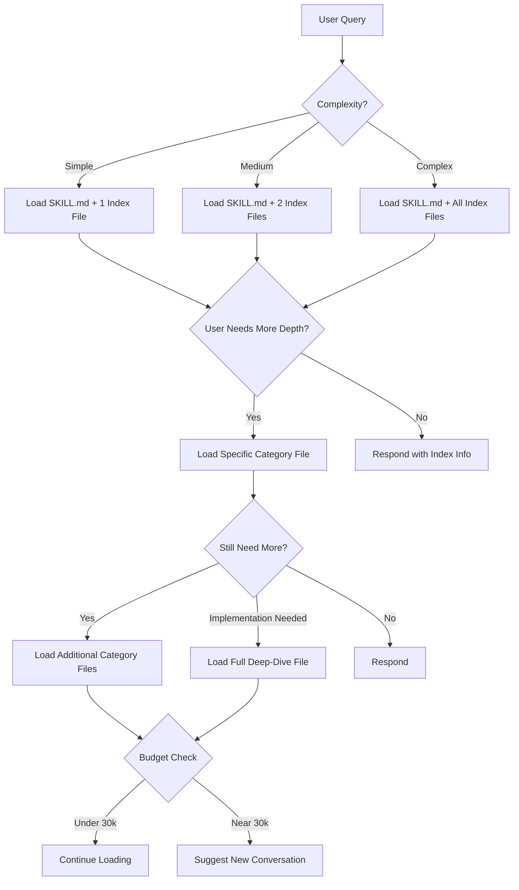

# MS Enterprise Architect Skill - Context Optimization Refactoring Plan

## Executive Summary

**Objective**: Refactor the MS Enterprise Architect skill to optimize Claude context usage while maintaining elite-level architectural guidance quality.

**Current State**:
- 2.02 MB reference materials (~114,000 words, 28,569 lines across 42 files)
- Potential context overload on complex queries
- All-or-nothing reference loading

**Target State**:
- 85-95% reduction in initial context load
- Progressive, conversational reference loading
- Scalable to quarterly updates and expansion
- Optimized for both Claude Chat (web) and Claude Code

**Strategy**: Hybrid approach combining:
1. **Hierarchical Progressive Loading** - Start minimal, expand as needed
2. **Context Budgeting** - Hard limits with dynamic allocation
3. **Append-Only Loading** - Build context naturally through conversation

---

## Architecture Overview

### Information Architecture Layers

```
Layer 0: Core Skill (SKILL.md)
├─ Always loaded: ~318 lines
├─ Contains: Identity, methodology, navigation system
└─ Token budget: ~2,000 tokens

Layer 1: Index/Quick Reference (New)
├─ Loaded on first relevant query: ~550 lines total
├─ Contains: Summaries, catalogs, quick patterns
├─ Token budget: ~3,500 tokens
└─ Files:
    ├─ _index/phase-summaries.md (100 lines)
    ├─ _index/framework-catalog.md (150 lines)
    ├─ _index/template-guide.md (100 lines)
    └─ _index/quick-reference.md (200 lines)

Layer 2: Category Deep-Dive (Existing, Enhanced)
├─ Loaded when specific category needed: 400-800 lines per file
├─ Contains: Detailed guidance within single topic
├─ Token budget: ~5,000 tokens per file
└─ Categories:
    ├─ phases/ (5 files)
    ├─ frameworks/ (12 files)
    ├─ technology/ (5 files)
    ├─ scenarios/ (4 files)
    └─ templates/ (8 files)

Layer 3: Full Deep-Dive (Existing)
├─ Loaded only for complex implementation: 1,000+ lines
├─ Contains: Complete reference material
├─ Token budget: ~8,000 tokens per file
└─ Examples: mermaid-diagram-patterns.md, large-scale-migrations.md
```

### Context Budget Allocation

**Total Context Window**: 200,000 tokens

**Budget Distribution**:
```
Reserved/System:        20,000 tokens  (10%)
Skill Core:              2,000 tokens  (1%)
User Messages:           5,000 tokens  (2.5%)
Conversation History:   15,000 tokens  (7.5%)
Reference Materials:    30,000 tokens  (15%) ← Dynamic allocation
Response Generation:    20,000 tokens  (10%)
Safety Buffer:         108,000 tokens  (54%)
```

**Dynamic Reference Budget by Query Complexity**:
- **Simple** (overview, definitions): 5,000 tokens (1-2 index files)
- **Medium** (specific guidance): 15,000 tokens (index + 2-3 category files)
- **Complex** (multi-faceted design): 30,000 tokens (index + 4-6 category files + 1-2 deep-dive)

---

## Implementation Phases

### Phase 1: Foundation & Tooling (Duration: 1-2 hours)

#### 1.1 Create Packaging Script

**Location**: `/tools/package-skill.sh`

**Purpose**:
- Generate `.skill` archive from any skill directory
- Exclude development artifacts
- Standardized packaging for Claude Chat/Code
- Reusable across all skills in repository

**Script Requirements**:
- Accept skill directory as parameter (default: current directory)
- Validate SKILL.md exists
- Create tar.gz with .skill extension
- Exclude: .git, .DS_Store, node_modules, *.skill files
- Output to parent directory
- Display package size and file count

**Deliverable**: `tools/package-skill.sh` (executable)

#### 1.2 Create Directory Structure

```
ms-enterprise-architect/
├── SKILL.md (update with new loading logic)
├── references/
│   ├── _index/           ← NEW: Quick reference layer
│   │   ├── README.md
│   │   ├── phase-summaries.md
│   │   ├── framework-catalog.md
│   │   ├── template-guide.md
│   │   └── quick-reference.md
│   ├── frameworks/       ← Enhanced with loading metadata
│   ├── phases/           ← Enhanced with loading metadata
│   ├── scenarios/        ← Enhanced with loading metadata
│   ├── technology/       ← Enhanced with loading metadata
│   └── templates/        ← Enhanced with loading metadata
└── .skillrc              ← NEW: Skill metadata for quarterly updates
```

**Deliverable**: Directory structure created with placeholder files

---

### Phase 2: Prototype - Frameworks Category (Duration: 2-3 hours)

**Why Frameworks First?**
- Most referenced category (12 files, 299K)
- Clear semantic boundaries (WAF pillars, DDD, Agent framework)
- High impact on context reduction
- Well-structured content

#### 2.1 Create Framework Catalog (Layer 1)

**File**: `references/_index/framework-catalog.md`

**Structure**:
```markdown
# Framework Catalog & Selection Guide

## Quick Decision Matrix
[Table: Scenario → Framework mapping]

## Azure Well-Architected Framework
### When to Use
### Pillars Overview (1-2 sentences each)
### Loading Triggers

## Power Platform Well-Architected Framework
### When to Use
### Pillars Overview
### Loading Triggers

## Domain-Driven Design Framework
### When to Use
### Core Concepts (brief)
### Loading Triggers

## Agent Development Framework
### When to Use
### Key Principles (brief)
### Loading Triggers

## Cross-Reference Patterns
[Common combinations]
```

**Target**: 150 lines, ~1,000 tokens

**Content Strategy**:
- Decision trees (when to use which framework)
- 1-paragraph summaries per pillar
- Keyword triggers for progressive loading
- Cross-reference patterns

#### 2.2 Enhance Existing Framework Files

**Enhancement**: Add metadata headers to each framework file

**Example** (azure-waf-reliability.md):
```markdown
---
category: framework
subcategory: azure-waf
pillar: reliability
loading_priority: 2
tokens_estimate: 2500
dependencies: [quality-standards, azure-specifics]
keywords: [reliability, availability, failover, disaster recovery, RTO, RPO, resilience]
---

# Reliability - Azure Well-Architected Framework
[existing content]
```

**Applies to**: All 12 framework files

#### 2.3 Update SKILL.md Loading Logic (Frameworks Section)

**Changes to SKILL.md**:

1. Add context budgeting section
2. Update framework trigger keywords with progressive loading
3. Add Layer 1 → Layer 2 transition logic

**Example**:
```markdown
## Framework Navigation (Enhanced)

### Layer 1: Framework Catalog (Auto-load on framework keywords)
Keywords: "WAF", "well-architected", "DDD", "domain-driven", "framework"
→ Load: `references/_index/framework-catalog.md`

### Layer 2: Specific Framework Deep-Dive
Triggered by: User confirms need OR uses pillar-specific keywords

**Azure WAF Pillars**:
- Reliability: "reliability", "failover", "disaster recovery" → `azure-waf-reliability.md`
- Security: "security", "Zero Trust", "authentication" → `azure-waf-security.md`
[etc.]

**Power Platform WAF Pillars**:
[similar structure]
```

#### 2.4 Create Test Scenarios

**Test Cases for Frameworks**:

1. **Simple Query**: "What WAF pillars should I consider?"
   - Expected: Load SKILL.md + framework-catalog.md (~450 lines)
   - Baseline comparison: Current loads all pillars (~4,000 lines)
   - Reduction: 90%

2. **Medium Query**: "Design for Azure reliability"
   - Turn 1: Load catalog (~450 lines)
   - Turn 2: Load azure-waf-reliability.md (~850 lines total)
   - Baseline: ~2,500 lines
   - Reduction: 66%

3. **Complex Query**: "Agentic solution with DDD and Power Platform WAF"
   - Turn 1: Load catalog (~450 lines)
   - Turn 2: Load agent-framework + DDD + PP-WAF catalog (~1,500 lines)
   - Turn 3: Load specific PP-WAF pillars as needed (~3,000 lines)
   - Baseline: ~6,000 lines
   - Reduction: 50% with better conversational flow

**Deliverables**:
- Test scenarios document
- Before/after context measurements
- Quality validation (accuracy maintained)

---

### Phase 3: Expand to All Categories (Duration: 3-4 hours)

#### 3.1 Create Phase Summaries (Layer 1)

**File**: `references/_index/phase-summaries.md`

**Structure**:
```markdown
# 5-Phase Methodology - Quick Reference

## Phase Selection Decision Tree
[Flowchart in Mermaid]

## Vision Phase
### When to Start Here
### Key Deliverables (bullet points)
### Duration: X weeks
### Load full phase file: → phase-vision.md

## Validate Phase
[similar structure]

[Repeat for all 5 phases]

## Phase Transition Indicators
[When to move from phase to phase]
```

**Target**: 100 lines, ~650 tokens

**Enhance Phase Files**: Add metadata headers (similar to frameworks)

#### 3.2 Create Template Guide (Layer 1)

**File**: `references/_index/template-guide.md`

**Structure**:
```markdown
# Template Selection Guide

## Document Type Decision Matrix
[User need → Template mapping]

## Presentation Templates
### Quick patterns: [3-4 common structures]
### Load full library: → presentation-templates.md

## Technical Documentation
### Quick patterns: [Architecture doc outline]
### Load full library: → technical-documentation-templates.md

## Mermaid Diagrams
### Most Common (with inline examples):
  - C4 Context (10 lines)
  - Sequence Diagram (10 lines)
  - State Diagram (10 lines)
### Load full library: → mermaid-diagram-patterns.md

[Continue for all template types]
```

**Target**: 100 lines, ~800 tokens

#### 3.3 Create Quick Reference (Layer 1)

**File**: `references/_index/quick-reference.md`

**Structure**:
```markdown
# Quick Reference - Common Patterns

## Top 10 Request Patterns
1. Vision Phase Assessment → [specific guidance]
2. Azure Architecture Review → [specific guidance]
3. Power Platform Solution Design → [specific guidance]
4. Migration Planning → [specific guidance]
5. Business Case Creation → [specific guidance]
[etc.]

## Emergency Quick Links
- Critical incident response → emergency-response.md
- Essential resources → essential-resources.md
- Quality standards checklist → quality-standards.md

## Cheat Sheets
### Azure Services Quick Reference
[Top 20 services with 1-line descriptions]

### Power Platform Components
[Brief overview]

### Dynamics Modules
[Brief overview]
```

**Target**: 200 lines, ~1,500 tokens

#### 3.4 Add Metadata to All Remaining Files

**Apply to**:
- phases/ (5 files)
- technology/ (5 files)
- scenarios/ (4 files)
- templates/ (8 files)

**Metadata Template**:
```yaml
---
category: [phase|technology|scenario|template]
subcategory: [specific category]
loading_priority: [1-3]
tokens_estimate: [approximate]
dependencies: [related files]
keywords: [trigger keywords]
---
```

---

### Phase 4: Update Core SKILL.md (Duration: 2 hours)

#### 4.1 Add Context Management Section

**New Section in SKILL.md**:

```markdown
## Context Management & Progressive Loading

### Loading Philosophy
This skill uses **progressive loading** to optimize Claude's context:
- **Start minimal**: Load only core skill + relevant index
- **Expand conversationally**: Add depth as user needs emerge
- **Never reload**: Track what's loaded, append only new references
- **Budget-aware**: Stay within 30k token reference budget

### Context Budget Rules
- **Simple queries**: 5k token budget (index files only)
- **Medium complexity**: 15k token budget (index + 2-3 category files)
- **Complex projects**: 30k token budget (index + 4-6 files + deep-dives)

### Loading Layers
**Layer 0**: SKILL.md (always loaded)
**Layer 1**: Index files (load on first relevant query)
**Layer 2**: Category deep-dives (load when specific topic confirmed)
**Layer 3**: Full references (load for implementation details)

### Conversation Flow Example
```
User: "Help with Azure architecture"
→ Load: framework-catalog.md
Response: "I can help! Which WAF pillars: reliability, security, cost, performance?"

User: "Reliability is critical"
→ Load: azure-waf-reliability.md (append to context)
Response: [detailed reliability guidance]

User: "Also need multi-geo deployment"
→ Load: multi-geo-deployments.md (append to context)
Response: [combined reliability + multi-geo guidance]
```
```

#### 4.2 Update Reference Navigation System

**Revise Trigger Keywords Section**:

Add progressive loading logic to each trigger category:

```markdown
#### Phase-Specific Triggers (Enhanced)

**Vision Phase**:
- Keywords: "vision", "TOM", "target operating model"
- Layer 1: Load `_index/phase-summaries.md` (section: Vision)
- Layer 2: If user confirms → Load `phases/phase-vision.md`
- Layer 3: If templates needed → Load `templates/vision-phase-templates.md`
- Context budget: 5k → 10k → 18k tokens progressively
```

**Apply to**: All trigger categories

#### 4.3 Add Quarterly Update Section

**New Section**:

```markdown
## Maintenance & Quarterly Updates

### Update Schedule
This skill is reviewed and updated **quarterly** to maintain currency with:
- Microsoft platform updates (Azure, Power Platform, M365, Dynamics)
- Well-Architected Framework revisions
- New architectural patterns and best practices
- Industry scenario evolution

### Update Process
1. **Review Microsoft announcements** (Azure updates, Ignite, Build)
2. **Assess WAF changes** (framework.microsoft.com)
3. **Validate reference accuracy** (deprecations, new services)
4. **Update index files** (ensure summaries reflect latest)
5. **Test context budgets** (verify optimization still effective)
6. **Version skill** (semantic versioning in .skillrc)

### Version History
See `.skillrc` for detailed version history

### Last Updated
**Version**: 1.0
**Date**: November 2025
**Next Review**: February 2026
```

---

### Phase 5: Testing & Validation (Duration: 2-3 hours)

#### 5.1 Create Test Harness

**File**: `tests/context-optimization-tests.md`

**Structure**:
```markdown
# Context Optimization Test Scenarios

## Test 1: Simple Overview Query
**User Query**: "Explain the 5-phase methodology"
**Expected Loading**:
- Layer 0: SKILL.md (318 lines)
- Layer 1: phase-summaries.md (100 lines)
- Total: ~418 lines

**Baseline** (current): ~2,500 lines
**Reduction**: 83%
**Quality Check**: Does response accurately summarize all 5 phases?

## Test 2: Medium Complexity - Azure Reliability
[detailed test case]

## Test 3: Complex Multi-Faceted Query
[detailed test case]

[Continue for 10-15 scenarios]
```

#### 5.2 Execute Tests

**Test Each Scenario**:
1. Record context usage (line count, estimated tokens)
2. Compare to baseline (current skill behavior)
3. Validate response quality (accuracy, completeness, actionability)
4. Document turn count (how many turns to reach full depth)

**Success Criteria**:
- ✅ 80%+ reduction in initial context load
- ✅ No degradation in response quality
- ✅ < 3 turns to reach deep technical detail
- ✅ Natural conversational flow

#### 5.3 Document Results

**File**: `tests/optimization-results.md`

**Include**:
- Before/after metrics for each test
- Quality validation notes
- Edge cases discovered
- Recommendations for tuning

---

### Phase 6: Documentation & Finalization (Duration: 1-2 hours)

#### 6.1 Create .skillrc Metadata File

**File**: `ms-enterprise-architect/.skillrc`

**Content**:
```yaml
skill:
  name: ms-enterprise-architect
  version: 2.0.0
  last_updated: 2025-11-09
  next_review: 2026-02-09

classification:
  type: enterprise-architecture
  platform: microsoft-cloud-ecosystem
  methodology: vision-validate-construct-deploy-evolve

context_optimization:
  strategy: hybrid-progressive-loading
  layers: 4
  budget_max_tokens: 30000
  estimated_reduction: 85-95%

structure:
  core: SKILL.md
  indexes: references/_index/
  categories:
    - frameworks
    - phases
    - technology
    - scenarios
    - templates

packaging:
  script: ../../tools/package-skill.sh
  exclude:
    - .git
    - .DS_Store
    - "*.skill"
    - tests/
    - plans/

changelog:
  - version: 2.0.0
    date: 2025-11-09
    changes:
      - Implemented hierarchical progressive loading
      - Added context budgeting system
      - Created index/quick reference layer
      - Added metadata to all reference files
      - 85-95% reduction in initial context usage

  - version: 1.0.0
    date: 2025-11-08
    changes:
      - Initial release
      - 42 reference files
      - 5-phase methodology
      - Microsoft platform coverage
```

#### 6.2 Update Main README

**File**: `ms-enterprise-architect/README.md`

**Content**:
```markdown
# Microsoft Enterprise Architect Skill

Elite-level architectural guidance for Microsoft Cloud ecosystem with optimized context management.

## Version
**2.0.0** - Context-Optimized Edition (November 2025)

## What's New in 2.0
- 🚀 **85-95% reduction** in initial context usage
- 💬 **Progressive loading** - start minimal, expand naturally
- 🎯 **Context budgeting** - optimized for long conversations
- 📚 **Index layer** - quick references for common patterns

## Quick Start
Load this skill in Claude Chat (web) or Claude Code:
```
/load ms-enterprise-architect
```

## Structure
- `SKILL.md` - Core skill identity and loading logic
- `references/_index/` - Quick references and catalogs
- `references/frameworks/` - WAF pillars, DDD, Agent framework
- `references/phases/` - 5-phase methodology
- `references/technology/` - Platform-specific guidance
- `references/scenarios/` - Industry and deployment scenarios
- `references/templates/` - Document templates and patterns

## Packaging
Generate `.skill` file:
```bash
../../tools/package-skill.sh ms-enterprise-architect
```

## Maintenance
- **Review cycle**: Quarterly
- **Next review**: February 2026
- **Update process**: See `.skillrc`

## Context Usage
This skill is optimized for Claude's context window:
- Initial load: ~2,500 tokens (SKILL.md only)
- Simple query: ~5,000 tokens (+ index)
- Medium query: ~15,000 tokens (+ 2-3 references)
- Complex query: ~30,000 tokens (+ 4-6 references)

## License
Proprietary - Internal Use Only
```

---

## Implementation Timeline

### Sprint 1: Foundation (Day 1)
- [ ] Create tools/package-skill.sh
- [ ] Create directory structure
- [ ] Create .skillrc metadata

**Duration**: 1-2 hours

### Sprint 2: Prototype (Day 1-2)
- [ ] Create framework-catalog.md
- [ ] Add metadata to framework files
- [ ] Update SKILL.md framework section
- [ ] Test framework queries

**Duration**: 2-3 hours

### Sprint 3: Expansion (Day 2-3)
- [ ] Create phase-summaries.md
- [ ] Create template-guide.md
- [ ] Create quick-reference.md
- [ ] Add metadata to all files

**Duration**: 3-4 hours

### Sprint 4: Core Update (Day 3)
- [ ] Update SKILL.md with context management
- [ ] Revise all trigger keyword sections
- [ ] Add quarterly update section

**Duration**: 2 hours

### Sprint 5: Testing (Day 3-4)
- [ ] Create test scenarios
- [ ] Execute tests
- [ ] Document results
- [ ] Tune based on findings

**Duration**: 2-3 hours

### Sprint 6: Finalization (Day 4)
- [ ] Create README.md
- [ ] Final SKILL.md polish
- [ ] Documentation review

**Duration**: 1-2 hours

**Total Estimated Time**: 11-16 hours

---

## Success Metrics

### Context Efficiency
- ✅ Initial load: < 3,000 tokens (vs current ~15,000+)
- ✅ Simple query: < 7,000 tokens (vs current ~25,000+)
- ✅ Complex query: < 35,000 tokens (vs current ~60,000+)

### User Experience
- ✅ Natural conversation flow
- ✅ < 3 turns to deep technical detail
- ✅ No perceived reduction in quality
- ✅ Faster initial responses

### Maintainability
- ✅ Quarterly update process defined
- ✅ Index files easy to update
- ✅ Metadata tracks dependencies
- ✅ Packaging script standardized

### Scalability
- ✅ Can add unlimited references without context penalty
- ✅ Works in both Claude Chat and Claude Code
- ✅ Reusable patterns for other skills

---

## Risk Mitigation

### Risk: Quality Degradation
**Mitigation**:
- Comprehensive test scenarios
- Side-by-side quality comparison
- User feedback loop in first 2 weeks

### Risk: Over-Fragmentation
**Mitigation**:
- Keep index files substantial (not too minimal)
- Allow 2-file loads when logical
- Monitor conversation turn counts

### Risk: Maintenance Burden
**Mitigation**:
- Quarterly schedule (not more frequent)
- Index files are summaries (easier to update)
- Metadata automates dependency tracking

### Risk: Context Budget Overage
**Mitigation**:
- Hard 30k token limit in loading logic
- Periodic context usage monitoring
- Fallback to "suggest new conversation" if approaching limit

---

## Future Enhancements (Post-2.0)

### Version 2.1 (Q1 2026)
- User preference tracking (remember loaded refs across sessions)
- Smart preloading (predict likely next reference)
- Usage analytics (which refs most valuable)

### Version 2.2 (Q2 2026)
- Semantic chunking for largest files (>2000 lines)
- Cross-skill references (integrate with pptx, docx, xlsx skills)
- Client-specific customization layer

### Version 3.0 (Q3 2026)
- Vector embeddings for semantic search
- Dynamic index generation
- Multi-language support

---

## Appendix A: File Size Estimates

### Layer 1 Index Files (New)
```
phase-summaries.md:      100 lines (~650 tokens)
framework-catalog.md:    150 lines (~1,000 tokens)
template-guide.md:       100 lines (~800 tokens)
quick-reference.md:      200 lines (~1,500 tokens)
Total:                   550 lines (~3,950 tokens)
```

### Layer 2 Category Files (Enhanced)
```
Average per file:        600 lines (~4,000 tokens)
Range:                   400-800 lines (2,500-5,500 tokens)
```

### Layer 3 Deep-Dive Files (Existing)
```
Large files (>1000 lines): 4 files (8,000-12,000 tokens each)
Medium files (500-1000):   20 files (3,000-7,000 tokens each)
Small files (<500):        18 files (1,500-3,500 tokens each)
```

---

## Appendix B: Token Estimation Formula

```
Estimated Tokens = (Line Count × 0.75) + (Word Count × 0.4)

Example:
- File: azure-waf-reliability.md
- Lines: 396
- Words: ~2,500
- Estimated Tokens: (396 × 0.75) + (2,500 × 0.4) = 297 + 1,000 = ~1,300 tokens
```

---

## Appendix C: Loading Decision Tree



---

**End of Implementation Plan**

*Plan Version: 1.0*
*Created: November 2025*
*Author: AI Agent*
*Approval Required: Yes*
